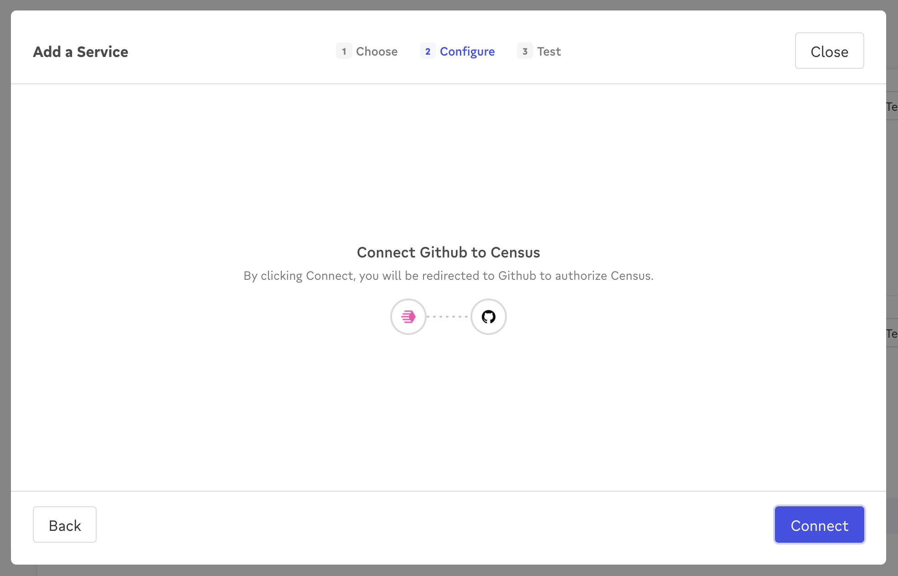

# GitHub

## 🏃‍♀️ Getting Started

1. Click **Add Service**.
2. Select **GitHub** from the menu.
3. Complete the OAuth flow to grant Census access to your GitHub workspace. Be sure to select the repositories you wish to sync data to (or grant access to all repositories if you prefer).

<figure><figcaption>
Grant Census access to your GitHub account.
</figcaption></figure>

## 🔀 Supported Objects and Behaviors

| **Object Name** | **Supported?** | **Identifiers**  | **Behaviors** |
| --------------: | :------------: | ---------------- | --------------|
| Issue | ✅ | Issue Number | Update Only, Append |

[Contact us](mailto:support@getcensus.com) if you want Census to support more GitHub objects and/or behaviors.

## 🚑 Need help connecting to GitHub?

[Contact us](mailto:support@getcensus.com) via support@getcensus.com or start a conversation with us via the [in-app](https://app.getcensus.com) chat.
