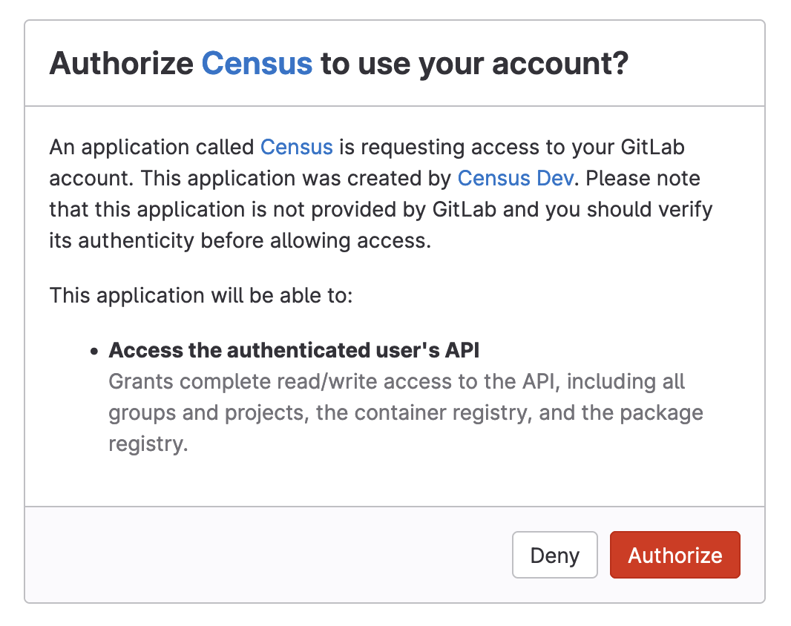

# GitLab

## 🏃‍♀️ Getting Started

1. Navigate to the **Destinations** page in Census and click **New Destination**.
2. Select **GitLab** from the menu.
3. Enter the URL for your GitLab instance. If you're using their standard cloud offering, this will be `gitlab.com`. If you have a self-managed instance, this might look like `gitlab.yourcompany.com`.

<figure><figcaption>
Authorize Census to access your GitLab instance.
</figcaption></figure>

## 🔀 Supported Objects and Behaviors

| **Object Name** | **Supported?** | **Sync Keys**  | **Behaviors**                      |
| --------------: | :------------: | ---------------- |------------------------------------|
| Issues | ✅ | Internal ID | Update or Create, Update Only, Add |

[Contact us](mailto:support@getcensus.com) if you want Census to support more GitLab objects and/or behaviors.

## 🚑 Need help connecting to GitLab?

[Contact us](mailto:support@getcensus.com) via support@getcensus.com or start a conversation with us via the [in-app](https://app.getcensus.com) chat.
