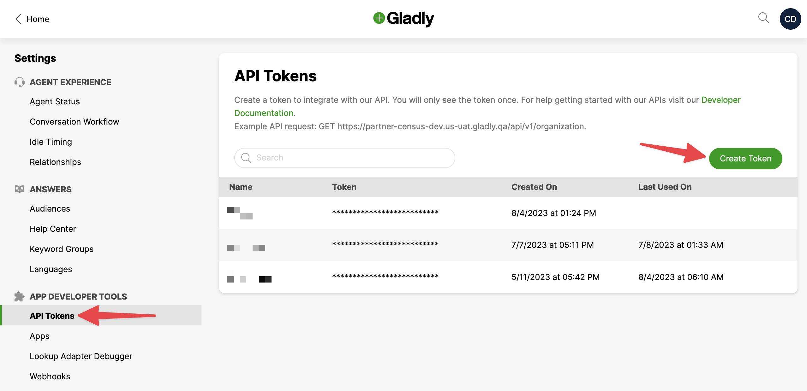

# Gladly

## 🏃‍♀️ Getting Started

1. Navigate to the **Destinations** tab in Census and click **Add Destination**.
2. Select **Gladly** from the menu.
3. Open Gladly in another browser tab and navigate to **Settings** > **API Tokens**. Create a new token and copy it to your clipboard.
4. Return to Census and enter your **API Token** along with your **User** and **Organization**. The former is the email address you log into Gladly with and the latter can be found in the URL when you're logged in (e.g. https://**your-org-name**.us-uat.gladly.qa).

<figure><figcaption>
Enter your Gladly credentials into Census.
</figcaption></figure>

## 🗄 Supported Objects and Behaviors

| **Object Name** | **Supported?** | **Sync Key** | **Behaviors** |
| -------: | :---: | ----------- | -------------------------- |
| Customer |  ✅  | Customer ID | Update or Create, Update Only |

[Contact us](mailto:support@getcensus.com) if you want Census to support more Gladly objects and/or behaviors.

## 🚑 Need help connecting to Gladly?

[Contact us](mailto:support@getcensus.com) via support@getcensus.com or start a conversation with us via the [in-app](https://app.getcensus.com) chat.
