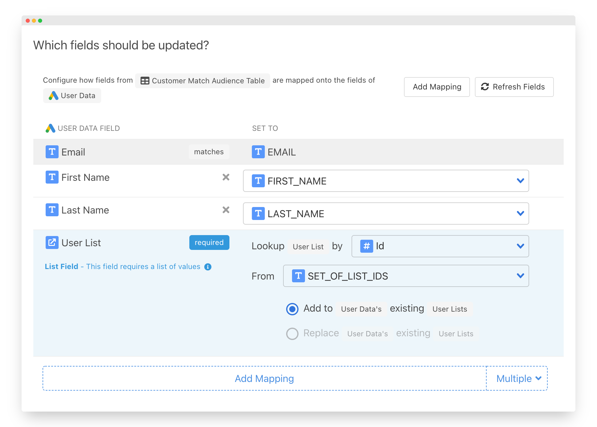
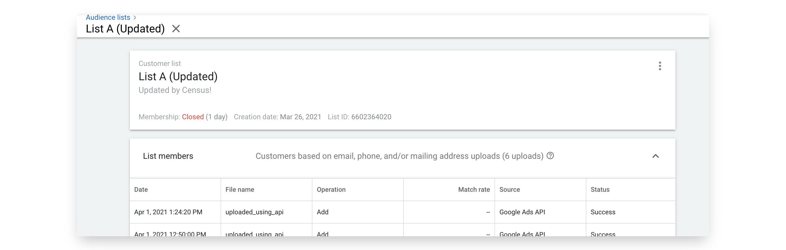

# Google Ads

## 🏃‍♂️ Getting Started

In this guide, we will show you how to connect your Google Ads account to [Census](https://www.getcensus.com/) and create your first sync.

### **Prerequisites**

To set up a Google Ads sync, you'll need three things:

* A Census Account – If you don't have one already, [create a Free Trial Census Account](https://app.getcensus.com/)
* A Google Ads Account.
  * To create Customer Match syncs, your Google Ads Account will need access to the Customer Match feature. See [Google's Customer Match policy](https://support.google.com/adspolicy/answer/6299717?hl=en) for more details.
* Access to your data warehouse. For details on how to create credentials, see our articles for [Redshift](../source-warehouse/redshift.md), [Snowflake](../source-warehouse/snowflake.md), [Google BigQuery](../source-warehouse/google-bigquery.md), [Databricks](../source-warehouse/databricks.md), and [Postgres](../source-warehouse/postgres.md).

### 1. Connect Google Ads

* Once you are in Census, Navigate to [Connections](https://app.getcensus.com/connections)
* Click the **Add Service** button
* Select Google Ads in the dropdown list.

Follow Google OAuth flow to connect your Google Ads account. 

Finally, select the Google Ads account you'd like to sync to

### 2. Connect your Data Warehouse

Please follow one of our short guides depending on your data warehouse technology

* [Redshift](https://help.getcensus.com/article/10-configuring-redshift-postgresql-access)
* [Postgres](https://help.getcensus.com/article/10-configuring-redshift-postgresql-access)
* [BigQuery](https://help.getcensus.com/article/21-configuring-bigquery-access)
* [Snowflake](https://help.getcensus.com/article/8-configuring-snowflake-access)
* [Databricks](../source-warehouse/databricks.md)

After setting up your warehouse, your Census Connections Page should look like this:

### 3. Create your Google Ads Customer Match Model 

Navigate to the [Models](https://app.getcensus.com/models) page.​

Here you can write SQL queries or select dbt models that contain the data you want to send to Google Ads.

Right now, we're going to send data to an existing Customer Match list, which requires a specific set of properties. We'll create a model that has:

* The email of the Customer
* A list of the target Customer Match lists
* Any other properties about the Customer that can assist in the match.

Once you have created your model, click save.

### 4. Create your first Sync

Now head to the [Sync page](https://app.getcensus.com/syncs) and click the **Add Sync** button

In the " **What data do you want to sync?"** section

* For the **Connection**, select the data warehouse you connected in step 2
* For the **Source,**  select the model you created in step 3

Next up is the **"Where do you want to sync data to?"** section

* Pick **Google Ads** as the Connection
* For Object, pick **User Details**

For the " **How should changes to the source be synced?"** section 

* **Update or Create** will be selected by default
* Pick the right mapping key, in this case, we'll use **Email**

Finally, select the fields you want to update in the Mapper in the **"Which Fields should be updated?"** section. Here simply map the field from your model to the properties of the Customer Match List. 

The end result should look something like this

Click the **Next** button to see the final preview which will have a recap of what will happen when you start the sync.

### 5. Confirm the data is in your Customer Match List

Now go back to your Google Ads account and view the list. If everything went well, you should see that the list has been updated with your data. Because this is an Audience Matching mechanism, Google will not tell you the exact number of matches it found, but should tell you that it was updated. 

That's it! In 5 steps, you connected your data warehouse to Google Ads and built live Customer Match audiences Google Ads 🎉

## 🗄 Supported Objects

| Service | **Object Name** | **Supported?** | Identifiers |
| :--- | ---: | :---: | :--- |
| Customer Match | Customer | ✅ | User ID, Mobile ID, Email,  Phone Number |
| Offline Conversions | Click, Call | ✅ | Click ID, Caller ID |

[Contact us](mailto:support@getcensus.com) if you're looking for support more additional Google Ads objects.

**Google Customer Match behavior**

Google Customer Match, as its name implies, is a matching service rather than the usual direct upload. In order to protect user data, we do not upload the data you provide directly. Instead, records are "matched" against Google's existing user base. To do this, both sides perform a "hash" -- or consistent, but irreversible conversion -- of data so users can be compared without revealing the actual personally identifiable information. Census automatically takes care of this hashing step for you. 

We recommend you do not use Google's Customer Match expiration setting. Census-synced records are subject to the same expiration and will not be re-uploaded unless they are changed in your source data. 

## 🔄 Supported Sync Behaviors

| **Behaviors** | **Supported?** | **Objects?** |
| ---: | :---: | :---: |
| **Update or Create** | ✅ | All |
| **Mirror** | ✅ | All |

[Contact us](mailto:support@getcensus.com) if you're looking for additional Sync Behaviors!

Note: If you're reusing an existing Customer Match Lists, Census will not remove any users already added to those lists through other means. 


Learn more about our sync behaviors on our [Core Concept page](../basics/core-concept.md#the-different-sync-behaviors).


## 🚑 Need help connecting to Google Ads?

[Contact us](mailto:support@getcensus.com) via support@getcensus.com or start a conversation with us via the [in-app](https://app.getcensus.com) chat.

