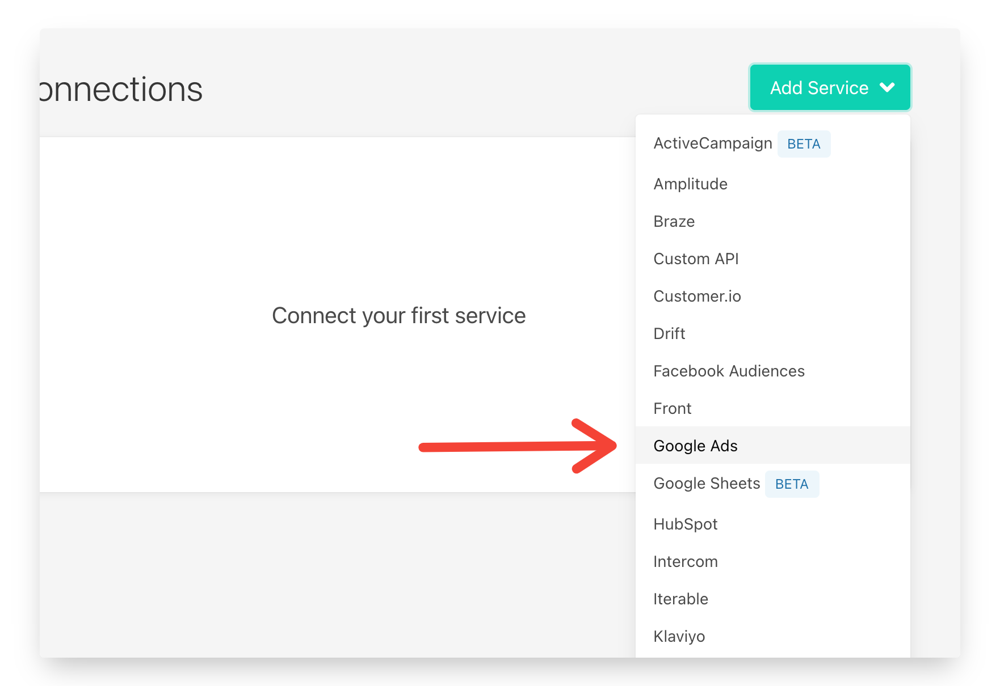
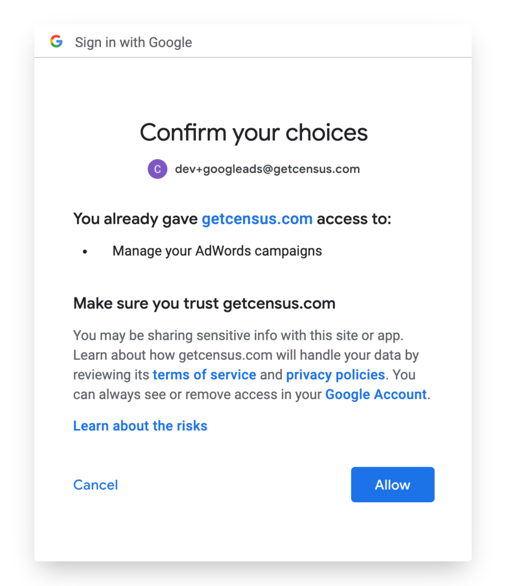
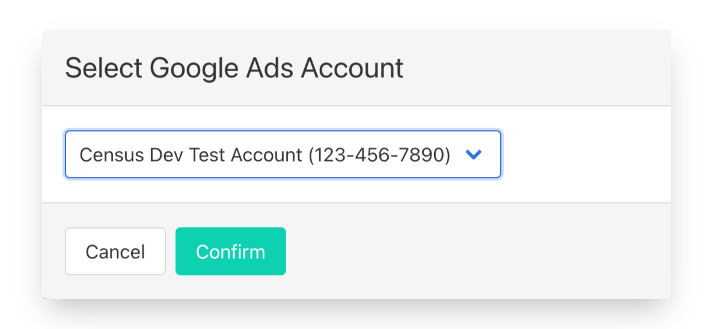
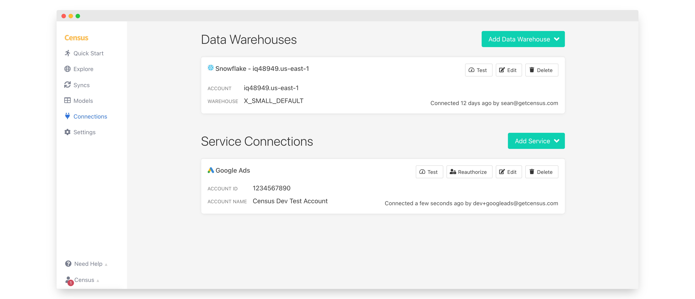

# Google Ads

## 🏃‍♀️ Getting Started


Just a heads up: We use the new [Google Ads API](https://developers.google.com/google-ads/api/docs/start) as opposed to the older AdWords API.


In this guide, we will show you how to connect Google Ads to Census.



### Prerequisites

* Have your Census account ready. If you need one, [create a Free Trial Census account](https://app.getcensus.com) now.
* Have your Google Ads account ready.
  * To create Customer Match syncs, your Google Ads Account will need access to the Customer Match feature. See [Google's Customer Match policy](https://support.google.com/adspolicy/answer/6299717?hl=en) for more details.
* Have the proper credentials to access to your data source. See our docs for each supported data source for further information:
  * [Databricks](https://docs.getcensus.com/sources/databricks)
  * [Google BigQuery](https://docs.getcensus.com/sources/google-bigquery)
  * [Google Sheets](https://docs.getcensus.com/sources/google-sheets)
  * [Postgres](https://docs.getcensus.com/sources/postgres)
  * [Redshift](https://docs.getcensus.com/sources/redshift)
  * [Rockset](https://docs.getcensus.com/sources/rockset)
  * [Snowflake](https://docs.getcensus.com/sources/snowflake)

### 1. Connect Google Ads

* Once you are in Census, Navigate to [Connections](https://app.getcensus.com/connections)
* Click the **Add Service **button
* Select Google Ads in the dropdown list.

Follow Google OAuth flow to connect your Google Ads account.&#x20;

Finally, select the Google Ads account you'd like to sync to

### 2. Connect your Data Warehouse

Please follow one of our short guides depending on your data warehouse technology

* [Redshift](https://help.getcensus.com/article/10-configuring-redshift-postgresql-access)
* [Postgres](https://help.getcensus.com/article/10-configuring-redshift-postgresql-access)
* [BigQuery](https://help.getcensus.com/article/21-configuring-bigquery-access)
* [Snowflake](https://help.getcensus.com/article/8-configuring-snowflake-access)
* [Databricks](../../sources/databricks.md)

After setting up your warehouse, your Census Connections Page should look like this:

## 🗄 Supported Objects

| Service                                                                                                         | **Object Name** | **Supported?** | Identifiers                                        |
| --------------------------------------------------------------------------------------------------------------- | --------------: | :------------: | -------------------------------------------------- |
| [Customer Match Lists (Audiences)](https://docs.getcensus.com/destinations/google-ads/customer-match-audiences) |        Customer |        ✅       | 
User ID, Mobile ID, Email,  Phone Number
 |
| [Offline Conversions](https://docs.getcensus.com/destinations/google-ads/offline-conversions)                   |     Click, Call |        ✅       | Click ID, Caller ID                                |

[Contact us](mailto:support@getcensus.com) if you're looking for additional Google Ads objects.

## 🚑 Need help connecting to Google Ads?

[Contact us](mailto:support@getcensus.com) via support@getcensus.com or start a conversation with us via the [in-app](https://app.getcensus.com) chat.
