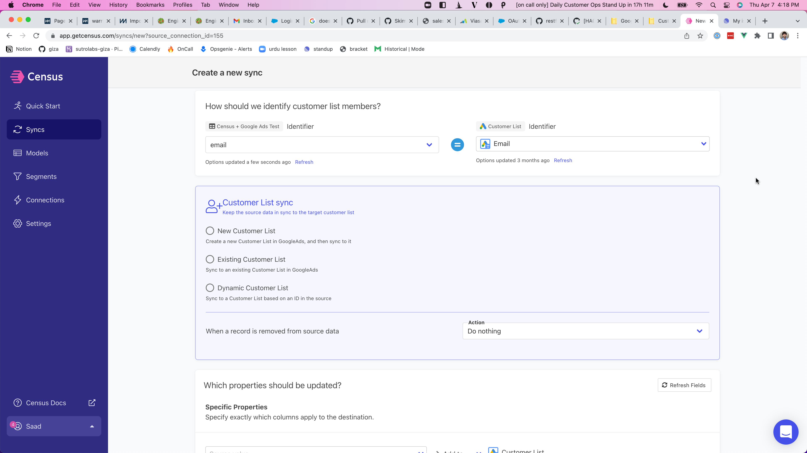

# Customer Match Lists (Audiences)

## Connect your Google Ads Account

Follow the [set-up instructions here!](https://docs.getcensus.com/destinations/google-ads)

## Sync a Customer Match List with Census

### 1. Create your Google Ads Customer Match Model 

Navigate to the [Models](https://app.getcensus.com/models) page.​

Here you can write SQL queries or select dbt models that contain the data you want to send to Google Ads.

Right now, we're going to send data to an existing Customer Match list, which requires a specific set of properties. We'll create a model that has:

* The email of the Customer
* Any other properties about the Customer that can assist in the match.

Once you have created your model, click save.

### 2. Create your first Sync

Now head to the [Sync page](https://app.getcensus.com/syncs) and click the **Add Sync** button

In the " **What data do you want to sync?"** section

* For the **Connection**, select the data warehouse you connected in the Prerequisites Step 2
* For the **Source,** select the model you created in step 1 of this section

Next up is the **"Where do you want to sync data to?"** section

* Pick **Google Ads** as the Connection
* For Object, pick **Customer**

For the " **How should we identify customer list members?"** section

* Pick the right mapping key, in this case, we'll use **Email**
* You will have the option of picking an existing list to sync or creating a new list to sync

Finally, select the fields you want to update in the Mapper in the **"Which Properties should be updated?"** section. Here simply map the field from your model to the properties of the Customer Match List.

The end result should look something like this

Click the **Next** button to see the final preview which will have a recap of what will happen when you start the sync.

### 3. Confirm the data is in your Customer Match List

Now go back to your Google Ads account and view the list. If everything went well, you should see that the list has been updated with your data. Because this is an Audience Matching mechanism, Google will not tell you the exact number of matches it found, but should tell you that it was updated.

That's it! In 3 steps, you connected your data warehouse to Google Ads and built live Customer Match audiences Google Ads 🎉

## **Best Practices and Notes**

Google Customer Match, as its name implies, is a matching service rather than the usual direct upload. In order to protect user data, we do not upload the data you provide directly. Instead, records are "matched" against Google's existing user base. To do this, both sides perform a "hash" -- or consistent, but irreversible conversion -- of data so users can be compared without revealing the actual personally identifiable information. Census automatically takes care of this hashing step for you.

We recommend you do not use Google's Customer Match expiration setting. Census-synced records are subject to the same expiration and will not be re-uploaded unless they are changed in your source data.

When syncing to a customer list manually created in Google Ads—such as one using Mobile Advertising ID as the upload key—you may notice "Unknown" listed under the Segment Type column. This indicates that the list’s upload key type has not yet been defined. Census uses the upload key type to ensure we are uploading data properly to existing Customer Lists.\
To resolve this, you’ll need to define the upload key type directly in Google Ads:

1. Open your customer list in Google Ads.
2. Click List Members → Modify List → Data Source: Upload File Manually.
3. Select the appropriate Data Type, such as:
   * Upload Emails, Phones, and/or Mailing Addresses
   * Upload User IDs
   * Upload Mobile Device IDs
4. Upload a CSV file with at least one valid record.

Once this is done, the list’s upload key type will be set, and Census will be able to sync to it successfully.

## Supported Sync Behaviors

|        **Behaviors** | **Supported?** |
| -------------------: | :------------: |
| **Update or Create** |        ✅       |
|           **Mirror** |        ✅       |

_**Sync Keys**: User ID, Mobile ID, Email, Phone Number_

Please note that the above behaviors will map to what you select in the, "_**When a record is removed from source data**_" dropdown in the **Customer List sync** section. Selecting "**Do Nothing**" will map to **Update or Create(Upsert)** while "**Remove matching record from customer list**" will map to **Mirror**.

Contact the support team if you're looking for additional Sync Behaviors!

Note: If you're reusing an existing Customer Match List, Census will not remove any users already added to those lists through other means.

### Digital Markets Act (DMA)

When syncing Customer Match Lists to Google Ads, you can include consent information to ensure compatibility with [Google's EU User Consent Policy](https://www.google.com/about/company/user-consent-policy/). Google Ads objects now support two additional fields: `Consent for ad user data` and `Consent for ad personalization`, which can be set to one of the following values: `UNKNOWN`, `UNSPECIFIED`, `GRANTED`, `DENIED`. See Google's [documentation](https://support.google.com/google-ads/answer/14310715) for more information on the behavior of different options.

## :warning:Common Issues

### Did my sync work? It says completed but it isn't showing the updated timestamp I expect.

The standard place where bulk files uploading update status doesn't actually update when using Census. Instead, you've gotta hover on a specific card.

Steps to get there:

1. Open your google ads account
2. Navigate to Tools & Settings > Audience Manager
3. Hover over the name of your desired audience in the list.
4. Expand the section labeled `Customers based on email, phone, and/or mailing address uploads`
5. Within that, you'll see a `Last upload` label.

If that date isn't the same time as the most recent sync completed, please reach out via our in-app chat and we will investigate it with you.
