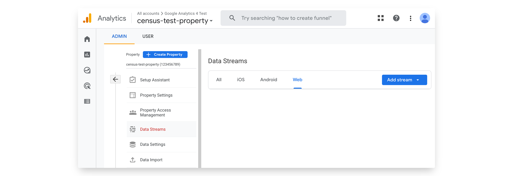
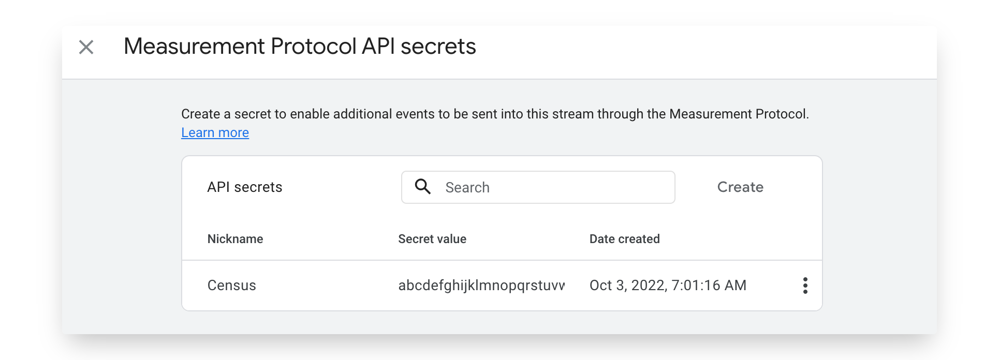

# Google Analytics 4

Google Analytics 4 is the latest version of Google's web and app analytics platform. It's a significant upgrade from Universal Analytics and is designed to be more flexible and powerful. Census can help you send event and user data to Google Analytics 4 to enrich the data you're already collecting.

## Getting Started

In this guide, we will show you how to connect Google Analytics 4 to Census and create your first sync.


GA4 has some very interesting behaviors with identifiers, custom fields, and delayed data indexing. If something is confusing, take a look at the [Understanding GA4 Identifiers and Quirks](google-analytics-four.md#things-to-know) section below.


### Prerequisites

* Have your Google Analytics account ready, with an existing **Google Analytics 4 property**. For Universal Analytics, read our docs for the [Google Analytics destination](google-analytics.md).
  * You'll also need admin access to create API credentials.

### Step 1: Add a Data Stream to your Google Analytics 4 property

In order to add a Google Analytics 4 connection, you'll need to create what Google calls a Data Stream. A Data Stream represents events from either a website or a Firebase app. Google describes the process in more detail in [their docs](https://developers.google.com/analytics/devguides/collection/protocol/ga4/sending-events?client\_type=firebase#required\_parameters).

For a Web App:

* First create a new stream or choose an existing one in **Admin** > **Data Streams**. If creating a new one, specify Web type.

<figure><figcaption></figcaption></figure>

* Then within the selected datastream, visit **Measurement Protocol** > **Create**
* Copy the **Secret Value** and the **Measurement ID**

<figure><figcaption></figcaption></figure>

For Firebase (iOS/Android) applications:

* First create a new stream or choose an existing one in **Admin** > **Data Streams**. If creating a new one, specify iOS or Android types.
* Then within the selected datastream, visit **Measurement Protocol** > **Create**
* Copy the **Secret Value**
* You'll also separately need the Firebase App ID. The identifier for a Firebase app is found in the Firebase console under: **Project Settings** > **General** > **Your Apps** > **App ID**

### Step 2: **Create the Census Connection**

* Navigate to the Census [**Destinations**](https://app.getcensus.com/destinations) page and click **New Destination**
* Select Google Analytics 4 from the drop down list (Not Google Analytics)
* Configure the three settings:
  * Add the Secret Value in the **API Secret** box of the connection.
  * Add the Measurement ID or Firebase App ID in **App ID**
  * Specify the Connection Type: Either **GTag** for websites or **Firebase** for iOS/Android apps.

You should now be ready to start sending data to Google Analytics 4!

## Supported Objects and Sync Behaviors 


Learn about all of our sync behaviors in [Core Concepts](../basics/core-concept.md#sync-behaviors).


|                                                                                                          **Object Name** | **Supported?** |               **Sync Keys**               | **Behavior**                                                                                     |
| -----------------------------------------------------------------------------------------------------------------------: | :------------: | :---------------------------------------: | ------------------------------------------------------------------------------------------------ |
| 
Event <a href="../basics/data-models-and-entities/defining-source-data/events/#defining-event-syncs">Event</a>
 |        ✅       |              Unique Event ID              | Send                                                                                             |
|                                                                                                          User Properties |        ✅       | 
Client ID or

App Instance ID
 | 
Update Only <em><mark style="color:orange;">(ID must already exist in GA4)</mark></em>
 |


Learn more about all of our sync behaviors in our [Syncs](broken-reference) documentation.


[Contact us](mailto:support@getcensus.com) if you want Census to support more Google Analytics objects and/or behaviors

## Google Analytics 4 Quirks

There's quite a few quirks with Google Analytics 4, particularly with how it handles custom properties. If you need any help configuring Google Analytics, contact the [Census support team](mailto:support@getcensus.com).

### Custom Properties (Dimensions and Metrics)

Google Analytics supports custom properties they call Dimensions and Metrics, both on the event and the user scope. Their [docs have a lot of detail on this functionality](https://support.google.com/analytics/answer/10075209?visit\_id=638028534254170289-3199207859\&rd=1) but there's a few things to keep in mind for Census:

* Before using Custom Dimensions and Metrics in Census, they **must be defined in Google Analytics up 48 hours before they can be used by Census**. Yeah, kinda nuts. It looks like the new Custom fields will start showing up in the first few hours but data may not populate until 24-48 hours later.
* Google limits the number of user and event scoped custom dimensions and metrics. For most GA4 properties, a maximum of 50 custom event dimensions and 25 custom user dimensions are allowed. See [Google's docs for the up to date list of limits](https://support.google.com/analytics/answer/10075209#limits).
* Avoid syncing "high cardinality" dimensions. [Google defines high cardinality](https://support.google.com/analytics/answer/12226705) dimension as having more than 500 unique values in a single day. So stick to using dimensions that look like categories or tags.

To send custom properties as part of a sync, you can add destination fields via the new Custom Field button as well as the [Properties Bundle structured object](../basics/defining-source-data/events.md#using-the-properties-bundle) which can be used to send more complex event data structures.

### Properties and Data Streams

A Property is the "container" like it was in UA, but now in GA4, the property can span across web and mobile apps traffic. It must be set up as a Google Analytics 4 property. If you haven't yet moved, visit [Google's docs](https://support.google.com/analytics/answer/9744165?hl=en) to learn more about migrating to Google Analytics 4.

A GA4 Property has one or more Data Streams which send data to the property (you'll actually be required to set one up [when creating a new property](https://support.google.com/analytics/answer/9304153#stream)). The typical gtag integration will be set up as a Data Stream. You can think of Census as piggybacking or enriching the user activity already happening in those data streams.

Census connects to your GA4 property through a data stream which is uniquely identified by a combination of two of three identifiers provided when you first set up the connection (see [Step 1](google-analytics-four.md#step-1-add-a-data-stream-to-your-google-analytics-4-property)).

* An API **Secret Value** - This is a typical API Key. It should never be published anywhere public or user facing. Census will use it to securely talk directly to GA4's Measurement API.
* One of: A **Measurement ID** for web/gtag integrations (_not_ a Stream ID) or a **Firebase App ID** (_not_ an App Instance ID - See Below)

With these two, Census can begin adding event and user data to the data stream.

### Event Limitations

GA4 has been rebuilt primarily around events. Everything is an event (including adding user properties as discussed below). Census supports syncing to GA4's standard or reserved events, as well as custom events, and user properties can be passed along with events. However, there are some Google Analytics 4 limitations to keep in mind:

* Once events are sent to Google, they cannot be updated. This means that if you send an event with missing data, you'll need to send a new event with the corrected data.
* Events can be backfilled but only up to 3 days in the past (based on the timezone of the property). [Google's API Docs](https://developers.google.com/analytics/devguides/collection/protocol/ga4/reference?client\_type=gtag#payload\_post\_body).

When starting to sync events, take advantage of GA4's Realtime Event view (in Reports > Realtime). The "Event Count by Event Name" report will update in nearly real time as Census syncs events. We strongly recommend including User ID in your events where available. If it's excluded, the other User-based reports, realtime or otherwise, may not update.

### Identifying Users

Google Analytics 4 also uses a pair of identifiers to identifier users when syncing events and including user properties:

* A **Client ID** - Required and should uniquely represent a device
* A **User ID** - Technically optional but should be provided on every event if you intend to use GA4's User reports. This uniquely identifies the user across devices and can associate their activity across multiple. Note that the [property must be configured to use a User ID](https://support.google.com/analytics/answer/9213390#verify\_the\_reporting\_identity).

The Client ID is a randomly generated ID that's stored on a device to track activity across sessions. You can capture that from a user session in one of two ways depending on the type of device:

* Client ID from web/gtag clients. This is collected in the browser by calling `gtag.js('get')` .
* App Instance ID from iOS/Android apps. This is collected from within the app context by calling the equivalent of the `getAppInstanceId()` (the method name varies by language, see [Google's documentation](https://developers.google.com/analytics/devguides/collection/protocol/ga4/sending-events?client\_type=firebase#required\_parameters)).

Note: You may also generate your own IDs. We recommend the at least be unique by user (which means you can also simply use the User ID as a client ID)

Google goes into [more details on both identifiers](https://developers.google.com/analytics/devguides/collection/analyticsjs/cookies-user-id#getting\_the\_client\_id\_from\_the\_cookie) in their documentation.

### Other Delays

One last thing to keep in mind. GA4 now supports a real-time view of events and, once the above custom dimension restrictions are passed, you should see your events in real-time (ish, up to a minute delayed in some cases). However, there are still some additional delays in reporting:

* For many Google Analytics reports, data imported this way will only shows up if the User ID has been used as a visitor to the property in the last **30 days**.
* Data takes up to **24 hours** to be fully indexed by google

[Contact us](mailto:support@getcensus.com) if your use cases don't work with these limitations. We'd love to hear how we can make this connection better in the future!
