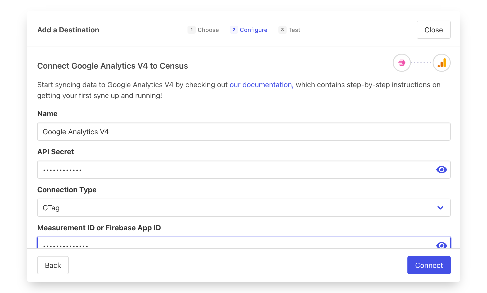

# Google Analytics 4

## 🏃‍♀️ Getting Started

In this guide, we will show you how to connect Google Analytics 4 to Census and create your first sync.&#x20;


GA4 has some very interesting behaviors with identifiers, custom fields, and delayed data indexing. If something is confusing, take a look at the [Understanding GA4 Identifiers and Quirks](google-analytics-four.md#things-to-know) section below.


### Prerequisites

* Have your Census account ready. If you need one, [create a Free Trial Census account](https://app.getcensus.com/) now.
* Have your Google Analytics account ready, with an existing **Google Analytics 4 property**. For Universal Analytics, read our docs for the [Google Analytics connector](google-analytics.md)).&#x20;
  * You'll also need admin access to create API credentials.
* Have the proper credentials to access to your data source. See our [docs for each supported data source](../sources/overview.md) for further information.

### Step 1: Add a Data Stream to your Google Analytics 4 property

In order to add a Google Analytics 4 connection, you'll need to create what Google calls a Data Stream. A Data Stream represents events from either a website or a Firebase app. Google describes the process in more detail in [their docs](https://developers.google.com/analytics/devguides/collection/protocol/ga4/sending-events?client\_type=firebase#required\_parameters).

For a Web App:

* First create a new stream or choose an existing one in **Admin** > **Data Streams**. If creating a new one, specify Web type.

<figure><figcaption></figcaption></figure>

* Then within the selected datastream, visit **Measurement Protocol** > **Create**
* Copy the **Secret Value** and the **Measurement ID**

<figure><figcaption></figcaption></figure>

****

For Firebase (iOS/Android) applications:

* First create a new stream or choose an existing one in **Admin** > **Data Streams**. If creating a new one, specify iOS or Android types.
* Then within the selected datastream, visit **Measurement Protocol** > **Create**
* Copy the **Secret Value**&#x20;
* You'll also separately need the Firebase App ID. The identifier for a Firebase app is found in the Firebase console under: **Project Settings** > **General** > **Your Apps** > **App ID**

### Step 2: **Create the Census Connection**

* Navigate to the Census [**Connections**](https://app.getcensus.com/connections) page and click **Add Service**
* Select Google Analytics 4 from the drop down list (Not Google Analytics)
* Configure the three settings:
  * Add the Secret Value in the **API Secret** box of the connection.
  * Add the Measurement ID or Firebase App ID in **App ID**
  * Specify the Connection Type: Either **GTag** for websites or **Firebase** for iOS/Android apps.

<figure><figcaption></figcaption></figure>

### Step 3: Create your first sync

The sync will move event data from your warehouse to your Google Analytics 4 property. Before continuing, you may first want to read our article on [Syncing Event Data](../basics/defining-source-data/events.md).&#x20;

1. From inside your Census account, navigate to the [**Syncs**](https://app.getcensus.com/syncs) page and click **Add Sync**.
2. Under **What data do you want to sync?**, choose your data warehouse as the **Connection** and your **source:** either a Model from the Census Models tab or a database table.
3. Under **Where do you want to sync data to?**, choose the Google Analytics 4 connection you created in Step 2 as the **Connection**.
   * Under **Object** select **Event**
4. Under **How should changes to the source be synced?**, **Append** will be automatically selected for the Events destination object.&#x20;
5. Under How are source records identified?? Select a unique Event ID from your data source. Census needs a unique identifier for each new event to sync.&#x20;
6. Under **Which properties should be updated?** Map the individual source columns to the destination fields. Some of those fields exist by default, but you may also want to add more custom properties. See below for [more information on how GA4 handles custom fields](google-analytics-four.md#custom-properties-dimensions-and-metrics).&#x20;
7. Click the **Next** button to see the final preview which will have a recap of what will happen when you start the sync. If you're happy, check the Sync Now checkbox and save the sync.
8. Confirm the data arrives in Google Analytics!

If you need any help configuring Google Analytics, contact the [Census support team](mailto:support@getcensus.com) to get some help.

## 🗄 Supported Objects and Behaviors


Learn about all of our sync behaviors in [Core Concepts](../basics/core-concept/#sync-behaviors).


|  **Object Name** | **Supported?** |               **Identifiers**              | **Behavior**                                                                                      |
| ---------------: | :------------: | :----------------------------------------: | ------------------------------------------------------------------------------------------------- |
|            Event |        ✅       |               Unique Event ID              | Append                                                                                            |
| User Properties  |        ✅       | 
Client ID or 

App Instance ID
 | 
Update Only  <em><mark style="color:orange;">(ID must already exist in GA4)</mark></em>
 |

Both Event and User Properties support sending custom properties that have already been defined in Google Analytics 4 (see below for more details on the [restrictions on custom properties](google-analytics-four.md#custom-properties-dimensions-and-metrics)). To send custom properties as part of a sync, you can add destination fields via the new Custom Field button as well as the [Properties Bundle structured object](../basics/defining-source-data/events.md#using-the-properties-bundle) which can be used to send more complex event data structures.&#x20;

[Contact us](mailto:support@getcensus.com) if you want Census to support more objects and behaviors for Google Analytics 4.

## 💡 Understanding GA4 Identifiers and Quirks

GA4 uses a combination of a half dozen different identifiers to associate the data coming from Census with data being collected directly by Google.&#x20;

#### The Property and Data Streams

A Property is the "container" like it was in UA, but now in GA4, the property can span across web and mobile apps traffic. It must be set up as a Google Analytics 4 property. If you haven't yet moved, visit [Google's docs](https://support.google.com/analytics/answer/9744165?hl=en) to learn more about migrating to Google Analytics 4.

A GA4 Property has one or more Data Streams which send data to the property (you'll actually be required to set one up [when creating a new property](https://support.google.com/analytics/answer/9304153#stream)). The typical gtag integration will be set up as a Data Stream. You can think of Census as piggybacking or enriching the user activity already happening in those data streams.&#x20;

Census connects to your GA4 property through a data stream which is uniquely identified by a combination of two of three identifiers provided when you first set up the connection (see [Step 1](google-analytics-four.md#step-1-add-a-data-stream-to-your-google-analytics-4-property)).

* An API **Secret Value** - This is a typical API Key. It should never be published anywhere public or user facing. Census will use it to securely talk directly to GA4's Measurement API.&#x20;
* One of: A **Measurement ID** for web/gtag integrations (_not_ a Stream ID) or a **Firebase App ID** (_not_ an App Instance ID - See Below)

With these two, Census can begin adding event and user data to the data stream.

**Identifying Users**

Google Analytics 4 also uses a pair of identifiers to identifier users when syncing user properties and events data.&#x20;

* A User Pseudo ID which you can think of as uniquely identifying the user on a single device. It's going to be one of:&#x20;
  * A **Client ID** for web/gtag connections. This must be collected from the browser by calling `gtag.js('get')` .&#x20;
  * An **App Instance ID** for iOS/Android connections. This must be collected from within the app context by calling the equivalent of the `getAppInstanceId()` (the method name varies by language, see [Google's documentation](https://developers.google.com/analytics/devguides/collection/protocol/ga4/sending-events?client\_type=firebase#required\_parameters)).
* Optionally, an additional **User ID**. This uniquely identifies the user across devices and can associate their activity across multiple. Note that the [property must be configured to use a User ID](https://support.google.com/analytics/answer/9213390#verify\_the\_reporting\_identity).

#### Custom Properties (Dimensions and Metrics)

Google Analytics supports custom properties they call Dimensions and Metrics, both on the event and the user scope. Their [docs have a lot of detail on this powerful functionality](https://support.google.com/analytics/answer/10075209?visit\_id=638028534254170289-3199207859\&rd=1) but there's a few things to keep in mind for Census:

* Before using Custom Dimensions and Metrics in Census, they **must be defined in Google Analytics up 48 hours before they can be used by Census**. Yeah, kinda nuts. It looks like the new Custom fields will start showing up in the first few hours but data may not populate until 24-48 hours later.&#x20;
* Google limits the number of user and event scoped custom dimensions and metrics. For most GA4 properties, a maximum of 50 custom event dimensions and 25 custom user dimensions are allowed. See [Google's docs for the up to date list of limits](https://support.google.com/analytics/answer/10075209#limits).&#x20;
* Avoid syncing "high cardinality" dimensions. [Google defines high cardinality](https://support.google.com/analytics/answer/12226705) dimension as having more than 500 unique values in a single day. So stick to using dimensions that look like categories or tags.&#x20;

#### Other Delays

One last thing to keep in mind. GA4 now supports a real-time view of events and, once the above custom dimension restrictions are passed, you should see your events in real-time (ish, up to a minute delayed in some cases). However, there are still some additional delays in reporting:

* For many Google Analytics reports, data imported this way will only shows up if the User ID has been used as a visitor to the property in the last **30 days**.
* Data takes up to **24 hours** to be fully indexed by google

[Contact us](mailto:support@getcensus.com) if your use cases don't work with these limitations. We'd love to hear how we can make this connection better in the future!
