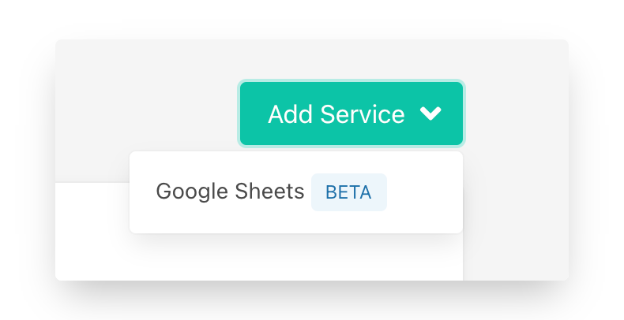
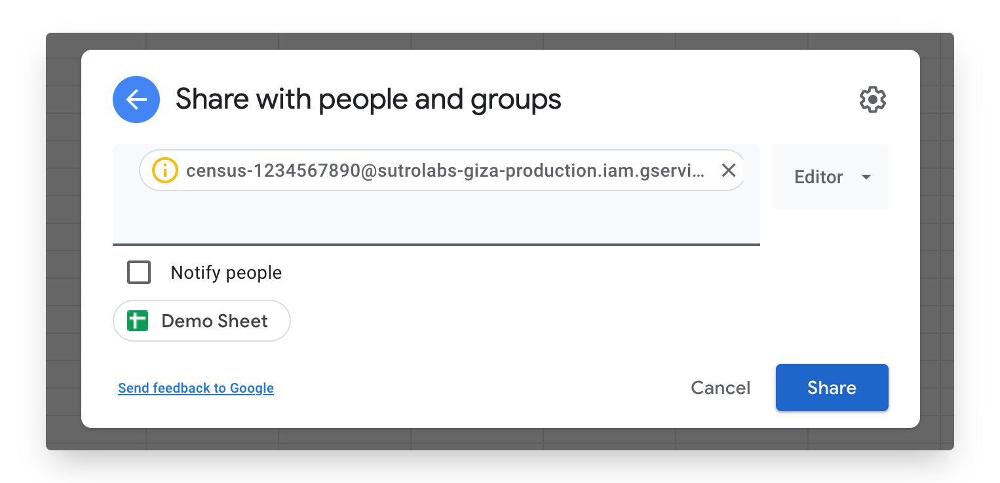
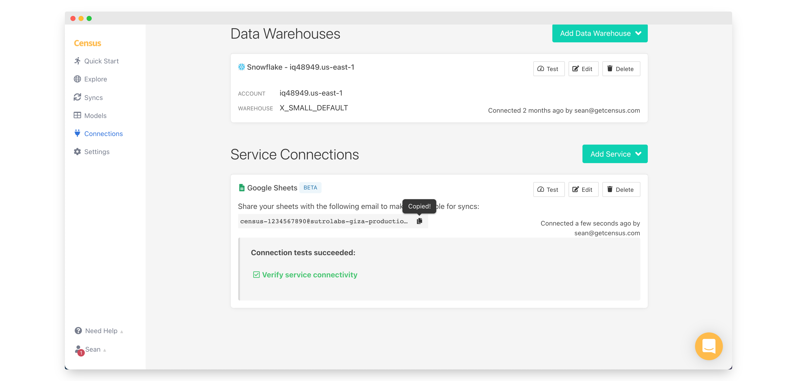
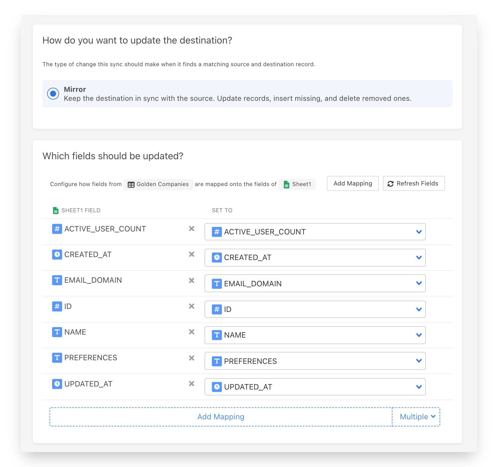
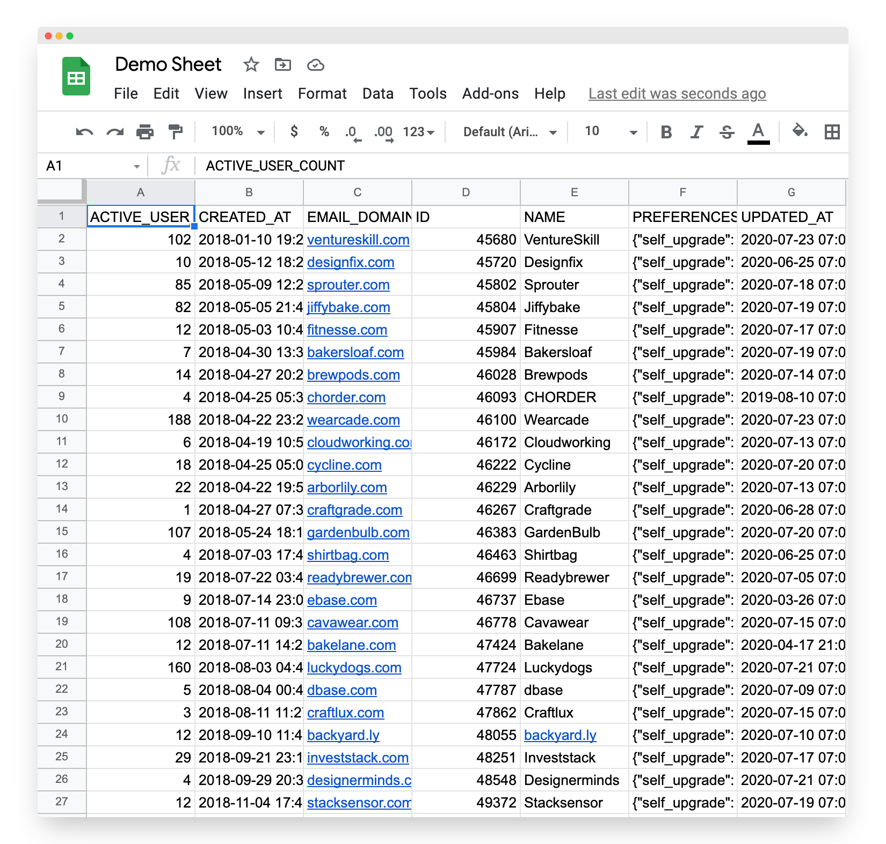

# Google Sheets

## 🏃‍♂️ Getting Started

In this guide, we will show you how to connect Google Sheets to [Census](https://www.getcensus.com/) and create your first sync.

### Prerequisites 

To get started, you'll need three things:

1. A Census account​. If you need one, [create a Free Trial Census account](https://app.getcensus.com/)​ now.
2. The Google account with access to your target Google Sheets 
3. Credential to access your data warehouse. 

### 1. Create a Google Sheets connection

Our Google Sheets connector behaves a little differently than other Census connectors. Instead of going through an OAuth connection flow, we provide you a Google Identity address you use to share the correct Google Sheets docs. This lets you be very specific about which Google Sheets you give Census access to.

* In Census, navigate to [Connections](https://app.getcensus.com/connections)
* Click the Add Service button
* Select Google Sheets in the dropdown list

Your new Google Sheets connection will include your Google Identity email. Click the copy button \(\) to save it to your clipboard, will use it in a minute.

### 2. Share your target Google Sheet

Now head to the Google Sheet you'd like to sync to. If you don't have one in mind, you can [create a new one](https://sheets.new). Either way, make sure your target Google Sheet has an empty tab inside it that Census can sync to, as the contents of which ever tab you select will be replaced by Census. 

To give Census access to your Google Sheet, press the Share button and then add paste the Google Identity email from Census into the share dialog and confirm.

### 3. Connect your data warehouse

If this is your first Census sync, you'll also need to connect your data warehouse. Follow one of our short guides depending on your data warehouse 

* [Redshift](https://help.getcensus.com/article/10-configuring-redshift-postgresql-access)
* [Postgres](https://help.getcensus.com/article/10-configuring-redshift-postgresql-access)
* [BigQuery](https://help.getcensus.com/article/21-configuring-bigquery-access)
* [Snowflake](https://help.getcensus.com/article/8-configuring-snowflake-access)
* [Databricks](../source-warehouse/databricks.md)

After setting up your warehouse, your Census Connections Page should look like this:

### 4. Create your first Model

Now navigate to the [Census's models page.](https://app.getcensus.com/models)

Here you will have to write SQL queries to select the data you want to send to your Google Sheet. Your model can be a complex query selecting details about customers and generating metrics, or as simple as a `SELECT * FROM ...`, it's up to you. Once you have created your model, click **Save Model**. 

### 5. Create your first Sync

Now head to the [Sync page](https://app.getcensus.com/syncs) and click the **Add Sync** button

In the " **What data do you want to sync?"** section

* For the **Connection**, select the data warehouse you connected in step 3
* For the **Source,**  select the model you created in step 4

Next up is the **"Where do you want to sync data to?"** section

* Pick Google Sheets as **the Connection**
* For Object, pick the Google Sheet you gave permission to in step 1 and select the tab within it that you want to sync to. As a reminder, Census will replace the contents of the tab you select so we recommend you only select a tab that's empty.

For the " **How should changes to the source be synced?"** section 

* **Mirror** will be preselected

Finally, select the fields you want to update in the Mapper in the **"Which Fields should be updated?"** section

* Here Census will pre-populate all the columns from your model in step 4. But you can choose to remove any of the fields you don't want. 
* If you plan to add more fields in the future, you'll need to edit this sync and return here to add them.

The end result should look something like this:

Click the **Next** button to see the final preview which will have a recap of what will happen when you start the sync. If you're happy, check the Sync Now checkbox and save the sync. We're off to the races.

### 6. Confirm the data is in Google Sheets

Once the sync has completed, return to your Google Sheet and the specific tab you selected. If everything went well, you should see your data in Google Sheets!

That's it! In 6 steps, you've connected Google Sheets and started syncing data from your warehouse  🎉

## 🗄 Supported Objects

Google Sheets support is pretty straight forward!

| **Object Name** | **Supported?** |
| ---: | :---: |
| Sheet Tabs | ✅ |

[Contact us](mailto:support@getcensus.com) if you want Census to support more Google Sheets functionality.

## 🔄 Supported Sync Behaviors


Learn more about all of our sync behaviors on our [Core Concepts page](../basics/core-concept.md#the-different-sync-behaviors).


| **Behaviors** | **Supported?** | **Objects?** |
| ---: | :---: | :---: |
| **Mirror** | ✅ | Sheet Tabs |

[Contact us](mailto:support@getcensus.com) if you want Census to support more Sync behaviors for Google Sheets.

## 🚑 Need help connecting to Google Sheets?

[Contact us](mailto:support@getcensus.com) via support@getcensus.com or start a conversation with us via the [in-app](https://app.getcensus.com) chat.

