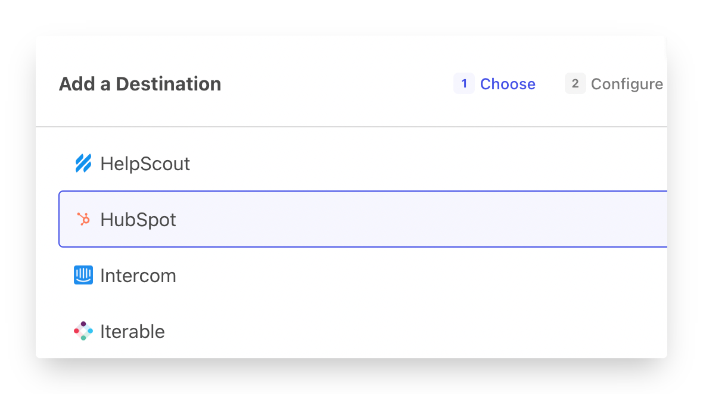
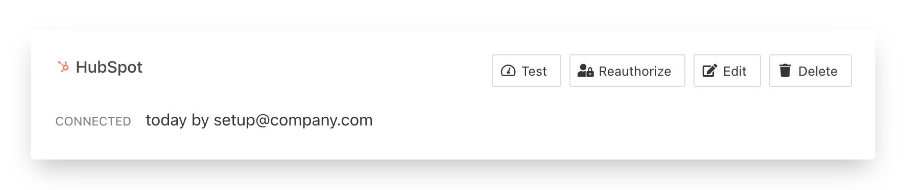
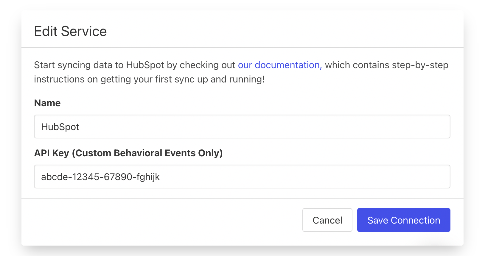

# HubSpot

## 🏃‍♀️ Getting Started

In this guide, we will show you how to connect HubSpot to Census and create your first sync.



### Prerequisites

* Have your Census account ready. If you need one, [create a Free Trial Census account](https://app.getcensus.com/) now.
* Have your HubSpot account ready.
* Have the proper credentials to access to your data source. See our docs for each supported data source for further information:
  * [Azure Synapse](../sources/azure-synapse.md)
  * [Databricks](https://docs.getcensus.com/sources/databricks)
  * [Elasticsearch](https://docs.getcensus.com/sources/elasticsearch)
  * [Google BigQuery](https://docs.getcensus.com/sources/google-bigquery)
  * [Google Sheets](https://docs.getcensus.com/sources/google-sheets)
  * [MySQL](https://docs.getcensus.com/sources/mysql)
  * [Postgres](https://docs.getcensus.com/sources/postgres)
  * [Redshift](https://docs.getcensus.com/sources/redshift)
  * [Rockset](https://docs.getcensus.com/sources/rockset)
  * [Snowflake](https://docs.getcensus.com/sources/snowflake)
  * [SQL Server](https://docs.getcensus.com/sources/sql-server)

### 1. Connect HubSpot

* Once you are in Census, Navigate to [Connections](https://app.getcensus.com/connections)
* Click the **Add Service** button
* Select HubSpot in the Add Destination menu and click **Connect**

Follow HubSpot OAuth flow to connect HubSpot. Your end state should look something like this below.&#x20;


If you plan on using Custom Behavioral Events, you'll also need to provide a

separate API Key. See [#custom-behavioral-events](hubspot.md#custom-behavioral-events "mention") section below.


### 2. Connect your Data Warehouse

Please follow one of our short guides depending on your data warehouse technology

* [Redshift](https://help.getcensus.com/article/10-configuring-redshift-postgresql-access)
* [Postgres](https://help.getcensus.com/article/10-configuring-redshift-postgresql-access)
* [BigQuery](https://help.getcensus.com/article/21-configuring-bigquery-access)
* [Snowflake](https://help.getcensus.com/article/8-configuring-snowflake-access)

After setting up your warehouse, your Census Connections Page should look like this

### 3. Create your first Model

Now navigate to the [Model section of our Dashboard](https://app.getcensus.com/models)

Here you will have to write SQL queries to select the data you want to see in HubSpot. Here are some ideas of data you should select

* The Lifetime Value of a customer and add it to a contact or companies
* The end of their trial
* The date they became active in your product
* The number of key activities a user did in your app in the last 7/30 days

Once you have created your model, click save.&#x20;

### 4. Create your first Sync

Now head to the [Sync page](https://app.getcensus.com/syncs) and click the **Add Sync** button

In the " **What data do you want to sync?"** section

* For the **Connection**, select the data warehouse you connected in step 2
* For the **Source,**  select the model you created in step 3

Next up is the **"Where do you want to sync data to?"** section

* Pick HubSpot as **the Connection**
* For Object, pick the one you want to sync data to; Contact or Company.

For the " **How should changes to the source be synced?"** section&#x20;

* Select your desired Sync Behavior from **Update or Create**, **Update Only, or Mirror**
* Pick the right mapping key, it could be Email for Contacts, Domain for Companies but we recommend you use your own internal id if possible

Finally, select the fields you want to update in the Mapper in the **"Which Fields should be updated?"** section

* Here simply map the field from your HubSpot instance to the column from your model.

The end result should look something like this

Click the **Next** button to see the final preview which will have a recap of what will happen when you start the sync

### 5. Confirm the data is in HubSpot

Now go back to your HubSpot and go view a record type (Contact or Company) that should have been updated. If everything went well, you should see your data in HubSpot

that's it, in 5 steps, you connect Census to HubSpot and started syncing customer & product data from your warehouse to HubSpot 🎉

## 🏎 Sync Speed

Census connects to HubSpot using their "Connected App" model, which are not subject to the daily HubSpot API call limit, only to the burst limit (100 requests/10 sec). Your Census syncs will not impact your HubSpot daily API limits or nor any other HubSpot integrations. For more information, see [HubSpot docs](https://legacydocs.hubspot.com/apps/api\_guidelines).


The choice of your sync identifier and behavior can have _**very drastic**_** ** performance impacts to your sync.&#x20;

Using a HubSpot Object ID or Contact Email as identifiers in HubSpot is fast, but using all other fields as identifiers is _**very**_ slow. That means that any syncs that create new records in HubSpot (other than Contacts by Email) will be slow. We're working with HubSpot to try and increase the speed of their APIs in order to improve our HubSpot sync speed.


| **Service**                 | Public API rate limit | **Records sync / Minute** |
| --------------------------- | --------------------- | ------------------------- |
| HubSpot (Free & Start Plan) | 600 calls / min       | \~600                     |
| HubSpot (Pro & Enterprise)  | 900 calls / min       | \~900                     |
| API Boost Add-on            | 1,200 calls / min     | \~1,200                   |

Please be aware that with Custom Objects require extra API calls and are even slower as a result (about 1/3 the speed).

## 🗄 Supported Objects

[Contact us](mailto:support@getcensus.com) if you're looking for Census to support other HubSpot objects!

|                 **Object Name** | **Supported?** | **Identifiers**                   |
| ------------------------------: | :------------: | --------------------------------- |
|                         Company |        ✅       | Object ID, any Text/Number        |
|                         Contact |        ✅       | Object ID, any Text/Number        |
|                            Deal |        ✅       | Object ID, any Text/Number        |
|                         Product |        ✅       | Object ID, any Text/Number        |
|                       Line Item |        ✅       | Object ID, any Text/Number        |
|                   Custom Object |        ✅       | Object ID, any searchableProperty |
|         Custom Behavioral Event |        ✅       | Unique Event ID                   |
| Engagements (Task, Call, Email) |       🔜       |                                   |

#### Custom Objects (Available on HubSpot Enterprise plans)

As of March 2021, only properties in the searchableProperties set are usable as sync identifiers to HubSpot Custom Objects. This is a bit confusing as this label only appears in the HubSpot API. A searchable property can be added to a Custom Object via HubSpot's API. The calls to make this update can be found in HubSpot's [Custom Objects API Docs](https://t.sidekickopen08.com/s3t/c/5/f18dQhb0S7kF8cFC2RW1K7Z1759hl3kW7\_k2841CXdp3VP16Md1G7ysXW2dykfC1TtC07101?te=W3R5hFj4cm2zwW3H4THp3ZZnXLW49Rd2x4hCWyFW43X00w43T4NTW43P1-Z3zfPd7W3FcKxL3FcKxJW3Fd-wl43T4CBw3C9Ryyb7l2\&si=8000000004039937\&pi=71ef6659-f8eb-4943-8de6-e67c9ea6453c) > Object Schema Tab > searchableProperties.&#x20;

Additionally, HubSpot has some apps available in their marketplace like [Dotsquares](https://hubspot.dotsquares.com/easy-custom-objects-setup/) that can assist with Custom Object management.&#x20;

If you need a hand making one of your existing Custom Object fields as searchable, please contact Census's Support team and we can walk you through it!&#x20;

#### Custom Behavioral Events

Custom Behavioral Events require a little bit of prep work. You'll first need to jump into HubSpot and do two steps:

**Step 1**, get your HubSpot API key (unfortunately, this type of object needs a slightly different credential than the rest of HubSpot). You can do that within the **Integrations > API Key** section of **Settings**. One twist, you'll need Super Admin privileges to access it.[ HubSpot has all the details in their docs](https://knowledge.hubspot.com/integrations/how-do-i-get-my-hubspot-api-key). Once you have your API Key, visit [Census's Connections page](https://app.getcensus.com/connections) and use the **Edit** button on your existing HubSpot connection to store the key in Census.

**Step 2**, create the Custom Behavioral Event, see [HubSpot's instructions for how to do that](https://knowledge.hubspot.com/analytics-tools/create-custom-behavioral-events). You'll need to both create the event AND add all of the custom properties beforehand. Once you've done so, copy and paste HubSpot's internal name for object, you'll need to provide that to the `Event Name` property during the Census sync.&#x20;

Note: The custom fields you've added will not show inside Census, you'll need to use the `New Custom Field` option to create the matching fields on Census, make sure they're named exactly the same (keep in mind, names are case sensitive!).

## 🔄 Supported Sync Behaviors


Learn more about what all of our sync behaviors on our [Core Concept page](../basics/core-concept/#the-different-sync-behaviors).


|        **Behaviors** | **Supported?** | **Objects?** |
| -------------------: | :------------: | :----------: |
| **Update or Create** |        ✅       |      All     |
|      **Update Only** |        ✅       |      All     |
|           **Mirror** |        ✅       |      All     |

[Contact us](mailto:support@getcensus.com) if you want Census to support more Sync Behaviors for HubSpot.

## 🔑 Require Permissions

Census requires that the connecting HubSpot user have Super Admin permissions in order to access all supported HubSpot objects. If you have limited permissions and still want to connect Census to HubSpot, contact the [contact the Census support team](mailto:support@getcensus.com).

## 🚑 Need help connecting to HubSpot?

[Contact us](mailto:support@getcensus.com) via support@getcensus.com or start a conversation with us via the [in-app](https://app.getcensus.com) chat.
