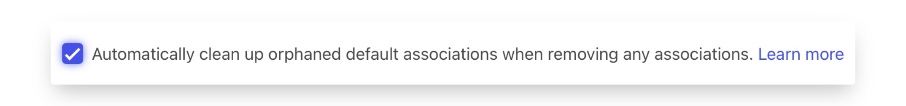

# HubSpot

## Getting Started

In this guide, we will show you how to connect HubSpot to Census.



### Connecting HubSpot

* Within Census, navigate to the [Destinations page](https://app.getcensus.com/destinations).
* Click the **New Destination** button.
* Select HubSpot from the menu and click **Connect.**


Follow the OAuth flow to connect HubSpot. Easy!

## Supported Objects and Sync Behaviors <a href="#supported-objects-and-sync-behaviors" id="supported-objects-and-sync-behaviors"></a>

| **Object Name**          | **Supported?** | **Sync Keys**                                         | **Behaviors**                                              |
| ------------------------ | :------------: | ----------------------------------------------------- | ---------------------------------------------------------- |
| Appointment              |        ✅       | Object ID, qualifying custom properties\*             | Update Only, Update or Create, Mirror                      |
| Company                  |        ✅       | Object ID, Domain, and qualifying custom properties\* | Update Only, Update or Create, Mirror                      |
| Contact                  |        ✅       | Object ID, Email, and qualifying custom properties\*  | Create Only, Update Only, Update or Create, Mirror, Delete |
| Contact & Static List    |        ✅       | Email                                                 | Update Only, Update or Create, Mirror                      |
| Deal                     |        ✅       | Object ID, and qualifying custom properties\*         | Create Only, Update Only, Update or Create, Mirror         |
| Custom Behavioral Event  |        ✅       | Unique Event ID                                       | Send                                                       |
| Custom Object            |        ✅       | Object ID, any searchableProperty                     | Update Only, Update or Create, Mirror                      |
| Email                    |        ✅       | N/A                                                   | Send                                                       |
| Lead                     |        ✅       | Lead Name                                             | Create Only, Update Only, Update or Create, Mirror         |
| Line Item                |        ✅       | Object ID, and qualifying custom properties\*         | Update Only, Update or Create, Mirror                      |
| Product                  |        ✅       | Object ID, and qualifying custom properties\*         | Update Only, Update or Create, Mirror                      |
| Static List Membership   |        ✅       | Record ID                                             | Update or Create, Mirror                                   |
| Subscription Preferences |        ✅       | Email                                                 | Mirror                                                     |
| Ticket                   |        ✅       | Record ID                                             | Send                                                       |

Contact the support team if you want Census to support more Hubspot objects and/or behaviors

#### Qualified Custom Properties for Sync Keys

In order to use a Custom Property as a Sync Key in Census, it must be one of the following types:

* Single-line Text
* Number

Additionally, we **strongly** recommend this field be [marked as Unique](https://knowledge.hubspot.com/properties/create-and-edit-properties). **Using a non-unique custom property will significantly degrade your sync speed**. &#x20;

Unfortunately, this can only be done when the property is created in HubSpot. Depending on the volume and frequency of your HubSpot syncs, it may be worth re-creating the property in HubSpot to add the unique rule.&#x20;

### Contact Emails

Please note that an email address already associated with a Contact cannot be used for another Contact. If you attempt to update a Contact record with an email address that is already in use, the field will not be updated.

### Custom Objects

Custom Objects are available to customers on HubSpot's Enterprise plans.

To ensure a Hubspot Custom Object property can be used as a **Sync Key** within Census the object must be updated to include the property as a `searchableProperties`.

Hubspot currently restricts users to updating this property via the Hubspot API.&#x20;


This is not the same as configuring a property to 'Show in global search results' within the HubSpot UI


The calls to make this update can be found in HubSpot's [Custom Objects API Docs](https://developers.hubspot.com/docs/api/crm/crm-custom-objects) > Object Schema Tab > searchableProperties.

HubSpot offers some third party apps, available in their marketplace that can also assist with Custom Object management.

#### API How To

* Retrieve (or create) [a private app access token](https://developers.hubspot.com/docs/guides/apps/private-apps/overview#make-api-calls-with-your-app-s-access-token) to make API calls to Hubspot.
* Perform a GET request to the `/crm/v3/schemas` endpoint. Then, search the response to identify the `objectTypeId` of the custom object you wish to update, as well as the `name` of the field you want to modify.

Here is an example request:

```url
curl --location 'https://api.hubapi.com/crm/v3/schemas' \
--header 'Authorization: Bearer {YourPrivateToken}' \
--header 'Content-Type: application/json' \
```

The values will look something like this:

```json
"objectTypeId": "2-41250440",
"name": "property_name_example",
```

* Complete a PATCH request to the `/crm/v3/schemas/{objectTypeId}` endpoint. Ensure you use the `objectTypeId` you identified in the previous step and include the following request body:

```json
{
  "searchableProperties": [
    "property_name_example"
  ]
}
```

Here is an example request with the `objectTypeId` as `2-41250440`:

```
curl --location --request PATCH 'https://api.hubapi.com/crm/v3/schemas/2-41250440'
--header 'Content-Type: application/json'
--header 'Authorization: Bearer {YourPrivateToken}'
--data '{ "searchableProperties": [ "property_name_example" ] }'
```

* Refresh the Object within a Census Sync, it should now display the new field in the Sync Key options.&#x20;

For additional support, please contact the support team and we can walk you through it.

### Custom Behavioral Events

Custom Behavioral Events require a bit of prep work. You'll first need to go into HubSpot and create your event (see [HubSpot's instructions for how to do that](https://knowledge.hubspot.com/analytics-tools/create-custom-behavioral-events)).

You'll need to both create the event AND add all of the custom properties beforehand. Once you've done so, copy and paste HubSpot's **internal name** for the object—you'll need to provide that to the `Event Name` property during the Census sync.

Hubspot also requires either the contact ID, email or utk of the contact associated with the event.

Note: The custom fields you've added will not show inside Census. You'll need to use the **New Custom Field** option to create the matching fields in Census. Make sure they're named exactly the same (names are case-sensitive).

### Subscription Preferences

Subscription preferences allow you to manage which users are subscribed or unsubscribed from your existing marketing subscriptions (Currently, HubSpot does not allow external services to programmatically create new subscriptions).

HubSpot Subscription Preferences syncs require additional fields when using HubSpot's GDPR portal:

* **Legal Basis** One of the following values: `LEGITIMATE_INTEREST_PQL`, `LEGITIMATE_INTEREST_CLIENT`, `PERFORMANCE_OF_CONTRACT`, `CONSENT_WITH_NOTICE`, `NON_GDPR`, `PROCESS_AND_STORE`, `LEGITIMATE_INTEREST_OTHER`.
* **Legal Basis Explanation** A more detailed explanation to go with the legal basis.

The same value provided for these fields will be used for both subscribing and unsubscribing a user.


Census can only remove contacts from subscriptions that were originally created by Census.


### Managing Object Associations

HubSpot supports an advanced method of defining relationships between objects called [Associations](https://knowledge.hubspot.com/crm-setup/create-and-use-association-labels). Associations have a number of different properties:

* They're supported between all HubSpot object pairs, including Custom Objects.
* They can represent one-to-many and many-to-many relationships.
* Associations can be labeled or unlabeled. HubSpot Professional and Enterprise plans also support custom labels.

Many-to-many associations can be updated in Census syncs on either side of the associations, while one-to-many associations can only be set on the child or "many" side.

<figure><figcaption><p>Census Company/Contact Association</p></figcaption></figure>

#### Labeled Associations

Labels in HubSpot can be complex. Census provides some advanced configurations to make updating and removing labels a bit more straightforward.

When creating a labeled association between two objects in HubSpot, HubSpot will also automatically create an unlabeled association. Additionally, when creating an association from a Contact to a Company, HubSpot will create another association labeled Primary. That means that adding a labeled association with a Census sync may actually create up to three associations.

<figure><figcaption><p>Hubspot Labeled Association</p></figcaption></figure>

<figure><figcaption><p>Census Labeled Association Sync Mapping</p></figcaption></figure>

Unfortunately, HubSpot does not offer a way to remove these default associations when they're no longer necessary after removing the labeled association Census created. These associations may have actually been created intentionally so Census also cannot delete them automatically.

To navigate this, Census provides an option to automatically clean up orphaned default associations when removing any associations.



When this behavior is enabled and a Census sync removes a labeled association, we'll also check to see if the remaining associations are only the unlabeled and Primary labeled associations. If so, we'll automatically remove those associations as well.

By default, this feature is not enabled to avoid accidentally deleting associations that were created outside the sync and should still exist.

### Formatting Data for Hubspot Data Types

**Object references (Associations):** will be mapped to a Hubspot Array of Reference data type. The source data should be formatted in an array.

**Example:** `["RecordID_1", "RecordID_2"]`

**Multiple Checkboxes (Enumerated fields):** will be mapped to a Hubspot Array of Enumeration. The source data should also be formatted as an array. Additionally, HubSpot expects the options provided to be the Internal Value as given by Hubspot's property settings page.

**Example:** `["InternalValue1", "InternalValue2", "InternalValue3"]`

### Delete Behaviour

In Mirror syncs, Census will perform a "soft delete" and archive records instead of permanently deleting them.&#x20;

We also support HubSpot's "GDPR Delete", which is a permanent deletion. This sync behaviour is available on the Contact object: set the GDPR Delete endpoint toggle to `TRUE`.&#x20;

<figure><figcaption></figcaption></figure>

## Sync Speed

Census uses a variety of APIs to achieve the highest possible speed. With the right sync configuration (see below), Census can **update 10,000 contacts per second**. Census connects to HubSpot via OAuth, which is subject to a limit of 100 requests every 10 seconds (except for the Search API). For more information, see the [HubSpot documentation](https://developers.hubspot.com/docs/api/usage-details).


Your choice of sync key and behavior can have significant performance implications.

Using HubSpot Object IDs or Contact emails as identifiers in HubSpot is fast, but using all other fields as identifiers is very slow. That means any syncs that create new records in HubSpot (other than Contacts by email) will be slow. However, if a custom field is unique, it will significantly improve performance compared to non-unique custom fields. We're working with HubSpot to increase the speed of their APIs in order to improve sync speed.


Please be aware that Custom Objects require additional API calls and are even slower as a result (\~1/3 the speed).

## 🔑 Required Permissions

Census requires that the connecting HubSpot user have Super Admin permissions in order to access all supported HubSpot objects.

## 🆘 Common Errors

There's a few errors which frequently cause skipped records on when syncing data to Hubspot.

* `TypeCastError: Empty input (after ) at line 1, column 1 [parse.c:1060] in 'InternalValue1;`When syncing to a Multiple Checkbox (Enumerated) field, the source data should be formatted as an array instead of adding a semicolon between each value.
* `Multiple Contacts found with ID 123456`When syncing associations, the `Lookup By` field should be unique. For example, if we have a Company sync with a contact association in the field mapping and the `Lookup By` field is a non-unique ID field, we will reject the Company record if we find multiple Contacts with that ID.

## :electric\_plug: Disconnecting HubSpot

If you need to disconnect HubSpot from Census for any reason, you can delete your connection from the Destinations page in Census and/or uninstall the Census app from your HubSpot account by following [these instructions](https://knowledge.hubspot.com/integrations/connect-apps-to-hubspot#uninstall-an-app). Note that you won't be able to sync new data from Census until the connection is restored, but no previously synced data in HubSpot will be impacted.

## Need help connecting to HubSpot?

Contact the support team or start a conversation with us via the [in-app](https://app.getcensus.com) chat.
