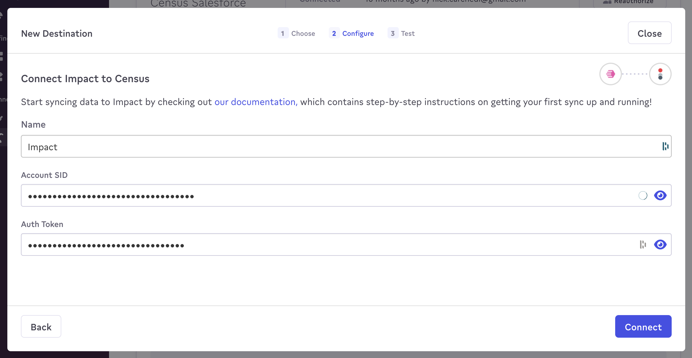

# Impact

## 🏃‍♀️ Getting Started

1. Go to the **Destinations** tab and click **New Destination**.
2. Select **Impact** from the menu.
3. Enter your Impact **Account SID** and **Auth Token**.

<figure><figcaption>
Enter your Impact credentials to connect.
</figcaption></figure>

## 🔀 Supported Objects and Sync Behaviors 

| **Object Name** | **Supported?** | **Sync Keys**  | **Behaviors** |
| --------------: | :------------: | ---------------- |---------------|
| Conversion | ✅ | Any unique identifier | Send          |

[Contact us](mailto:support@getcensus.com) if you want Census to support more Impact objects and/or behaviors.

## 🚑 Need help connecting to Impact?

[Contact us](mailto:support@getcensus.com) via support@getcensus.com or start a conversation with us via the [in-app](https://app.getcensus.com) chat.
