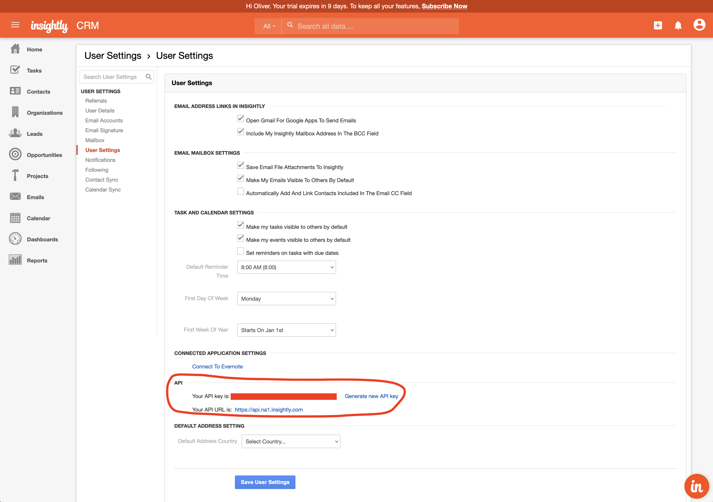

# Insightly

## 🏃‍♀️ Getting Started

1. Click **Add Service**.
2. Select **Insightly** from the menu.
3. Enter your **API Key** and **Instance Pod**. These can both be found on the **User Settings** page in the Insightly app. Note: if your API URL is _https://api.na1.insightly.com_, then your Instance Pod is `na1`.

<figure><figcaption>
Get your API key and instance pod from the Insightly app.
</figcaption></figure>

## 🔀 Supported Objects and Behaviors

| **Object Name** | **Supported?** | **Identifiers**  | **Behaviors**       |
| --------------: | :------------: | ---------------- | ------------------- |
|         Contact |        ✅       | Contact ID, Email | Update Only, Append |

[Contact us](mailto:support@getcensus.com) if you want Census to support more Insightly objects and/or behaviors.

## 🚑 Need help connecting to Insightly?

[Contact us](mailto:support@getcensus.com) via support@getcensus.com or start a conversation with us via the [in-app](https://app.getcensus.com) chat.
