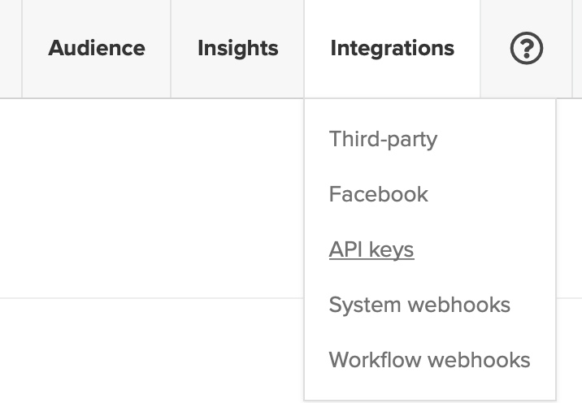
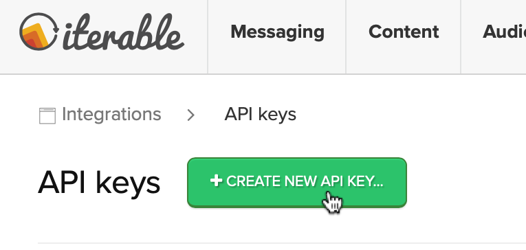
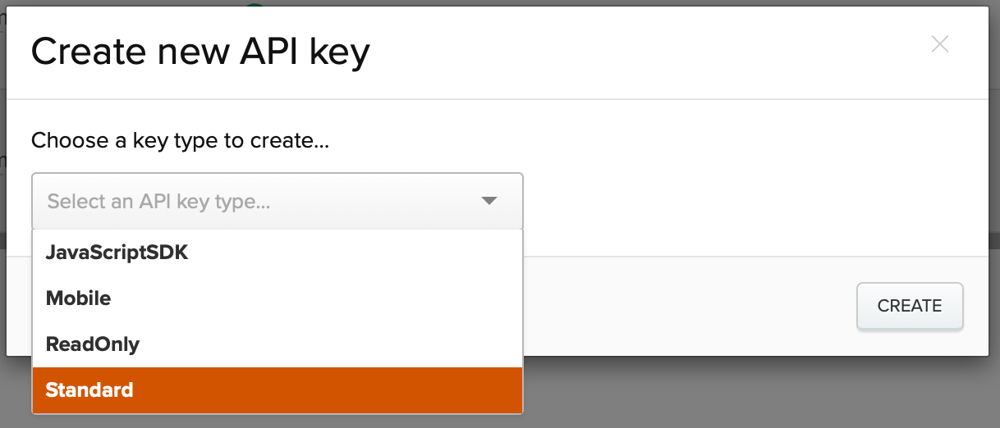
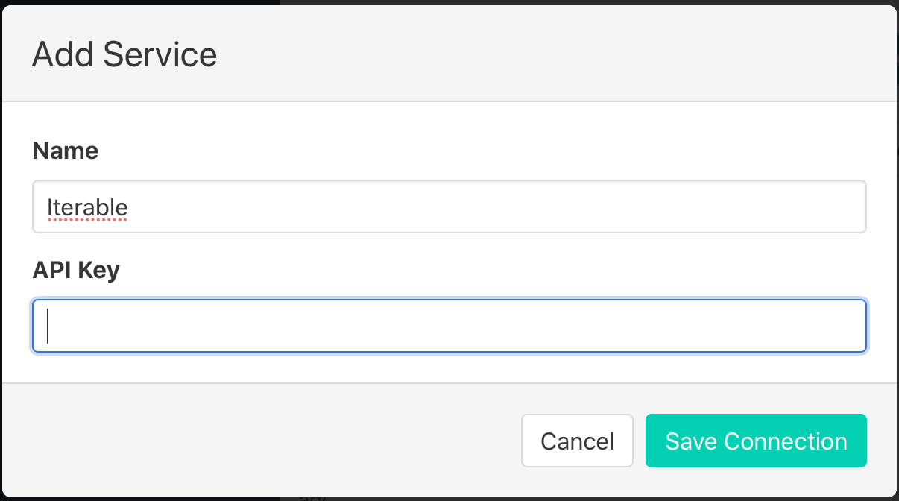
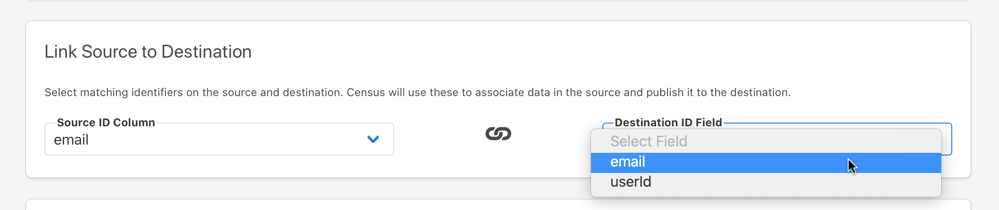
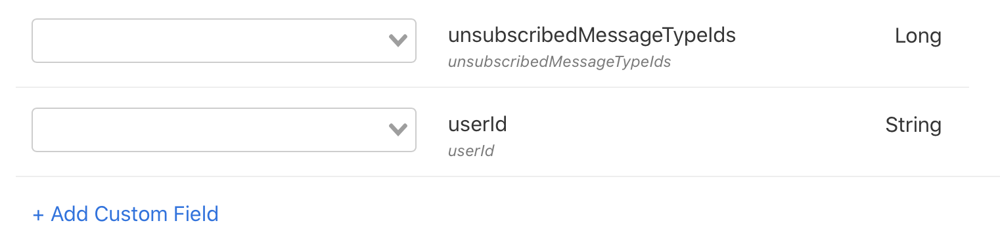

# Iterable


Please note that for larger syncs, it might take ~10 minutes for you to see the new data in Iterable's UI.


## 🏃‍♀️ Getting Started

In this guide, we will show you how to connect Iterable to Census and create your first sync.

### Prerequisites

* Have your Census account ready. If you need one, [create a Free Trial Census account](https://app.getcensus.com/) now.
* Have your Iterable account ready.
* Have the proper credentials to access to your data source. See our docs for each supported data source for further information:
  * [Databricks](https://docs.getcensus.com/sources/databricks)
  * [Google BigQuery](https://docs.getcensus.com/sources/google-bigquery)
  * [Google Sheets](https://docs.getcensus.com/sources/google-sheets)
  * [Postgres](https://docs.getcensus.com/sources/postgres)
  * [Redshift](https://docs.getcensus.com/sources/redshift)
  * [Rockset](https://docs.getcensus.com/sources/rockset)
  * [Snowflake](https://docs.getcensus.com/sources/snowflake)

### 1. Create a new Iterable API key

To connect Census to your Iterable, you'll need to provide Census with an API key so that we can talk to it directly. 

**A. Go to your Integration &gt; API keys page**

In the top right, click on your name, and select Account Settings



**B. Create a new key for Census**

Click the Create New API key button in the top left.



Select the "Standard" key type from the subsequent dropdown. 



Copy the resulting key \(a string of 32 characters\) to add it to Census.

**C. Create a new Iterable connection in Census**

* Visit the Connections tab in Census
* Then select Iterable from the Add Service menu
* Finally, paste in the API Key you just created. You can customize the name of the connection if you plan to connect multiple instances of Iterable.



Iterable will now appear as a new destination for Census syncs. 

### 2. Syncing data into Iterable

Once the service is added, you can sync users from your database into your Iterable audience \(and augment existing contacts with new product data\).

When creating a sync in Census, you can use _email_ or _userId_ as an identifier. 



You can map data fields into your existing Iterable audience schema \(including into nested schemas\). You can also create new custom fields by clicking "+ Add Custom Field" when editing the mapping.



## 🗄 Supported Objects

| **Object Name** | **Supported?** | Identifiers |
| ---: | :---: | :--- |
| User | ✅ | User ID, Email |
| Event | ✅ | Event ID |
| Catalogs | ✅ | Key |

[Contact us](mailto:support@getcensus.com) if you want Census to support more objects for Iterable.

### Handling Nested Objects

Iterable supports nested objects and fields on its User object. If you would like to send JSON, Arrays, or JSON Arrays to a field in Iterable, you may.

For most data warehouses, there are specific datatypes for these types of values. However, Amazon Redshift does not natively support JSON, so you will want to store this type of data as a string value. Provided that the values are valid JSON, Census will ensure that it is nested as expected when sending the data to Iterable. 

As an example, valid JSON for a field named "subscription" could have the following value:

```text
{
  "plan": "Premium",
  "products": [
      "unlimited_users",
      "24_hr_support_sla"
    ]
}
```

We recommend testing your JSON fields in Redshift by using Redshift's [`IS_VALID_JSON`](https://docs.amazonaws.cn/en_us/redshift/latest/dg/IS_VALID_JSON.html) and [`IS_VALID_JSON_ARRAY`](https://docs.amazonaws.cn/en_us/redshift/latest/dg/IS_VALID_JSON_ARRAY.html) functions, especially before creating new fields in Iterable via Census's field mapper.

### Syncing to Catalogs

Iterable Catalogs let you create custom objects within Iterable that can be associated with users. Here's a few tips when using Catalogs to make sure your sync is successful.

* Census will rely on the schema you've defined inside Iterable. We don't currently allow you to create fields from Census. 
* We strongly recommend that you specify the type of each catalog field through the Iterable UI before using Census to sync items. Untyped fields are not searchable by collections. And andy catalog item uploaded _before_ a field is typed will not have searchable by that field. If we see an untyped field in Census, we will send string values to that field because we don't know what type it should be.
* In practice, even if a field is typed, Iterable will accept and update field values of different types. For instance, if the `age` field is typed as a Long, but we send a value of "25", Iterable will accept and update records to use the string "25" as age. 
* Iterable can take a while to process new Catalog items. In some cases, we see Iterable take as long as 20 minutes before the record appears. 

## 🔄 Supported Sync Behaviors


Learn more about what all of our sync behaviors on our [Core Concept page](../basics/core-concept.md#the-different-sync-behaviors).


| **Behaviors** | **Supported?** | **Objects?** |
| ---: | :---: | :---: |
| **Update or Create** | ✅ | User, Catalog |
| **Update Only** | ✅ | User |
| **Append** | ✅ | Event |
| **Mirror** | ✅ | Catalog |

[Contact us](mailto:support@getcensus.com) if you want Census to support more Sync Behaviors for Iterable.

## 🚑 Need help connecting to Iterable?

[Contact us](mailto:support@getcensus.com) via support@getcensus.com or start a conversation with us via the [in-app](https://app.getcensus.com) chat.

