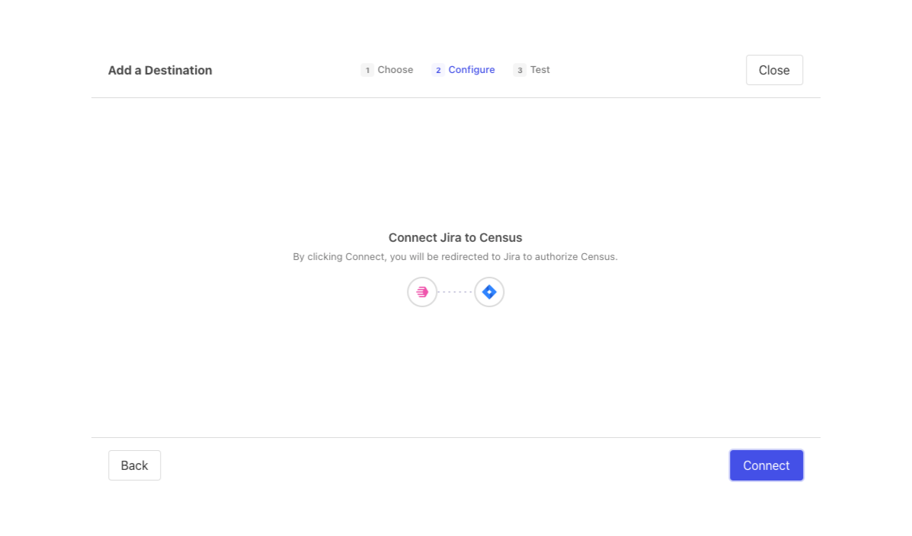
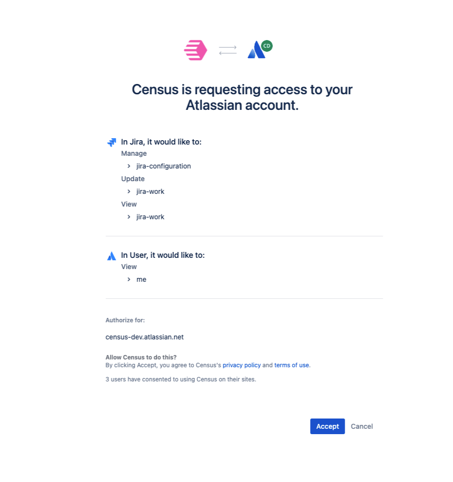
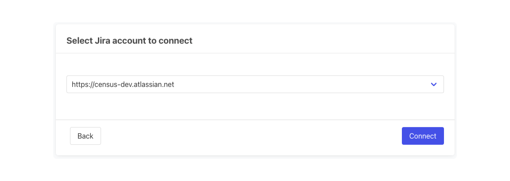
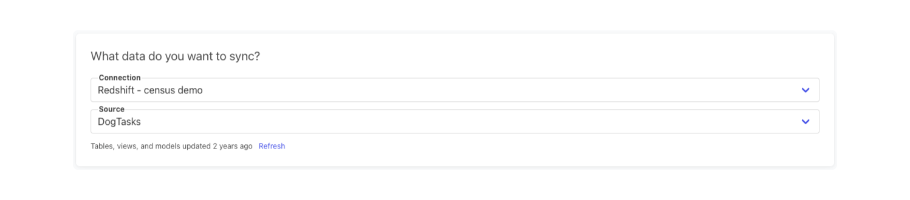
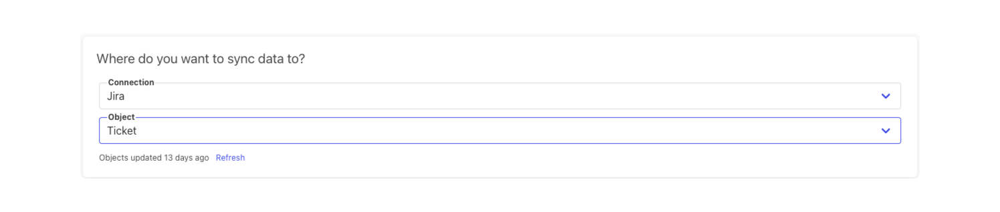
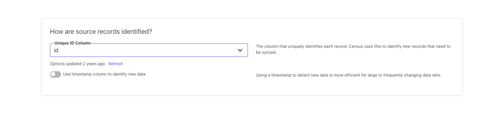
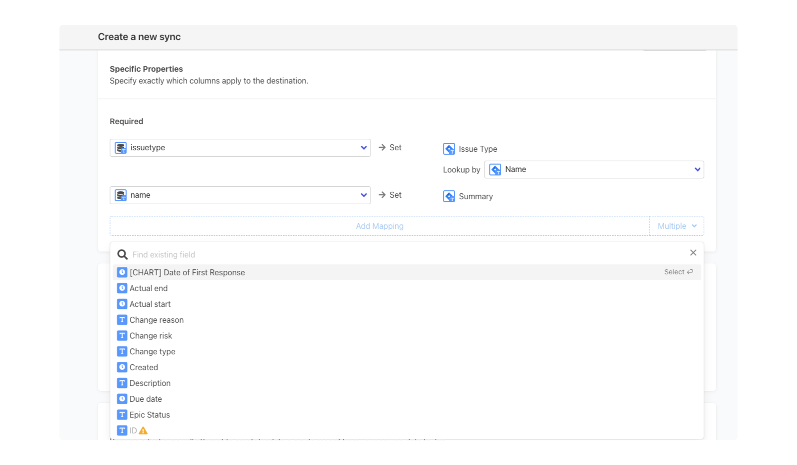

# Jira

## 🏃‍♀️ Getting Started

‌In this guide, we will show you how to connect Jira to Census and create your first sync.

### Prerequisites

* Have your Census account ready. If you need one, [create a Free Trial Census account](https://app.getcensus.com/) now.
* Have your Jira account ready.
* Have the proper credentials to access to your data source. See our docs for each supported data source for further information:
  * [Amazon Athena](../sources/aws-athena.md)
  * [Azure Synapse](../sources/azure-synapse.md)
  * [Databricks](https://docs.getcensus.com/sources/databricks)
  * [Elasticsearch](https://docs.getcensus.com/sources/elasticsearch)
  * [Google AlloyDB](../sources/alloydb.md)
  * [Google BigQuery](https://docs.getcensus.com/sources/google-bigquery)
  * [Google Sheets](https://docs.getcensus.com/sources/google-sheets)
  * [MySQL](https://docs.getcensus.com/sources/mysql)
  * [Postgres](https://docs.getcensus.com/sources/postgres)
  * [Redshift](https://docs.getcensus.com/sources/redshift)
  * [Rockset](https://docs.getcensus.com/sources/rockset)
  * [Snowflake](https://docs.getcensus.com/sources/snowflake)
  * [SQL Server](https://docs.getcensus.com/sources/sql-server)

### 1. Connect to Jira

* Once you are in Census, navigate to [Destinations](https://app.getcensus.com/destinations)
* Click the New Destination button
* Select Jira in the list, and click Connect

You will be redirected to a page to log in to Jira to authorize access to your account. Once you sign in, you'll see a page like the image below, confirming you want to authorize Census.

You'll then be prompted to select a Jira account to connect - choose the appropriate account in the dropdown and click Connect.

### 2. Create your Model

Navigate to the [Models page in Census](https://app.getcensus.com/models)

Here you can write a SQL query to select the data you want to see in Jira, or you can use a model from a dbt project or a Looker Look. Your data will require the following at minimum to populate a new Jira task:

* Id
* Task Type
* Summary

Once you have created your model, click Save.

### 3. Create your Sync

Now head to the [Sync page](https://app.getcensus.com/syncs) and click the Add Sync button

In the "What data do you want to sync?" section.

* For the Connection, select the data warehouse you've already connected (See Prerequisites).
* For the Source, select the model you created in step 2.

Next up is the "Where do you want to sync data to?" section.

* Pick the Jira connection you created in step 1.
* For Object, select Issue within the correct Jira project in your connection.

For the "How do you want to update the destination?" section, Add is the only option at this time.

For the "How are source records identified?" section, there are two options:

* Unique ID column: The column that uniquely identifies each record. Census uses this to identify new records that need to be synced.
* Timestamp: Using a timestamp to detect new data is more efficient for large or frequently changing data sets.

The Unique ID is always required; select the field from your model you want to map to that the identifier.

Finally, select the fields you want to update in the Mapper in the "Which properties should be updated?" section. Here simply map the field from your Jira instance to the column from your model.

Click the Next button to see the final preview, which will have a recap of what will happen when you start the sync.

## 🗄️ Supported Objects 

Jira's primary object is an Issue, which we support in Census.​

| **Object Name** | **Supported?** | **Sync Keys** | **Behaviors** |
| :-------------: | :------------: | :-------------: |:-------------:|
|      Issue      |        ✅       |    Unique ID    |      Add      |


Learn more about all of our sync behaviors on our [Core Concepts page](../basics/core-concept/#the-different-sync-behaviors).


[Contact us](mailto:support@getcensus.com) if you want Census to support more Sync behaviors or Objects for Jira.

If run into a dead end, start a conversation with us via the [in-app](https://app.getcensus.com/) chat.
