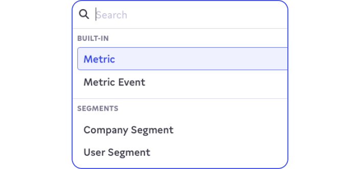

# LaunchDarkly

## 🏃‍♀️ Getting Started

1. Click **Add Service**.
2. Select **LaunchDarkly** from the menu.
3. Open the LaunchDarkly app in another window to find the following credentials:
  - **Service Access Token**: create a new token from **Account settings** > **Authorization**. Assign the role `Writer` and check the box next to **This is a service token**.
  - **Client Side ID**: go to **Account settings** > **Projects** and either click on an existing project or create a new one to get this ID.

<figure><figcaption>
Create a Service Access Token from the LaunchDarkly app.
</figcaption></figure>

## 🔀 Supported Objects and Behaviors

| **Object Name** | **Supported?** | **Identifiers** | **Behaviors** |
| --------------: | :------------: | --------------- | ------------- |
| Metric | ✅ | Key | Update or Create |
| Metric Event | ✅ | N/A | Append |

[Contact us](mailto:support@getcensus.com) if you want Census to support more LaunchDarkly objects and/or behaviors.

## 🚑 Need help connecting to LaunchDarkly?

[Contact us](mailto:support@getcensus.com) via support@getcensus.com or start a conversation with us via the [in-app](https://app.getcensus.com) chat.
