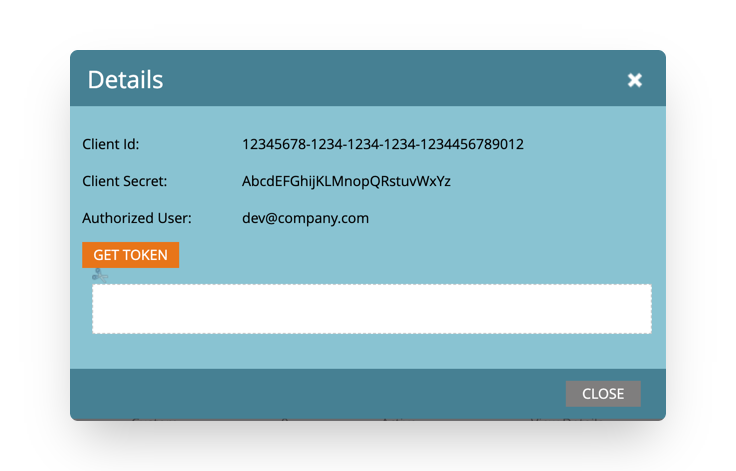
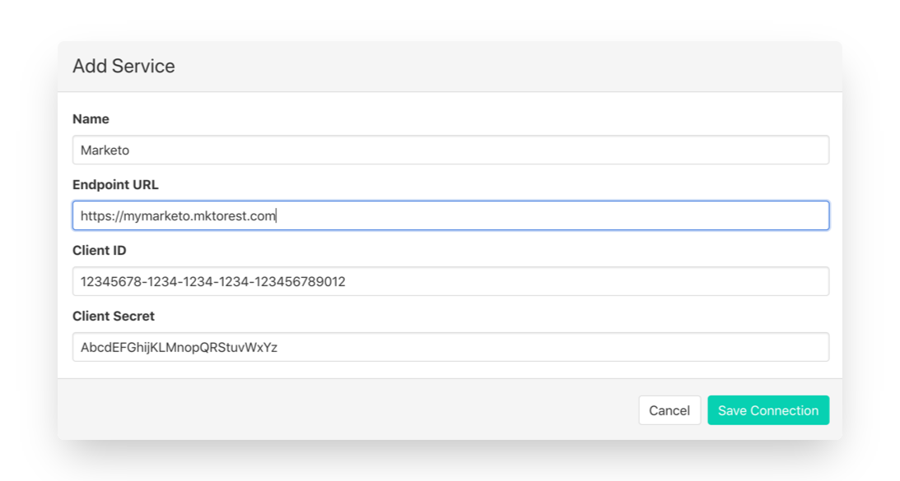

# Marketo

## Getting Started

In this guide, we will show you how to connect Marketo to Census and create your first sync.

### Prerequisites

* Have your Census account ready. If you need one, [create a Free Trial Census account](https://app.getcensus.com/) now.
* Have your Marketo account ready, with admin access to create API-only users and API credentials.
* Have the proper credentials to access to your data source. See our docs for each supported data source for further information:
  * [Azure Synapse](../sources/available-sources/azure-synapse.md)
  * [Databricks](https://docs.getcensus.com/sources/databricks)
  * [Elasticsearch](https://docs.getcensus.com/sources/elasticsearch)
  * [Google BigQuery](https://docs.getcensus.com/sources/google-bigquery)
  * [Google Sheets](https://docs.getcensus.com/sources/google-sheets)
  * [MySQL](https://docs.getcensus.com/sources/mysql)
  * [Postgres](https://docs.getcensus.com/sources/postgres)
  * [Redshift](https://docs.getcensus.com/sources/redshift)
  * [Snowflake](https://docs.getcensus.com/sources/snowflake)
  * [SQL Server](https://docs.getcensus.com/sources/sql-server)

### 1. Create a Marketo API User

Before setting up API credentials for Census, you'll first need a Marketo Role with API Access, as well as a user with that role.

#### API Access Role

None of the default Marketo Roles have API access so if this is your first API integration, you'll first need to create an API access role. [Marketo's documentation walks through creating a new API Access role](https://developers.marketo.com/rest-api/custom-services/) as well as your first user.

You can view/edit role permissions in **Admin, Users & Roles**, then clicking the **Roles** tab.

Whether you're using an existing role or creating a new one, please make sure it has at least the following permissions:

* **Read-Write People**
* **Read-Write Named Accounts**.
* **Read-Write Assets**

To use Custom Objects, we'll also need **Read-Write Custom Object** and **Read-Write Custom Object Type**.


Note: Even though your Marketo instance may support Custom Objects, the Custom Object Metadata API is not an out-of-the-box feature on Select Plans at Marketo and doesn’t automatically come with Custom Objects. If you still don't see Custom Objects in Census, you may need to contact your Marketo Account Manager to make sure you have access to the Custom Object Metadata API.


#### API Only User

We recommend you create a new Marketo API User so that you can track changes made by your Census syncs. Either way, the user must be marked **API Only** during creation.

### 2. Gather Marketo API Credentials

To connect Census to Marketo, you'll need to collect three pieces of information:

* Endpoint URL
* Client ID
* Client Secret

Back in **Admin**, expand the **Integrations** menu on the left and select the **Web Services** option. Scroll down to the **REST API** section. Copy and paste the **Endpoint URL** (you can excluding the `/rest` part).

Next we'll create a new LaunchPoint Service. Click on **LaunchPoint** and select **New** > **New Service.**

Your new service should have the following properties:

* Display Name: Census
* Service: **Custom**
* Description: Census Data Integration
* API Only User: _\[The user you created in step 1]_

Once created, you'll see your new service in the list of services. Click on **View Details**. You will need to copy the **Client ID** and **Client Secret** here.

### 3. Adding Credentials to Census

With all three pieces of information, return to Census and visit the **Destinations** tab. Click on the **New Destination** button and select **Marketo** from the menu. Copy and paste the values into the dialog and hit save. You should be clear to create a new sync!

## Supported Object and Sync Behaviors 


Learn more about all of our sync behaviors on our [Core Concepts page](../syncs/core-concept/#the-different-sync-behaviors).


|        **Object Name** | **Supported?** | **Sync Keys**              | **Behaviors**                         |
| ---------------------: | :------------: | -------------------------- | ------------------------------------- |
|                   Lead |        ✅       | Object ID, any Text/Number | Update or Create, Update Only, Mirror |
|          Named Account |        ✅       | Object ID, any Text/Number | Update or Create, Update Only         |
|         Custom Objects |        ✅       | Object ID, any Text/Number | Update or Create, Update Only, Mirror |
| Static List Membership |        ✅       | N/A                        | Mirror                                |
|      Custom Activities |        ✅       | N/A                        | Send                                  |


Please be aware that Update Only and Mirror make use of less efficient Marketo APIs and will result in more API usage for the same number of records.



Learn more about all of our sync behaviors in our [Syncs](../syncs/core-concept/#sync-behaviors) documentation.


[Contact us](mailto:support@getcensus.com) if you want Census to support more Marketo objects and/or behaviors

## Need help connecting to Marketo?

[Contact us](mailto:support@getcensus.com) via support@getcensus.com or start a conversation with us via the [in-app](https://app.getcensus.com) chat.
