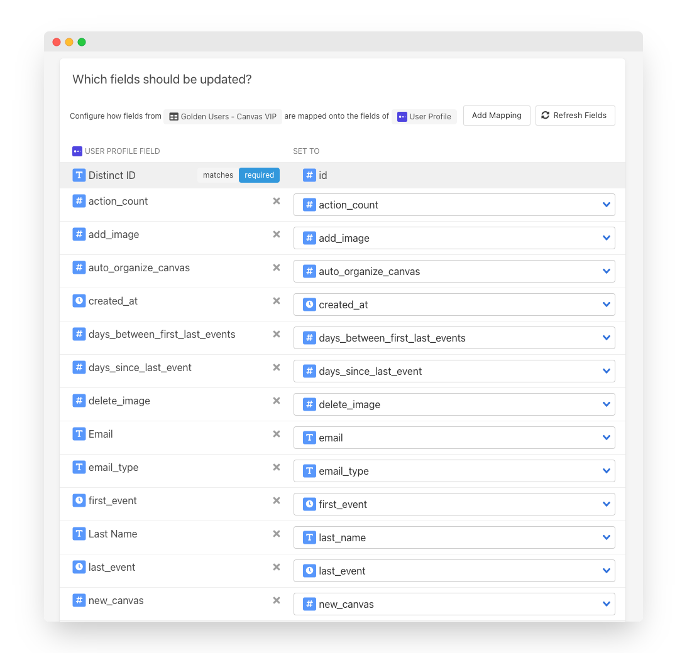

# Mixpanel

## 🏃‍♂️ Getting Started



### Prerequisites

* [Create a Free Trial Census Account](https://app.getcensus.com/)
* Have your Mixpanel Project Token and API Secret ready as we will be using those to connect Census to Mixpanel
* Have the credential to access your Warehouse. See our articles for each data warehouse here \([Redshift](https://help.getcensus.com/article/10-configuring-redshift-postgresql-access), [Postgres](https://help.getcensus.com/article/10-configuring-redshift-postgresql-access), [BigQuery](https://help.getcensus.com/article/21-configuring-bigquery-access), [Snowflake](https://help.getcensus.com/article/8-configuring-snowflake-access)\)

### 1. Connect Mixpanel

* Once you are in Census, Navigate to [Connections](https://app.getcensus.com/connections).
* Click the Add Service button.
* Select Mixpanel in the dropdown list

* Copy your Mixpanel's **Project Token** and **API secret** that you can find in your Mixpanel Project Settings. your end state should look something like this 👇

### 2. Connect your Data Warehouse

Please follow one of our short guides depending on your data warehouse technology.

* [Redshift](https://help.getcensus.com/article/10-configuring-redshift-postgresql-access)
* [Postgres](https://help.getcensus.com/article/10-configuring-redshift-postgresql-access)
* [BigQuery](https://help.getcensus.com/article/21-configuring-bigquery-access)
* [Snowflake](https://help.getcensus.com/article/8-configuring-snowflake-access)

After setting up your warehouse, your Census Connections Page should look like this.

### 3. Create your first Model

Now navigate to the [Model section of our Dashboard](https://app.getcensus.com/models)

Here you will have to write SQL queries to select the data you want to see in Mixpanel. Here are some ideas of data you should select

* The Lifetime Value of a customer and add it to a contact.
* The end of their trial
* The date they became active in your product.
* The number of key activities a user did in your app in the last 7/30 days

Once you have created your model, click save. 

### 4. Create your first Sync

Now head to the [Sync page](https://app.getcensus.com/syncs) and click the Add Sync button

In the " What data do you want to sync?" section

* For the Connection, select the data warehouse you connected in step 2
* For the Source, select the model you created in step 3

Next up is the "Where do you want to sync data to?" section.

* Pick Mixpanel as the Connection
* For Object, Select Events or User Profile. We will be using User Profile in this guide.

For the " How should changes to the source be synced?" section. 

* Select Update Or Create
* Pick the right mapping key; Mixpanel only supports Distinct ID.

Finally, select the fields you want to update in the Mapper in the "Which Fields should be updated?" section. Here simply map the field from your Mixpanel instance to the column from your model.

Click the Next button to see the final preview, which will have a recap of what will happen when you start the sync.

### 5. Confirm the data is in Mixpanel

Now go back to your Mixpanel Instance and view a Contact that should have been updated. If everything well well, you should see your data in Mixpanel.

That's it! In 5 steps, you connect Census to Mixpanel and started syncing customer & product data from your warehouse to Mixpanel 🎉

## 🗄 Supported Objects

Census currently supports syncing to the following Mixpanel objects.

| **Object Name** | **Supported?** | Identifiers |
| ---: | :---: | :--- |
| Event | ✅ | Insert ID |
| User Profile  | ✅ | Distinct ID |
| Group Profile | ✅ | Group ID |

[Contact us](mailto:support@getcensus.com) if you want Census to support more objects for Mixpanel.

## 🔄 Supported Sync Behaviors


Learn more about all of our sync behaviors on our [Core Concepts page](../basics/core-concept.md#the-different-sync-behaviors).


| **Behaviors** | **Supported?** | **Objects?** |
| ---: | :---: | :---: |
| **Update or Create** | ✅ | User Profile, Group Profile |
| **Create Only** | ✅ | Event |
| **Append** | ✅ | Event |

[Contact us](mailto:support@getcensus.com) if you want Census to support more Sync behaviors for Mixpanel.

