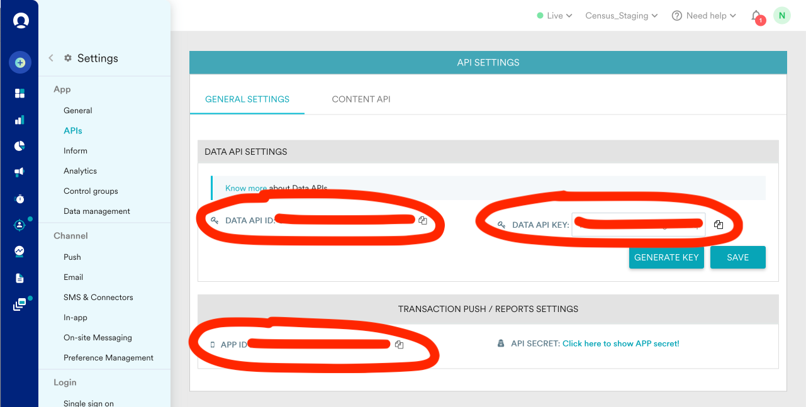

# MoEngage

## Getting Started

1. Navigate to the **Destinations** page in Census and click **New Destination**.
2. Select **MoEngage** from the menu.
3. Input the following credentials to connect MoEngage:
   * **REST Endpoint**: can be found on [this page](https://help.moengage.com/hc/en-us/articles/360057030512-Data-Centers-in-MoEngage#01G5DQVXGT2KZMXTJPF77QPJ25) based on your MoEngage URL. Enter the value exactly as shown in the **REST API Host** column.
   * **Data API ID**, **Data API Key**, and **App ID**: in the MoEngage app, navigate to **Settings** > **App** > **APIs** and generate a new **Data API** key.

<figure><figcaption>
Generate API credentials in the MoEngage app.
</figcaption></figure>

## Supported Objects and Sync Behaviors 

| **Object Name** | **Supported?** | **Sync Keys** | **Behaviors**    |
| --------------: | :------------: | ------------- | ---------------- |
|        Customer |        ✅       | Customer ID   | Update or Create |
|           Event |        ✅       | Any unique ID | Send             |


Learn more about all of our sync behaviors in our [Syncs](../syncs/core-concept/#sync-behaviors) documentation.


[Contact us](mailto:support@getcensus.com) if you want Census to support more MoEngage objects and/or behaviors.

## Need help connecting to MoEngage?

[Contact us](mailto:support@getcensus.com) via support@getcensus.com or start a conversation with us via the [in-app](https://app.getcensus.com) chat.
