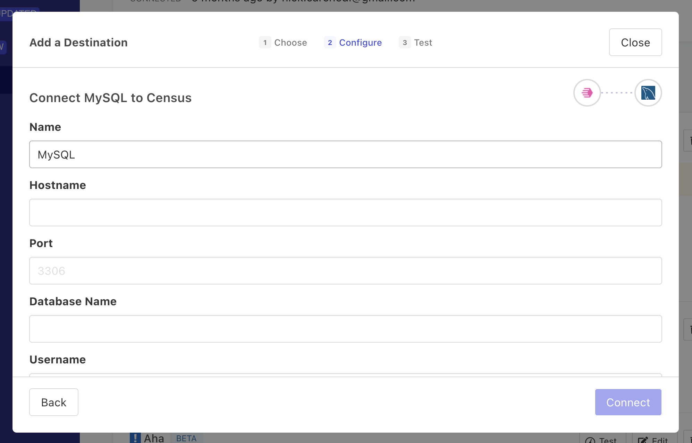

# MySQL

## 🏃‍♀️ Getting Started

1. Navigate to the **Destinations** page in Census and click **New Destination**.
2. Select **MySQL** from the menu.
3. Enter the requested database credentials.

<figure><figcaption><p>Enter your MySQL database credentials in Census.</p></figcaption></figure>

## :key: Permissions

To sync to MySql as a destination you need the following privileges on the user that you provide to Census.

```
CREATE TEMPORARY TABLES
CREATE
INSERT
UPDATE
DELETE
```

## 🔀 Supported Objects and Behaviors

| **Object Name** | **Supported?** | **Sync Keys**                                     | **Behaviors**                 |
| --------------: | :------------: | --------------------------------------------------- | ----------------------------- |
|           Table |        ✅       | Primary keys or columns with uniqueness constraints | Update or Create, Update Only |

[Contact us](mailto:support@getcensus.com) if you want Census to support more sync behaviors for MySQL.

## 🚑 Need help connecting to MySQL?

[Contact us](mailto:support@getcensus.com) via support@getcensus.com or start a conversation with us via the [in-app](https://app.getcensus.com) chat.
