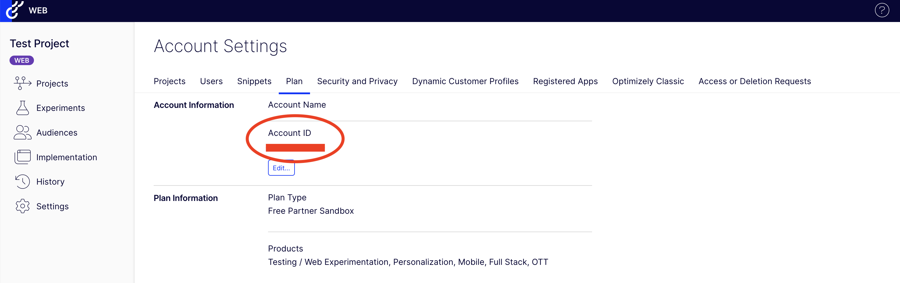
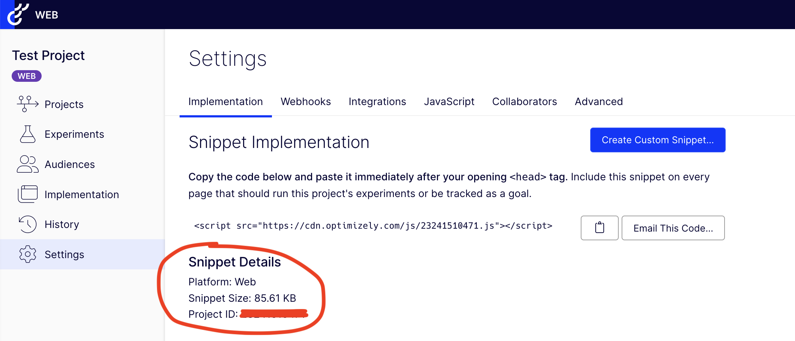

# Optimizely

## 🏃‍♀️ Getting Started

1. Navigate to the **Destinations** page in Census and click **New Destination**.
2. Select **Optimizely** from the menu.
3. Open the Optimizely app in another window. Gather your **Account ID** and **Project ID** from the settings pages displayed below.
4. Return to Census and enter these values to connect.

<figure><figcaption>
Get your Account ID from the Optimizely app.
</figcaption></figure>
<figure><figcaption>
Get your Project ID from the Optimizely app.
</figcaption></figure>

## 🔀 Supported Objects and Behaviors

| **Object Name** | **Supported?** | **Sync Keys**  | **Behaviors** |
| --------------: | :------------: | ---------------- | ------------- |
| Event | ✅ | Append | UUID |

[Contact us](mailto:support@getcensus.com) if you want Census to support more Optimizely objects and/or behaviors.

## 🚑 Need help connecting to Optimizely?

[Contact us](mailto:support@getcensus.com) via support@getcensus.com or start a conversation with us via the [in-app](https://app.getcensus.com) chat.
