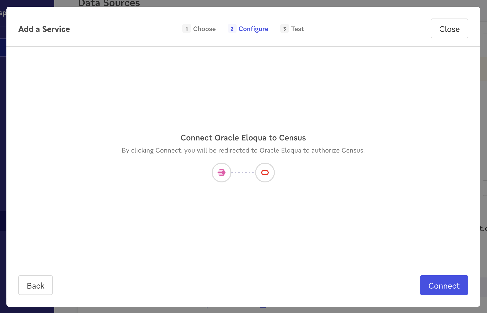

# Oracle Eloqua

## 🏃‍♀️ Getting Started

1. Navigate to the **Destinations** page in Census and click **New Destination**.
2. Select **Oracle Eloqua** from the menu.
3. Complete the OAuth flow to grant Census access to your Eloqua account.

<figure><figcaption>
Connect Census to your Eloqua account.
</figcaption></figure>

## 🔀 Supported Objects and Behaviors

| **Object Name** | **Supported?** | **Sync Keys**  | **Behaviors** |
| --------------: | :------------: | ---------------- | --------------|
| Contact | ✅ | Email Address | Update or Create |
| Contact List | ✅ | Email Address | Update or Create, Mirror |
| Custom Object | ✅ | Object ID | Update or Create |

[Contact us](mailto:support@getcensus.com) if you want Census to support more Oracle Eloqua objects and/or behaviors.

## 🚑 Need help connecting to Oracle Eloqua?

[Contact us](mailto:support@getcensus.com) via support@getcensus.com or start a conversation with us via the [in-app](https://app.getcensus.com) chat.
