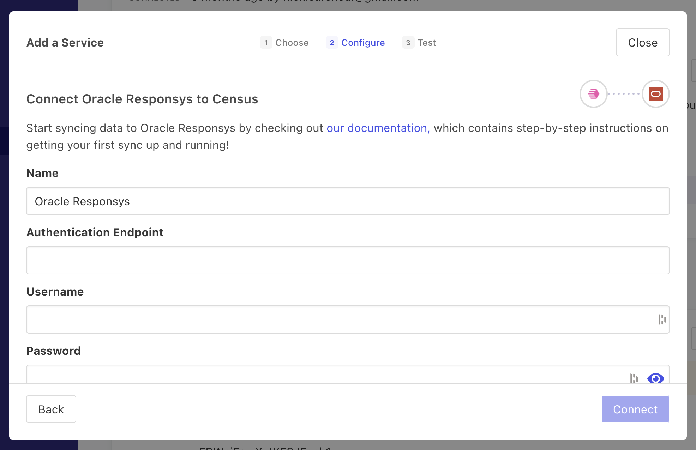

# Oracle Responsys

## 🏃‍♀️ Getting Started

1. Click **Add Service**.
2. Select **Oracle Responsys** from the menu.
3. Enter your **Authentication Endpoint** (see [this page](https://docs.oracle.com/en/cloud/saas/marketing/responsys-develop/API/GetStarted/Authentication/auth-endpoints-rest.htm)), **Username**, and **Password**. Please ensure your Responsys username has API access.

<figure><figcaption>
Enter your Responsys credentials to connect with Census.
</figcaption></figure>

## 🔀 Supported Objects and Behaviors

| **Object Name** | **Supported?** | **Identifiers**  | **Behaviors** |
| --------------: | :------------: | ---------------- | --------------|
| Profile List (Recipients) | ✅ | Customer ID, Responsys ID, Email Address, Email MD5 Hash, Email SHA256 Hash, Mobile Number | Update or Create |

[Contact us](mailto:support@getcensus.com) if you want Census to support more Responsys objects and/or behaviors.

## 🚑 Need help connecting to Responsys?

[Contact us](mailto:support@getcensus.com) via support@getcensus.com or start a conversation with us via the [in-app](https://app.getcensus.com) chat.
