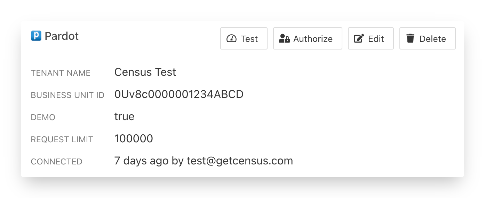
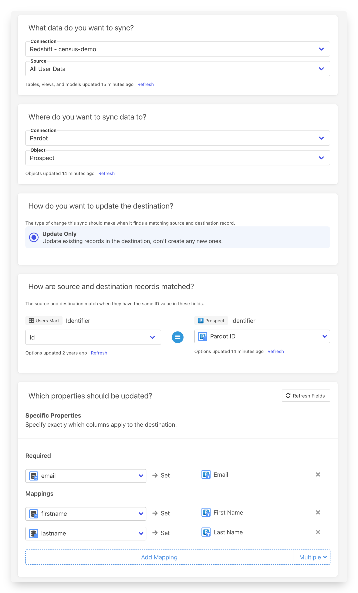

# Pardot

## 🏃‍♀️ Getting started

This guide shows you how to use Census to connect your Pardot account to your data warehouse and create your first sync.

### Prerequisites

Before you begin, you'll need the following:

* **Census account**: If you don't have this already, [start with a free trial](https://app.getcensus.com).
* **Pardot account**: No free trials in Pardot land, unfortunately. You'll need your actual account here.
* **Credentials for your data warehouse**: For details, see the guide for your specific technology.
  * [Databricks](https://docs.getcensus.com/sources/databricks)
  * [Google BigQuery](https://docs.getcensus.com/sources/google-bigquery)
  * [Google Sheets](https://docs.getcensus.com/sources/google-sheets)
  * [Postgres](https://docs.getcensus.com/sources/postgres)
  * [Redshift](https://docs.getcensus.com/sources/redshift)
  * [Rockset](https://docs.getcensus.com/sources/rockset)
  * [Snowflake](https://docs.getcensus.com/sources/snowflake)

### Step 1: Connect Pardot

1. Log into Census and navigate to [Connections](https://app.getcensus.com/connections).
2. Click **Add Service**.
3. Select **Pardot** from the menu
4. Follow the Pardot OAuth authentication flow, which will ask you to log in with your Pardot username and password.

Once complete, you'll see your new connection in the **Service Connections** list. 👇

### Step 2: Connect your data warehouse

The steps for connecting your data warehouse will depend on your technology. See the following guides:

* [Databricks](https://docs.getcensus.com/sources/databricks)
* [Google BigQuery](https://docs.getcensus.com/sources/google-bigquery)
* [Google Sheets](https://docs.getcensus.com/sources/google-sheets)
* [Postgres](https://docs.getcensus.com/sources/postgres)
* [Redshift](https://docs.getcensus.com/sources/redshift)
* [Rockset](https://docs.getcensus.com/sources/rockset)
* [Snowflake](https://docs.getcensus.com/sources/snowflake)

After connecting your warehouse, your **Connections** page should have both your data warehouse and your Pardot source listed.

### Step 3: Create your model

When defining models, you'll write SQL queries to select the data you want to see in Outreach. This can be as simple as selecting everything in a specific database table or as complex as creating new calculated values.

1. From inside your Census account, navigate to the [**Models**](https://app.getcensus.com/models) page.
2. Enter a name for your model. You'll use this to select the model later.
3. Enter your SQL query. If you want to test the query, use the **Preview** button.
4. Click **Save Model**.

### Step 4: Create your first sync 

The sync will move data from your warehouse to Pardot. In this step, you'll define how that will work.

1. From inside your Census account, navigate to the [**Syncs**](https://app.getcensus.com/syncs) page.
2. Under **What data do you want to sync?**, choose your data warehouse as the **Connection** and your model as the **Source**.
3. Under **Where do you want to sync data to?**, choose Pardot as the **Connection** and the **Prospect Object** in Pardot. (See [Supported Objects](outreach.md#supported-objects).)
4. Under **How should changes to the source be synced?**, choose **Update Only**. (See [Supported Sync Behaviors](outreach.md#supported-sync-behaviors).)
5. Under **How are source and destination records matched?**, select a mapping key. (See [Supported Objects](outreach.md#supported-objects) for details.)
6. Under **Which properties should be updated?**, select the fields you want to update by mapping a field in Pardot to a column in your model.
7. Click **Next**. This will open the **Confirm Details** page where you can see a recap of your setup.
8. If you want to start a sync immediately, set the **Run a sync now?** checkbox.
9. Click **Create Sync**.

When configuring your sync, the page should look something like this: 👇

### Step 5: Confirm the synced data in Pardot

Once your sync is complete, it's time to check your data. Open Pardot and check that the records updated correctly.

If everything went well, that's it! You've started syncing data from your warehouse to Pardot! 🎉

And if anything went wrong, [contact the Census support team](mailto:support@getcensus.com) to get some help.

## 🗄 Supported Objects

Census currently supports syncing to the following Pardot objects.

| **Object Name** | **Supported?** | Identifiers |
| --------------: | :------------: | ----------- |
|        Prospect |        ✅       | Pardot ID   |
|            List |       🔜       |             |

[Contact us](mailto:support@getcensus.com) if you want Census to support more objects for Pardot.

## 🔄 Supported Sync Behaviors


Learn more about all of our sync behaviors on our [Core Concepts page](../basics/core-concept/#the-different-sync-behaviors).


|   **Behaviors** | **Supported?** | **Objects?** |
| --------------: | :------------: | :----------: |
| **Update Only** |        ✅       |   Prospect   |

[Contact us](mailto:support@getcensus.com) if you want Census to support more Sync Behaviors for Pardot.

## 🚑 Need help connecting to Pardot?

[Contact us](mailto:support@getcensus.com) via support@getcensus.com or start a conversation with us via the [in-app](https://app.getcensus.com) chat.
