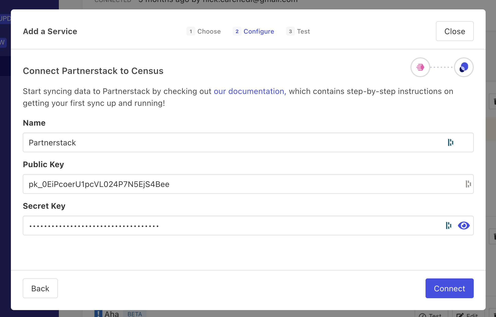

# PartnerStack

PartnerStack is a partner relationship management platform that helps you manage and scale your partnerships. Use Census to send customer attributes and transaction events to PartnerStack automatically.

## 🏃‍♀️ Getting Started

1. Navigate to the **Destinations** page in Census and click **New Destination**.
2. Select **PartnerStack** from the menu.
3. Open the PartnerStack app in another window. Go to **Settings** > **Integrations** and copy the relevant API keys (either Test or Production).
4. Return to Census and paste them into the **Public Key** and **Secret Key** fields, respectively.

<figure><figcaption>
Get your API keys from the PartnerStack app.
</figcaption></figure>

## 🔀 Supported Objects and Behaviors

| **Object Name** | **Supported?** | **Sync Keys** | **Behaviors**                 |
| --------------: | :------------: | --------------- |-------------------------------|
| Customer | ✅ | Customer Key | Update or Create, Update Only |
| Transaction     [Event Sync](/basics/data-models-and-entities/defining-source-data/events#defining-event-syncs) | ✅ | Unique Identifier | Send                          |

### Transactions

Transactions are sent to PartnerStack as events so each transaction must have a unique identifier so Census can correctly identify them, but that ID is not passed along to PartnerStack. Transactions need to be associated with a customer in PartnerStack, so you must include at exactly one of the following keys in your transaction data:
- customer_key - The PartnerStack unique identifier for the customer
- customer_external_key - Your unique identifier for the customer
- customer_email - The customer's email address

## 🚑 Need help connecting to Partnerstack?

[Contact us](mailto:support@getcensus.com) via support@getcensus.com or start a conversation with us via the [in-app](https://app.getcensus.com) chat.
