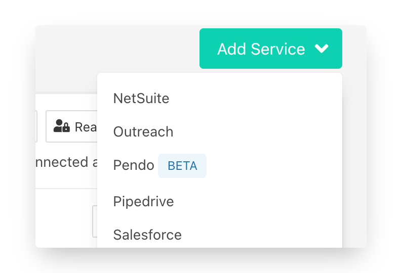
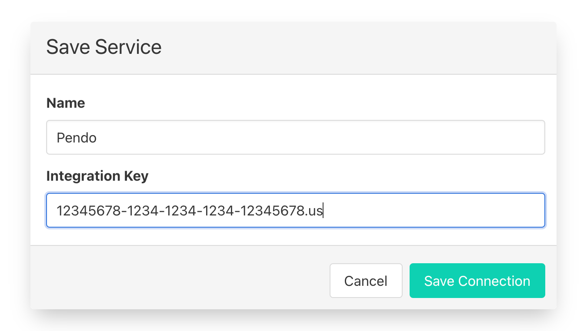

# Pendo

## 🏃‍♂️ Getting Started

In this guide, we'll show you how to connect Census to Pendo. 

### **Prerequisites**

To set up your first Pendo sync, you'll need three things:

* A Census Account – If you don't have one already, [create a Free Trial Census Account](https://app.getcensus.com/).
* Access to your data warehouse. For details on how to create credentials, see our articles for [Redshift](../sources/redshift.md), [Snowflake](../sources/snowflake.md), [Google BigQuery](../sources/google-bigquery.md), [Databricks](../sources/databricks.md), and [Postgres](../sources/postgres.md).
* A Pendo account with access to create a Pendo Integration Key. 

### 1. Create a Pendo Integration key

Pendo lets you create a number of Integration keys. You should create a new API key for Census rather than reusing an existing one.

Within Pendo's left navigation bar, click the **Settings** ⚙️icon and select **Integrations** from the popup menu. Then, inside the **Integration Keys** tab, click **+ Add Integration Key**.

Provide a name you'll recognize \("Census" is a good choice\) and check the **Allow Write Access**. Save your new key.

Finally, copy the long code you see under **Key**. We'll use that in a minute.

### 2. Create the Census Connection

Now let's create your new Census connection to Pendo.

1. In the **Settings** tab, Create a new Pendo Service Connection in Census.   
2. You can provide whatever name you like.
3. Copy and paste your new Pendo Integration key.  

   

And you're all set and ready to get syncing! 🎉

## 🗄 Supported Objects

Census currently supports syncing to the following Pendo objects.

| **Object Name** | **Supported?** | Identifiers |
| ---: | :---: | :--- |
| Account | ✅ | Account ID |
| Visitor | ✅ | Visitor ID |
| Event | 🔜 |  |

[Contact us](mailto:support@getcensus.com) if you want Census to support more objects for Pendo.

## 🔄 Supported Sync Behaviors


Learn more about all of our sync behaviors on our [Core Concepts page](../basics/core-concept.md#the-different-sync-behaviors).


| **Behaviors** | **Supported?** | **Objects?** |
| ---: | :---: | :---: |
| **Update Only** | ✅ | Account/Visitor |
| **Update or Create** | 🔜 |  |

[Contact us](mailto:support@getcensus.com) if you want Census to support more Sync Behaviors for Pendo.

## 🚑 Need help connecting to Pendo?

[Contact us](mailto:support@getcensus.com) via support@getcensus.com or start a conversation with us via the [in-app](https://app.getcensus.com) chat.

