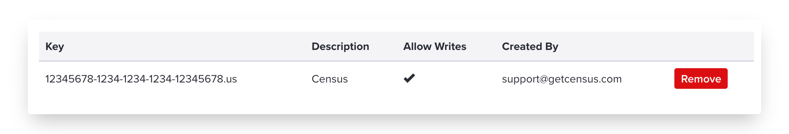

# Pendo

## 🏃‍♀️ Getting Started

In this guide, we will show you how to connect Pendo to Census and create your first sync.

### Prerequisites

* Have your Census account ready. If you need one, [create a Free Trial Census account](https://app.getcensus.com/) now.
* Have your Pendo account ready, with create access for Pendo Integration keys.
* Have the proper credentials to access to your data source. See our docs for each supported data source for further information:
  * [Azure Synapse](../sources/azure-synapse.md)
  * [Databricks](https://docs.getcensus.com/sources/databricks)
  * [Elasticsearch](https://docs.getcensus.com/sources/elasticsearch)
  * [Google BigQuery](https://docs.getcensus.com/sources/google-bigquery)
  * [Google Sheets](https://docs.getcensus.com/sources/google-sheets)
  * [MySQL](https://docs.getcensus.com/sources/mysql)
  * [Postgres](https://docs.getcensus.com/sources/postgres)
  * [Redshift](https://docs.getcensus.com/sources/redshift)
  * [Rockset](https://docs.getcensus.com/sources/rockset)
  * [Snowflake](https://docs.getcensus.com/sources/snowflake)
  * [SQL Server](https://docs.getcensus.com/sources/sql-server)

### 1. Collect your Pendo Credentials

Census needs the **Pendo Integration Key** to connect to your Pendo instance. This can be obtained by navigating to `Settings > Subscription Settings > App Details` and copying the `API Key` value.

If you plan to sync Track Events, Census also needs your **Track Event Shared Secret.** This can be obtained by navigating to `Settings > Subscription Settings > App Details` , clicking `Show` next to `Track Event Shared Secret` and then copying the value.

### 1A. Create a Pendo Integration key

Pendo lets you create a number of Integration keys. You should create a new API key for Census rather than reusing an existing one.

Within Pendo's left navigation bar, click the **Settings** ⚙️icon and select **Integrations** from the popup menu. Then, inside the **Integration Keys** tab, click **+ Add Integration Key**.

Provide a name you'll recognize ("Census" is a good choice) and check the **Allow Write Access**. Save your new key.

Finally, copy the long code you see under **Key**. We'll use that in a minute.

### 2. Create the Census Connection

Now let's create your new Census connection to Pendo.

1. In the **Settings** tab, Create a new Pendo Destination in Census.\

<figure><figcaption></figcaption></figure>

1. You can provide whatever name you like.
2.  Copy and paste your new Pendo Integration Key, and optionally, your Track Event Shared Secret.

    <figure><figcaption></figcaption></figure>

And you're all set and ready to get syncing! 🎉

## 🗄 Supported Objects

Census currently supports syncing to the following Pendo objects.

| **Object Name** | **Supported?** | **Sync Keys**                        |
| --------------: | :------------: | -------------------------------------- |
|         Account |        ✅       | Account ID                             |
|         Visitor |        ✅       | Visitor ID                             |
|     Track Event |        ✅       | N/A (only supports _Append_ operation) |

[Contact us](mailto:support@getcensus.com) if you want Census to support more objects for Pendo.

## 🔄 Supported Sync Behaviors


Learn more about all of our sync behaviors on our [Core Concepts page](../basics/core-concept/#the-different-sync-behaviors).


|   **Behaviors** | **Supported?** |   **Objects**   |
| --------------: | :------------: | :-------------: |
| **Update Only** |        ✅       | Account/Visitor |
|      **Append** |        ✅       |   Track Event   |

[Contact us](mailto:support@getcensus.com) if you want Census to support more Sync Behaviors for Pendo.

## 🚑 Need help connecting to Pendo?

[Contact us](mailto:support@getcensus.com) via support@getcensus.com or start a conversation with us via the [in-app](https://app.getcensus.com) chat.
