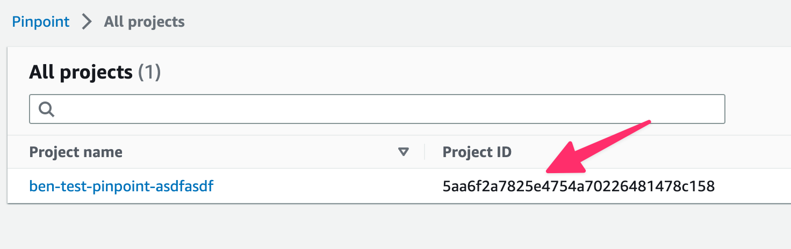
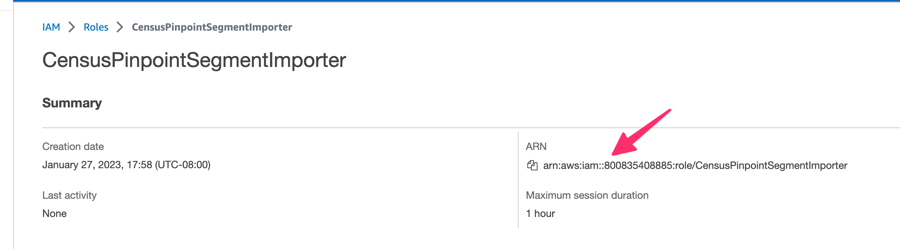
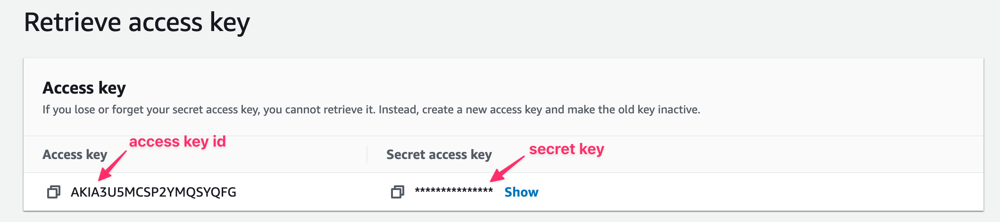

# Amazon Pinpoint

## 🏃‍♀️ Getting Started

There are essentially three groups of credentials that Census requires to connect to Pinpoint:

1. **The name of an S3 bucket** that has been created in your AWS account, which Census will use for staging data to be imported into Pinpoint
2. **Access keys** that will allow us to read and write to both the S3 bucket and Pinpoint
3. An **importer role ARN**. This is an identifier for a role that you will need to create in your AWS account. This role is delegated to AWS’s pinpoint import service, and will enable the import of segments from the S3 staging bucket into Pinpoint.

Here’s a list of steps for creating the necessary resources and establishing a connection:

1. Locate your Pinpoint instance and note its **Project ID**. Also note the **AWS Region** in which your Pinpoint instance resides.

<figure><figcaption><p>Copy your Pinpoint project ID.</p></figcaption></figure>

2. Create an S3 bucket that Census can use for staging Pinpoint data. **The S3 bucket should be created in the same region as your Pinpoint instance.** We recommend naming it `census-pinpoint-staging`.

3. Open AWS IAM and create a new role. For “trusted entity type”, choose “Custom Trust Policy”. Use this trust policy:

```
{
    "Version": "2012-10-17",
    "Statement": [
        {
            "Effect": "Allow",
            "Principal": {
                "Service": "pinpoint.amazonaws.com"
            },
            "Action": "sts:AssumeRole"
        }
    ]
}
```

Now attach the permissions policy `AmazonS3ReadOnlyAccess` to your role (if you’d like to restrict the access scope further, you can create a custom permissions policy that only allows access to the `census-pinpoint-staging` bucket.) Continue and choose a name for your role (we recommend `CensusPinpointSegmentImporter`). Finally, click on the newly created role and note the role’s ARN.

<figure><figcaption><p>Copy your role's ARN.</p></figcaption></figure>

4. Using a user in your AWS account with read/write access to the newly created S3 bucket and read/write access to your Pinpoint instance, go into AWS security credentials and [create a new access key](https://docs.aws.amazon.com/IAM/latest/UserGuide/id_credentials_access-keys.html#Using_CreateAccessKey). Note the **Access Key ID** and **Secret Key**.

<figure><figcaption><p>Copy your Access Key ID and Secret Key.</p></figcaption></figure>

5. Open the connections page in Census, click “Add Service”, and find Pinpoint. Now, enter the credentials that you previously noted down (**Access Key ID**, **Secret Key**, **Pinpoint Project ID**, **S3 Staging Bucket Name**, **Importer Role ARN**, **AWS Region**). Click “Connect” and ensure that the credentials test succeeds. You should now be ready to start syncing to Pinpoint!

## 🔀 Supported Objects and Behaviors

| **Object Name** | **Supported?** | **Identifiers**  | **Behaviors**       |
| --------------: | :------------: | ---------------- | ------------------- |
| Segment | ✅ | Any unique identifier | Mirror |

[Contact us](mailto:support@getcensus.com) if you want Census to support more Pinpoint objects and/or behaviors.

## 🚑 Need help connecting to Pinpoint?

[Contact us](mailto:support@getcensus.com) via support@getcensus.com or start a conversation with us via the [in-app](https://app.getcensus.com) chat.
