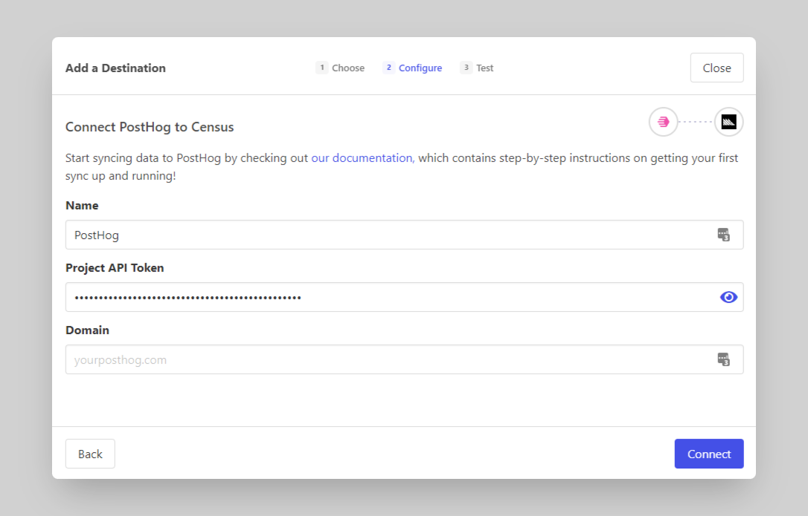
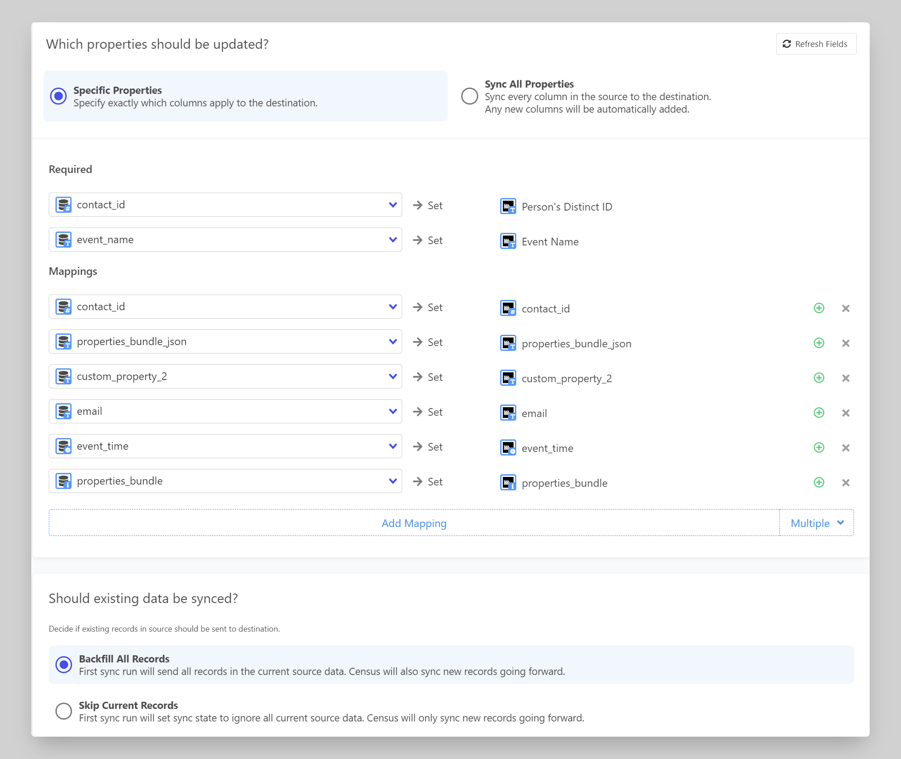

# PostHog

## 🏃‍♀️ Getting Started

In this guide, we will show you how to connect PostHog to Census and create your first sync.

### Prerequisites

* Have your Census account ready. If you need one, [create a Free Trial Census account](https://app.getcensus.com/) now.
* Have the proper credentials to access your data source. See our [docs](../sources/overview.md) for each supported data source for further information.

### 1. Grab your PostHog Project API Key

PostHog provides a write-only key.

In PostHog's left navigation bar, click **Project Settings**.

Then, scroll down to **Project Variables > Project API Key**.

Copy your **Project API Key**. We'll use that in a minute

### 2. Connect Census to PostHog

Great! Now let's pull it all together.&#x20;

1. In the [**Connections**](https://app.getcensus.com/connections) page, click on **Add Service**, and select "PostHog"
2. You can provide whatever name you like for the connection
3. Paste your PostHog Project API Key
4. Enter your PostHog custom domain if you're using one, otherwise leave it blank.
5. Click **Connect**

<figure><figcaption></figcaption></figure>

Census will test your API key and show a green checkmark :white\_check\_mark: when successful.

### 3. Connect to your Data Warehouse

See our [docs](../sources/overview.md) for each supported data source and follow the appropriate short guide depending on your data warehouse technology.

### 4. Create your first Model

Now navigate to the [Model page in Census](https://app.getcensus.com/models)

Here you will have to write SQL queries to select the data you want to see in PostHog. Here are some ideas of data you should select:

* Event data like event id, event name, contact id, contact name

Once you have created your model, click **Save Model**.

### 5. Create your first Sync

Now head to the [Sync page](https://app.getcensus.com/syncs) and click the **Create a Sync** button

In the "**What data do you want to sync?"** section

* For the **Connection**, select the data warehouse you connected in step 3
* For the **Source,** select the model you created in step 4

Next up is the **"Where do you want to sync data to?"** section

* Pick PostHog as the **Connection**&#x20;
* For Object, **Event** will automatically be chosen

For the " **How do you want to update the destination?"** section

* **Append** will automatically be chosen
* Choose the **Unique ID** Column
* Decide if you'd like to turn on **Use timestamp column to identify new data**.
  * This can be more efficient for large or frequently changing data sets. More info can be found in this [doc](../basics/data-models-and-entities/defining-source-data/events.md#using-timestamp-to-identify-new-records).

Finally, select the properties you want to update in the Mapper in the **"Which properties should be updated?"** section

* Choose to update **Specific Properties** or **Sync All Properties**.
* Map the required fields **Person's Distinct ID** and **Event Name** fields
* Map the rest of the fields from PostHog to the columns from your model

In the "**Should existing data be synced?"** section

* Chooses whether you want to backfill records or only sync new records going forward

The end result should look something like this

Click the **Next** button to see the final preview which will have a recap of what will happen when you start the sync

### 6. Confirm the data is in PostHog

Now go back to your PostHog account and view the event data that should have been created. If everything went well, you should see your data in PostHog.

That's it! In 6 steps, you connected Census to PostHog and started syncing event data from your warehouse to PostHog 🎉

## 🗄 Supported Objects

Census currently supports syncing to the following PostHog objects.

| **Object Name** | **Supported?** | **Identifiers** |
| --------------: | :------------: | --------------- |
| Event | ✅ | Event ID |
| Person | ✅ | ID, Email |
| Page | ✅ | Distinct ID |

[Contact us](mailto:support@getcensus.com) if you want Census to support more objects for PostHog.

## 🔄 Supported Sync Behaviors


Learn more about all of our sync behaviors on our [Core Concepts page](../basics/core-concept/#the-different-sync-behaviors).


| **Behaviors** | **Supported?** | **Objects?** |
| ------------: | :------------: | :----------: |
| **Update or Create** | ✅ | Person |
| **Update Only** | ✅ | Person |
| **Append** | ✅ | Event, Page |

[Contact us](mailto:support@getcensus.com) if you want Census to support more sync behaviors for PostHog.

## 🚑 Need help connecting to PostHog?

[Contact us](mailto:support@getcensus.com) via support@getcensus.com or start a conversation with us via the [in-app](https://app.getcensus.com) chat.
