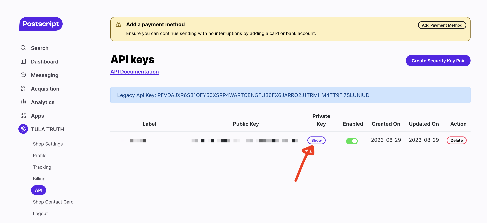

# Postscript

## 🏃‍♀️ Getting Started

1. Navigate to the **Destinations** page in Census and click **New Destination**.
2. Select **Postscript** from the menu.
3. Enter your **API Token**, which is your _Private Key_ found under API settings in the Postscript app.

<figure><figcaption>
Copy your Private Key from the Postscript app.
</figcaption></figure>

## 🗄 Supported Objects and Behaviors

<table data-header-hidden><thead><tr><th align="right"></th><th width="169" align="center"></th><th></th><th></th></tr></thead><tbody><tr><td align="right"><strong>Object Name</strong></td><td align="center"><strong>Supported?</strong></td><td><strong>Sync Keys</strong></td><td><strong>Behaviors</strong></td></tr><tr><td align="right">Subscriber</td><td align="center">✅</td><td>ID</td><td>Update Only</td></tr></tbody></table>

[Contact us](mailto:support@getcensus.com) if you want Census to support more Postscript objects and/or behaviors.

## 🚑 Need help connecting to Postscript?

[Contact us](mailto:support@getcensus.com) via support@getcensus.com or start a conversation with us via the [in-app](https://app.getcensus.com) chat.
