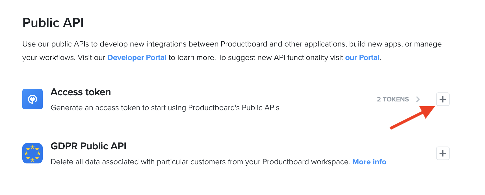

# Productboard

## Getting Started

1. Navigate to the **Destinations** page in Census and click **New Destination**.
2. Select **Productboard** from the menu.
3. Open Productboard in another browser tab and navigate to the **Integrations** page. Scroll down to the **Public API** section and generate a new **Access Token**. (If you don't see this option, reach out to Productboard support to ensure your plan has API access.)
4. Return to Census and enter your **API Token**.

<figure><figcaption>
Generate an API token from the Productboard app.
</figcaption></figure>

## Supported Objects and Sync Behaviors 

| **Object Name** | **Supported?** | **Sync Keys** | **Behaviors** |
| --------------: | :------------: | ------------- | ------------- |
|            Note |        ✅       | Any unique ID | Add           |


Learn more about all of our sync behaviors in our [Syncs](../syncs/overview.md) documentation.


Contact the support team if you want Census to support more Productboard objects and/or behaviors.

## Need help connecting to Productboard?

Contact the support team or start a conversation with us via the [in-app](https://app.getcensus.com) chat.
