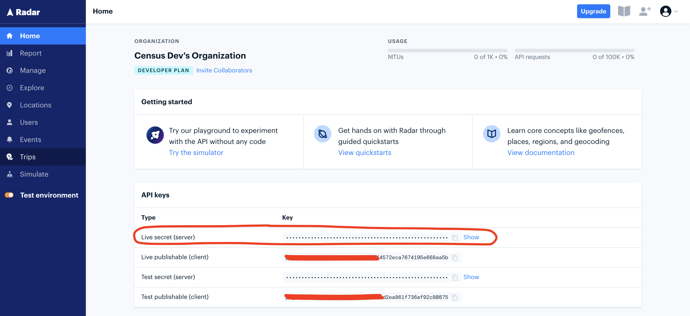

# Radar

## 🏃‍♀️ Getting Started

1. Click **Add Service**.
2. Select **Radar** from the menu.
3. Open the Radar app in another window. Visit the home screen and copy your **Secret Key**.
4. Return to Census and paste your **Secret Key**.

<figure><figcaption>
Get your Secret Key from the Radar app.
</figcaption></figure>

## 🔀 Supported Objects and Behaviors

| **Object Name** | **Supported?** | **Identifiers**  | **Behaviors** |
| --------------: | :------------: | ---------------- | ------------- |
| Geofence | ✅ | External ID and Tag | Update or Create |

[Contact us](mailto:support@getcensus.com) if you want Census to support more Radar objects and/or behaviors.

## 🚑 Need help connecting to Radar?

[Contact us](mailto:support@getcensus.com) via support@getcensus.com or start a conversation with us via the [in-app](https://app.getcensus.com) chat.
