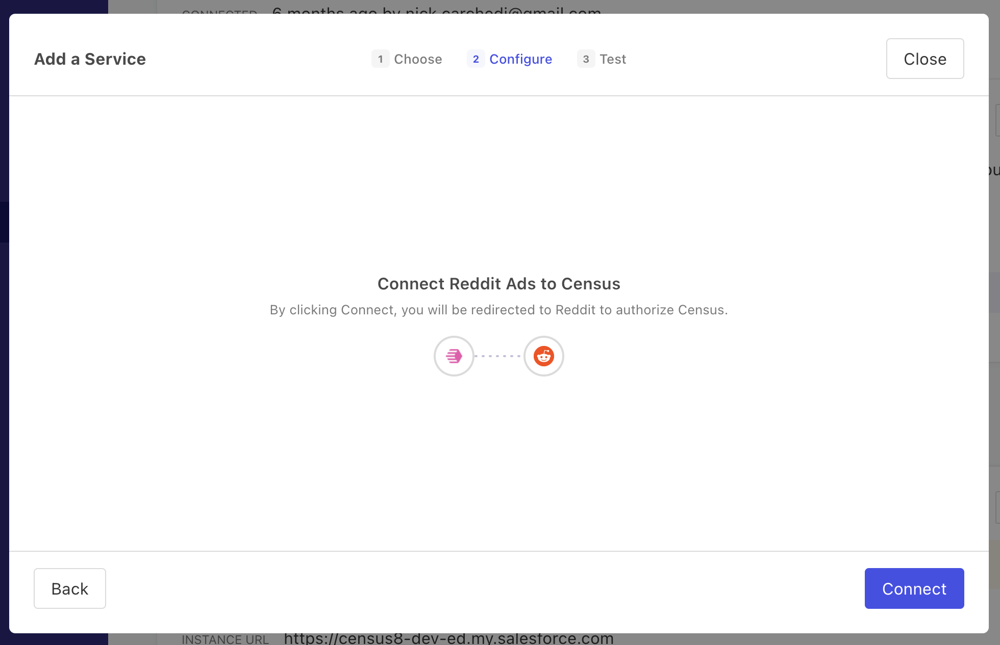

# Reddit Ads

Reddit Ads is an advertising platform that allows businesses to engage with Reddit's diverse and active community. Census can sync your customer data to Reddit Ads, helping you create targeted campaigns to reach specific subreddits, demographics, and interests.

## Getting Started

1. Navigate to the **Destinations** page in Census and click **New Destination**.
2. Select **Reddit Ads** from the menu.
3. Proceed through the OAuth flow to connect your Reddit Ads account to Census.

<figure><figcaption>
Connect your Reddit Ads account to Census.
</figcaption></figure>

## Supported Objects and Sync Behaviors 

<table data-header-hidden><thead><tr><th align="right"></th><th width="123" align="center"></th><th></th><th></th></tr></thead><tbody><tr><td align="right"><strong>Object Name</strong></td><td align="center"><strong>Supported?</strong></td><td><strong>Sync Keys</strong></td><td><strong>Behaviors</strong></td></tr><tr><td align="right">Conversion Event</td><td align="center">✅</td><td>Any unique ID</td><td>Send</td></tr><tr><td align="right">Custom Audiences</td><td align="center">✅</td><td>Email, Mobile Advertising ID (MAID)</td><td>Mirror</td></tr></tbody></table>


Learn more about all of our sync behaviors in our [Syncs](../basics/core-concept/#sync-behaviors) documentation.


[Contact us](mailto:support@getcensus.com) if you want Census to support more Reddit Ads objects and/or behaviors.

### Conversion Events

#### Field details

* `event_at`: The RFC3339 timestamp when the conversion event occurred
* `tracking_type`: Must be one of the following according to [Reddit's API documentation](https://ads-api.reddit.com/docs/#tag/Conversions/paths/\~1api\~1v2.0\~1conversions\~1events\~1{account\_id}/post): `PageVisit`, `ViewContent`, `Search`, `AddToCart`, `AddToWishlist`, `Purchase`, `Lead`, `SignUp`, `Custom`

### Custom Audiences

#### Sync Keys

Reddit will only accept hashed values for Custom Audience sync keys. Census will hash before sending to Reddit if you provide unhashed values. If you provide pre-hashed values, they must follow this format:

* The email address should be lowercase
* The local part of the email address should have any dots removed, and any text after a plus sign should be removed
* SHA-256 should be used to hash the identifier, and 64 lowercase hex digits should be given

#### Creating a Sync

1. Select Custom Audience Users as the destination.

<figure><figcaption></figcaption></figure>

2. Select your Sync Key.

<figure><figcaption></figcaption></figure>

3. Select an audience. You can select from existing audiences in the dropdown or create a new one. You cannot create an audience with the same name as an existing one.

<figure><figcaption></figcaption></figure>

## Need help connecting to Reddit Ads?

[Contact us](mailto:support@getcensus.com) via support@getcensus.com or start a conversation with us via the [in-app](https://app.getcensus.com) chat.
