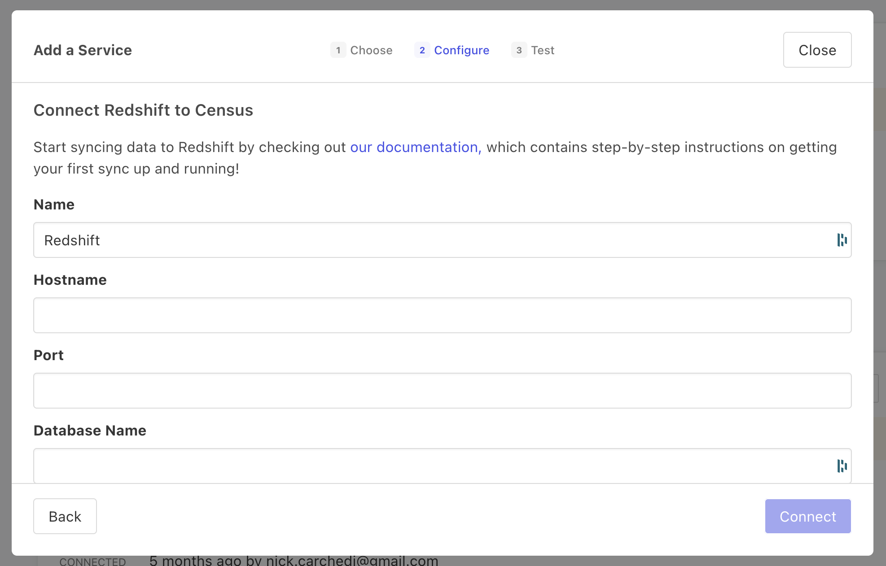

# Redshift

## 🏃‍♀️ Getting Started

1. Click **Add Service**.
2. Select **Redshift** from the menu.
3. Enter the requested database credentials.

<figure><figcaption>
Enter your Redshift credentials to connect with Census.
</figcaption></figure>

## 🔀 Supported Objects and Behaviors

<table data-header-hidden><thead><tr><th width="151" align="right"></th><th width="144" align="center"></th><th width="246"></th><th></th></tr></thead><tbody><tr><td align="right"><strong>Object Name</strong></td><td align="center"><strong>Supported?</strong></td><td><strong>Identifiers</strong></td><td><strong>Behaviors</strong></td></tr><tr><td align="right">Table</td><td align="center">✅</td><td>Primary keys or columns with uniqueness constraints</td><td>Update or Create, Update Only, Append</td></tr></tbody></table>

[Contact us](mailto:support@getcensus.com) if you want Census to support more Redshift objects and/or behaviors.

## 🚑 Need help connecting to Redshift?

[Contact us](mailto:support@getcensus.com) via support@getcensus.com or start a conversation with us via the [in-app](https://app.getcensus.com) chat.
