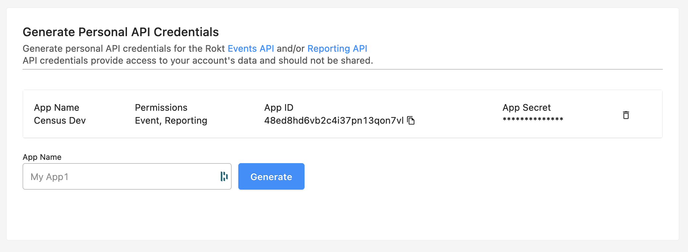

# Rokt

## Getting Started

1. Navigate to the **Destinations** page in Census and click **New Destination**.
2. Select **Rokt** from the menu.
3. Open Rokt in another browser tab and navigate to your **Profile Settings** page. Generate new API credentials and copy your **App ID** and **App Secret**.
4. Also take note of your **Account ID**, which can be found in the URL (e.g. https://my.rokt.com/accounts/**3144550328709722342**/profile-settings).
5. Finally, if you plan to sync Custom Audiences, you'll need to request an API Key from your Rokt account manager.
6. Return to Census and input these credentials to connect to Rokt.

<figure><figcaption>
Generate API credentials in the Rokt app.
</figcaption></figure>

## Supported Objects and Sync Behaviors 

| **Object Name** | **Supported?** | **Sync Keys**                  | **Behaviors**            |
| --------------: | :------------: | ------------------------------ | ------------------------ |
|           Event |        ✅       | Any unique ID                  | Send                     |
|        Audience |        ✅       | Email, MD5 Email, SHA256 Email | Update or Create, Mirror |


Learn more about all of our sync behaviors in our [Syncs](../basics/core-concept/#sync-behaviors) documentation.


[Contact us](mailto:support@getcensus.com) if you want Census to support more Rokt objects and/or behaviors.

### Audiences

To specify the list to which you want to add members, its name has to be mapped to the `List` field in Rokt. This means it should either be available in the source, or set as a Constant Value.

<figure><figcaption></figcaption></figure>

## Need help connecting to Rokt?

[Contact us](mailto:support@getcensus.com) via support@getcensus.com or start a conversation with us via the [in-app](https://app.getcensus.com) chat.
