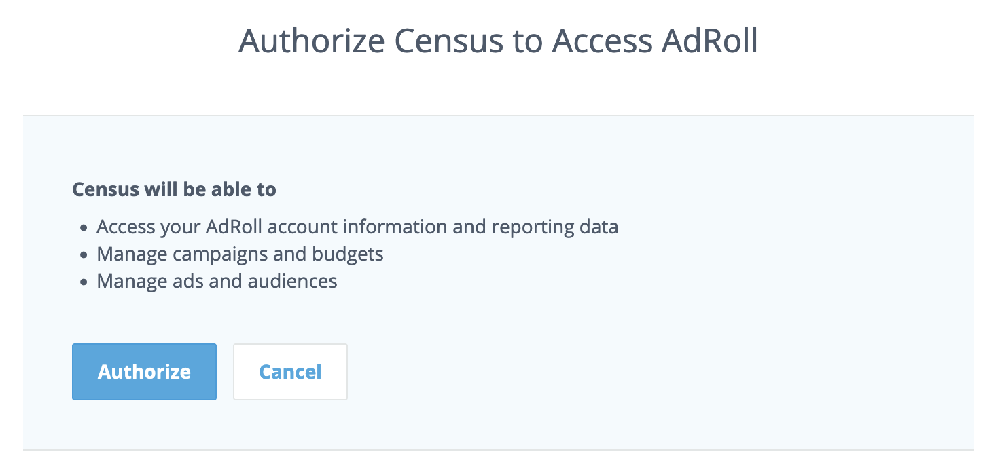

# RollWorks

## Getting Started

1. Navigate to the **Destinations** page in Census and click **New Destination**.
2. Select **RollWorks** from the menu.
3. When prompted, log into your RollWorks/AdRoll account and authorize Census.

<figure><figcaption>
Grant access to your RollWorks/AdRoll account.
</figcaption></figure>

## Supported Objects and Behaviors

|     **Object Name** | **Supported?** | **Sync Keys** | **Behaviors** |
| ------------------: | :------------: | ------------- | ------------- |
|        CRM Audience |        ✅       | Email         | Replace       |
| Target Account List |       🔜       | -             | -             |


Learn more about all of our sync behaviors on our [Core Concepts page](broken-reference).


Contact the support team if you want Census to support more RollWorks objects and/or behaviors.

## Need help connecting to RollWorks?

Contact the support team or start a conversation with us via the [in-app](https://app.getcensus.com) chat.
