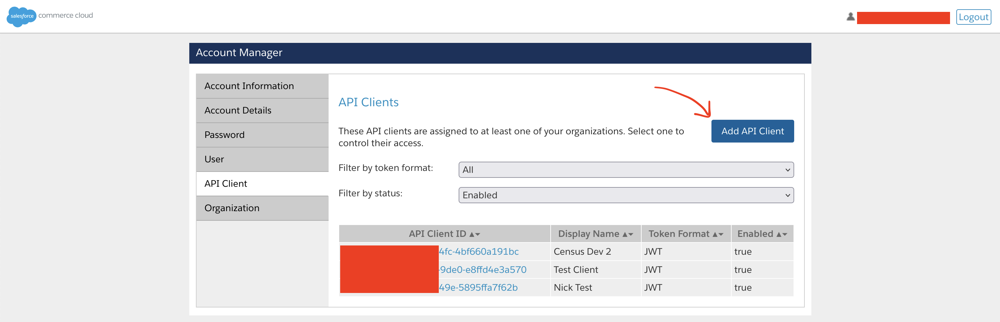

# Salesforce Commerce Cloud

## 🏃‍♀️ Getting Started

1. Click **Add Service**.
2. Select **Salesforce Commerce Cloud** from the menu.
3. In another browser tab, open the Commerce Cloud [Account Manager](https://account.demandware.com/) and follow the instructions [here](https://developer.salesforce.com/docs/commerce/commerce-api/guide/authorization-for-admin-apis.html#create-an-api-client) to create a new API Client. Enter the following under **Allowed Scopes**: `sfcc.customerlists.rw`. Take note of your API Client ID and password—you'll need them in a moment.
4. Navigate to **Administration** >  **Sites** >  **Manage Sites** and take note of the relevant **Site ID**.
5. Finally, go to **Administration** >  **Site Development** >  **Salesforce Commerce API Settings** and copy your **Short Code** and **Organization ID**.
6. Now return to Census and input the values you captured above to connect to Commerce Cloud.

<figure><figcaption>
Enter your credentials to connect to Commerce Cloud.
</figcaption></figure>

## 🔀 Supported Objects and Behaviors

| **Object Name** | **Supported?** | **Sync Keys**  | **Behaviors** |
| --------------: | :------------: | ---------------- | --------------|
| Customer | ✅ | Customer No, Email | Update Only |

[Contact us](mailto:support@getcensus.com) if you want Census to support more Salesforce Commerce Cloud objects and/or behaviors.

## 🚑 Need help connecting to Salesforce Commerce Cloud?

[Contact us](mailto:support@getcensus.com) via support@getcensus.com or start a conversation with us via the [in-app](https://app.getcensus.com) chat.
