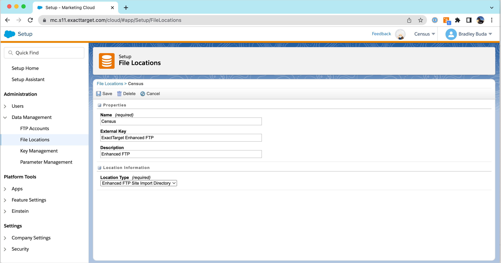

# Salesforce Marketing Cloud

## Getting Started

In this guide, we will show you how to connect Salesforce Marketing Cloud to Census and create your first sync.


This process involves several steps - please set aside 15-30 minutes to complete it. Note that you may be on an older or newer version of Marketing Cloud which has slightly different screens than the ones pictured below. Marketing Cloud configuration can be complex, so if you have any questions please contact our support team and we'll help you tailor these instructions to your needs.


### 1. Create and Configure a Server-to-Server Installed Package

Sign in to Salesforce Marketing Cloud and enter "Setup"

Navigate to "Apps > Installed Packages". Click "New" to create a new package. Create an app called "Census" and provide an optional description, then click "Save"

Click "Add Component" and choose "API Integration"

Choose "Server-to-Server" as the OAuth Integration Type

In "Set Server-to-Server Properties", given the new component the following permissions by checking the appropriate boxes:

* Automation > **Automations: Read, Write, Execute**
* Contacts > **Audiences: Read, Write**
* Contacts > **List and Subscribers: Read, Write**
* Data > **Data Extensions: Read, Write**
* Data > **File Locations: Read, Write**
* Journeys > **Journeys: Read, Write**

Click "Save" to continue. You should see a new Component in your package - verify that it has the correct permissions (in the Scope section) by comparing to the image below.

Copy the **Client Id**, **Client Secret**, and **Authentication Base URI** from this page - you will need to provide these values to Census in Step 3.

### 2. Create an SFTP Account in Salesforce Marketing Cloud

Census uses the ExactTarget Enhanced FTP server to upload large data files to your Salesforce Marketing Cloud instance and prepare them for import. In this step, you'll ensure there is a File Location for Census to upload the data, and create a new user account on your FTP server that Census can use to sign in.

**File Location**

In Salesforce Marketing Cloud Setup, navigate to "Data Management > File Locations". If you have an Enhanced FTP location with an external key of "ExactTarget Enhanced FTP", then no action is required. If you do not see this File Location, click "Create" to generate a new location with the following configurations:

* An "External Key" value of **ExactTarget Enhanced FTP**
* A "Location Type" of **Enhanced FTP Site Import Directory**

**FTP User**

Still in Salesforce Marketing Cloud Setup, navigate to "Data Management > FTP Accounts" and click "Add FTP User".

For the email address, type in "census@example.com" and give the user a strong, random password. You do not need to write down or memorize this password - Census does not require it, and in step 4 we will replace it with an SSH key. Make sure to give the Census user "Full" access, and do not specify any IPs in the "Allowlist IPs" list. Click Next.

There's nothing to do yet on the next screen - we'll set up SSH Keys later.

Select the Root folder as the Home Folder for your user. Click "Save" to create the user.

<figure><figcaption>
Select the Root folder as the Home Folder
</figcaption></figure>

Salesforce Marketing Cloud will create the user, which may take a few seconds. Copy the **FTP Username** that was assigned to the user, which you'll need in Step 3.

### 3. Configure Census with Your Connection Information

Go to [Census Destinations](https://app.getcensus.com/destinations), click **New Destination** and choose **Salesforce Marketing Cloud**.

<figure><figcaption></figcaption></figure>

In the dialog, fill out the data you gathered in steps 2 and 3:

* Name: A descriptive name of your choosing. If you have more than one Salesforce Marketing Cloud connection, you can use this field to help you keep track them
* Endpoint URL: Fill in the **Authentication Base URI** from Step 1
* Client ID and Client Secret: Fill in the **Client ID** and **Client Secret** from Step 1
* SFTP User: Fill in the **FTP Username** from Step 2
* (Optional) **Business Unit MID**: If you would like to create a connection for a business unit other than your primary SFMC account, you can provide a Business Unit MID. This can be found in the SFMC top navigation menu:
* Include Shared Data Extensions?: If you would like Census to access shared data extensions, check this box. This has performance implications (see below for more details).

<figure><figcaption></figcaption></figure>

*   In order to enable Census support for business units, you will also need to turn on business unit app integration in your SFMC instance under `Setup` > `Apps` > `Installed Packages` > `Census` > `Access` > `Enable Integration` :

    <figure><figcaption></figcaption></figure>

Click **Save Connection**.

Census will show your new Salesforce Marketing Cloud connection in its connections list

### 4. Upload Census's SSH Public Key to Marketing Cloud

The final step is to configure Marketing Cloud to accept Census's SSH public key for FTP access, instead of using a password. Still in Census, click the button labeled "Click to Download" next to the "SFTP Public Key". This will download a file called "census.pub" to your computer - make a note of where it was saved.

Return to Salesforce Marketing Cloud Setup and navigate to "Data Management" > "Key Management". Click "Create".

* For "Key Type", choose "SSH"
* For "Name", type "Census Public Key"
* For "External Key", type "census-public-key"
* Check the "Public Key" checkbox
* Click "Browse" next to the "Key (required)" field and find the "census.pub" file you previously downloaded.
* Click "Save"

Now we'll associate the key with the Census user. Navigate to "Data Management" > "FTP Accounts". Choose the "census@example.com" user and click the small arrow next to their name (you may need to scroll to the right. Choose "SSH Keys" from the drop-down menu.

Click in the "Search SSH Keys" box and find "Census Public Key" and select it. Change the "Authentication Options" to "SSH Key" and click "Save". In a few seconds, Salesforce Marketing Cloud will finish configuring the SSH key (you can click the refresh icon at the top right to see the activity log go from "Pending" to "Success".

You're ready to start using Census to load data from your warehouse to Salesforce Marketing Cloud!

## Supported Objects and Behaviors

|       **Object Name** | **Supported?** | **Sync Keys**     | **Behaviors**                          |
| --------------------: | :------------: | ----------------- | -------------------------------------- |
|        Data Extension |        ✅       | Unique Identifier | Update or Create, Update Only, Replace |
|               Contact |        ✅       | Contact Key       | Update or Create                       |
| API-Triggered Journey |        ✅       | Contact Key       | Update or Create, Mirror               |


Learn more about all of our sync behaviors on our [Core Concepts page](broken-reference).


Contact our support team if you want Census to support more Marketing Cloud objects and/or behaviors.

## 🏗️ Working With Data Extensions

Data Extensions are a fundamental component of Salesforce Marketing Cloud and are used in various capacities, including email personalization, segmentation, and reporting. They're unique in that they combine the common marketing automation concepts of segmentation and custom/relational data together into a single mechanism.

Census allows you to sync data to existing data extensions, create new ones, and add fields to existing ones as well.

### Creating a data extension

You can select any existing data extension as a destination for a sync. You can also create a new data extension when setting up a Census sync.

<figure><figcaption></figcaption></figure>

1. Click New Object
2. Provide a name for your data extension
3. Optionally, you can provide a different name for the identifier. By default, we'll use **ID**.


You can also have Census create the data extension within a subfolder by providing it in the data extension name. The subfolder must already exist, Census won't automatically create it. The subfolder will be relative to any configured root folder (see below).


### Adding new properties

Whether you're working with a brand new data extension or an existing one, you can always add more properties to a data extension. Within the Mappings section, either the **Add Mapping** or **Generate Mappings** allow you to add new properties to the data extension that will be created next time the sync is run.

### Setting a root folder

Some Salesforce Marketing Cloud installations have a very large number of data extensions. Census allows specify a specific folder to use as the root or base folder. Only data extensions within this folder or its subfolders will be shown in Census and new data extensions will be created in this folder.

<figure><figcaption></figcaption></figure>

1. Visit the Destinations page and find your Salesforce Marketing Cloud connection.
2. Click **Edit**.
3. Set the Folder Path value to match your desired folder.
4. Click **Save Connection**.

### Shared Data Extensions

In addition to Data Extentions in your specified root folder, you can also have Census look for shared data extensions. For organizations with thousands of data extensions (regardless of whether they're shared or not), this can make the process of scanning for all existing extensions very slow. This slowness will show up when setting up new Census connections or creating a new data extension. If you're experiencing slow performance, you can disable this feature by unchecking the "Include Shared Data Extensions?" checkbox in the Salesforce Marketing Cloud connection settings.

## Advanced Configuration

By default, Census uses Salesforce Marketing Cloud's bulk upload mechanism which is powered by SFTP. This is the recommended mechanism for most syncs. However, for small data volumes, it may be preferred to send updates individually via Salesforce Marketing Cloud's SOAP API for faster processing. If your syncs must be processed with as low latency as possible and you have a relatively small number of changes, you can disable the standard SFTP method of syncing.

## Need help connecting to Salesforce Marketing Cloud?

Contact our support team or start a conversation with us via the [in-app](https://app.getcensus.com) chat.
