# Salesforce Marketing Cloud

## 🏃‍♀️ Getting Started

In this guide, we will show you how to connect Salesforce Marketing Cloud to Census and create your first sync.

### Prerequisites

You'll need a Census account as well as a Salesforce Marketing Cloud account with the Administrator role. This process involves several steps - please set aside 15-30 minutes to complete it. Note that you may be on an older or newer version of Marketing Cloud which has slightly different screens than the ones pictured below. Marketing Cloud configuration can be complex, so if you have any questions please reach out to [support@getcensus.com](mailto:mailto:support@getcensus.com) and we'll help you tailor these instructions to your needs.

### 1. Create and Configure a Server-to-Server Installed Package

Sign in to Salesforce Marketing Cloud and enter "Setup"

Navigate to "Apps &gt; Installed Packages". Click "New" to create a new package. Create an app called "Census" and provide an optional description, then click "Save"

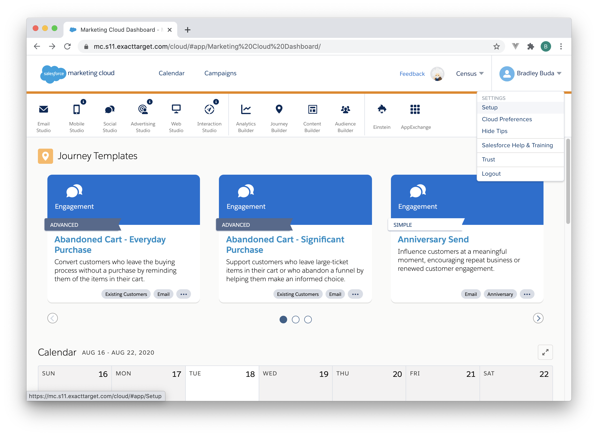

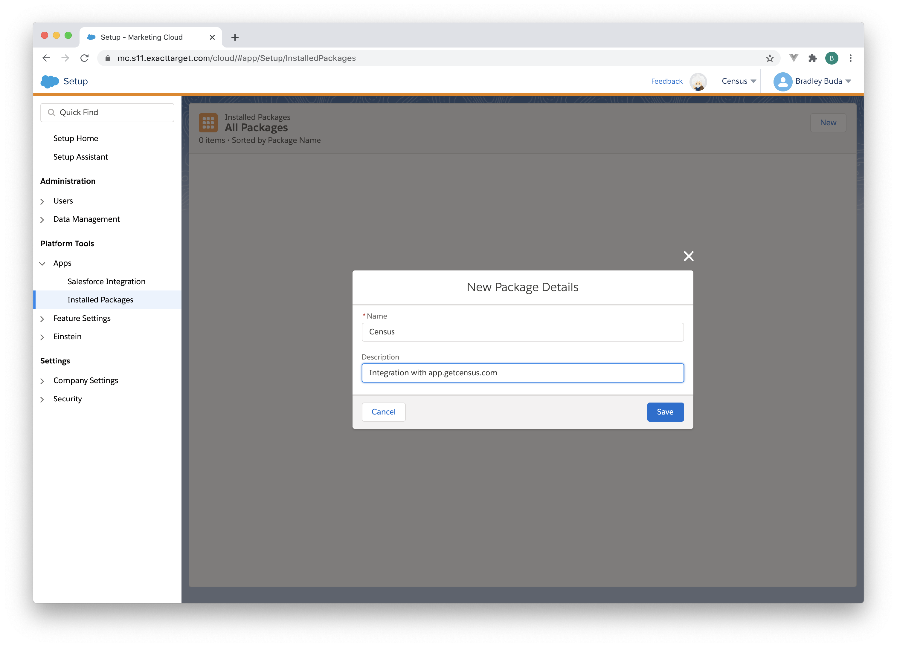

Click "Add Component" and choose "API Integration"

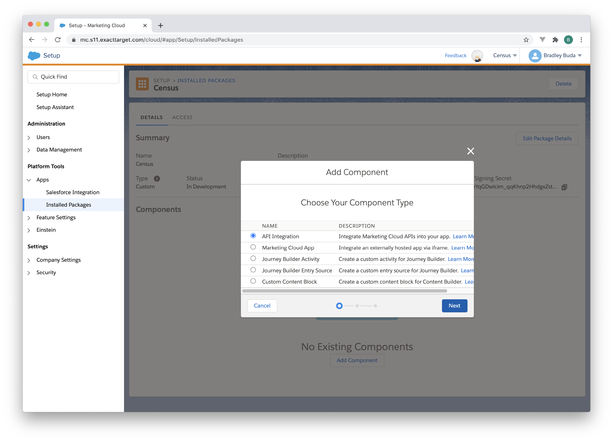

Choose "Server-to-Server" as the OAuth Integration Type

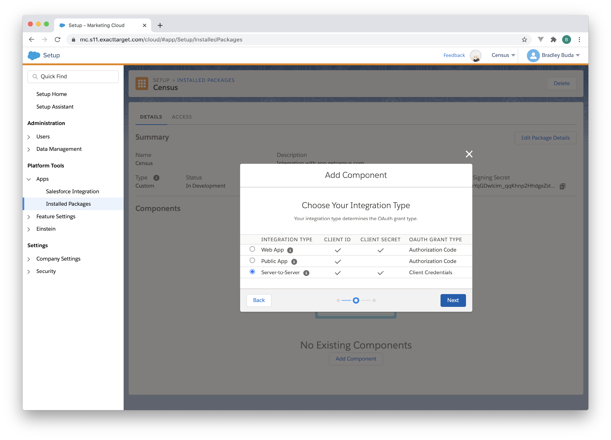

In "Set Server-to-Server Properties", given the new component the following permissions by checking the appropriate boxes:

* Automation &gt; **Automations: Read, Write, Execute**
* Contacts &gt; **Audiences: Read, Write**
* Contacts &gt; **List and Subscribers: Read, Write**
* Data &gt; **Data Extensions: Read, Write**
* Data &gt; **File Locations: Read, Write**

Click "Save" to continue. You should see a new Component in your package - verify that it has the correct permissions \(in the Scope section\) by comparing to the image below.

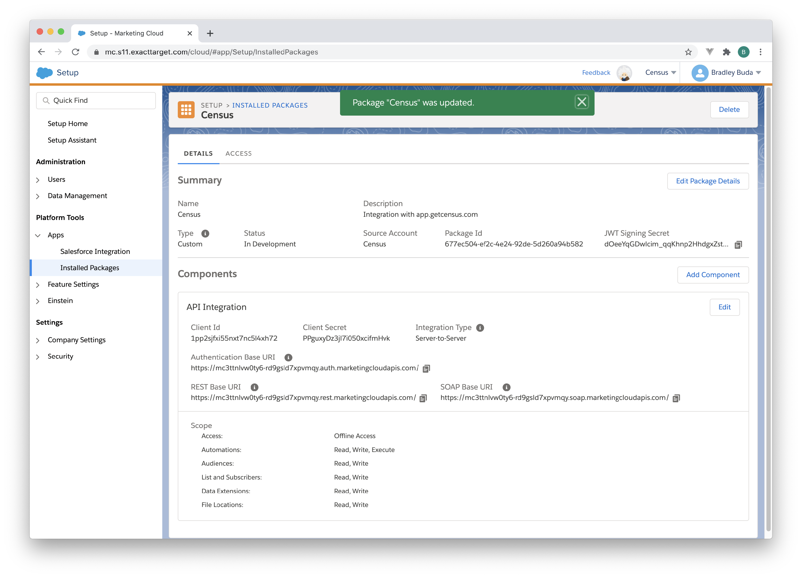

Copy the **Client Id**, **Client Secret**, and **Authentication Base URI** from this page - you will need to provide these values to Census in Step 3.

### 2. Create an SFTP Account in Salesforce Marketing Cloud

Census uses the ExactTarget Enhanced FTP server to upload large data files to your Salesforce Marketing Cloud instance and prepare them for import. In this step, you'll create a new user account on your FTP server that Census can use to sign in

Still in Salesforce Marketing Cloud Setup, navigate to "Data Management &gt; FTP Accounts" and click "Add FTP User".

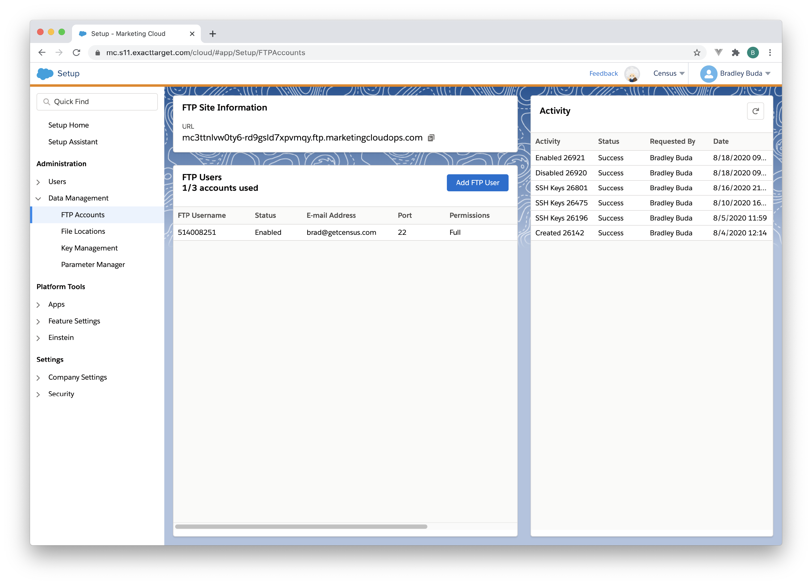

For the email address, type in "support@getcensus.com" and give the user a strong, random password. You do not need to write down or memorize this password - Census does not require it, and in step 4 we will replace it with an SSH key. Make sure to give the Census user "Full" access, and do not specify any IPs in the "Allowlist IPs" list. Click Next.

There's nothing to do yet on the next screen - we'll set up SSH Keys later. Click "Save" to create the user.

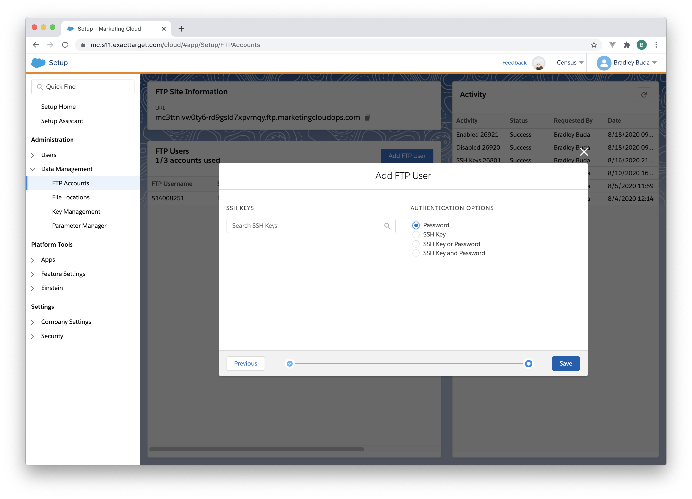

Salesforce Marketing Cloud will create the user, which may take a few seconds. Copy the **FTP Username** that was assigned to the user, which you'll need in Step 3.

### 3. Configure Census with Your Connection Information

Go to [Census Connections](https://app.getcensus.com/connections), click "Add Service" and choose "Salesforce Marketing Cloud".

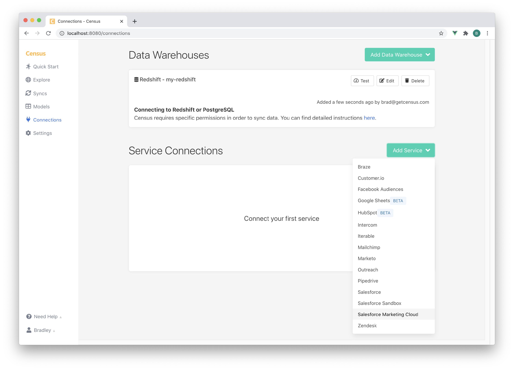

In the dialog, fill out the data you gathered in steps 2 and 3:

* Name: A descriptive name of your choosing. If you have more than one Salesforce Marketing Cloud connection, you can use this field to help you keep track them
* Endpoint URL: Fill in the **Authentication Base URI** from Step 2
* Client ID and Client Secret: Fill in the **Client ID** and **Client Secret** from step 2
* SFTP User: Fill in the **FTP Username** from Step 3

Click "Save Connection".

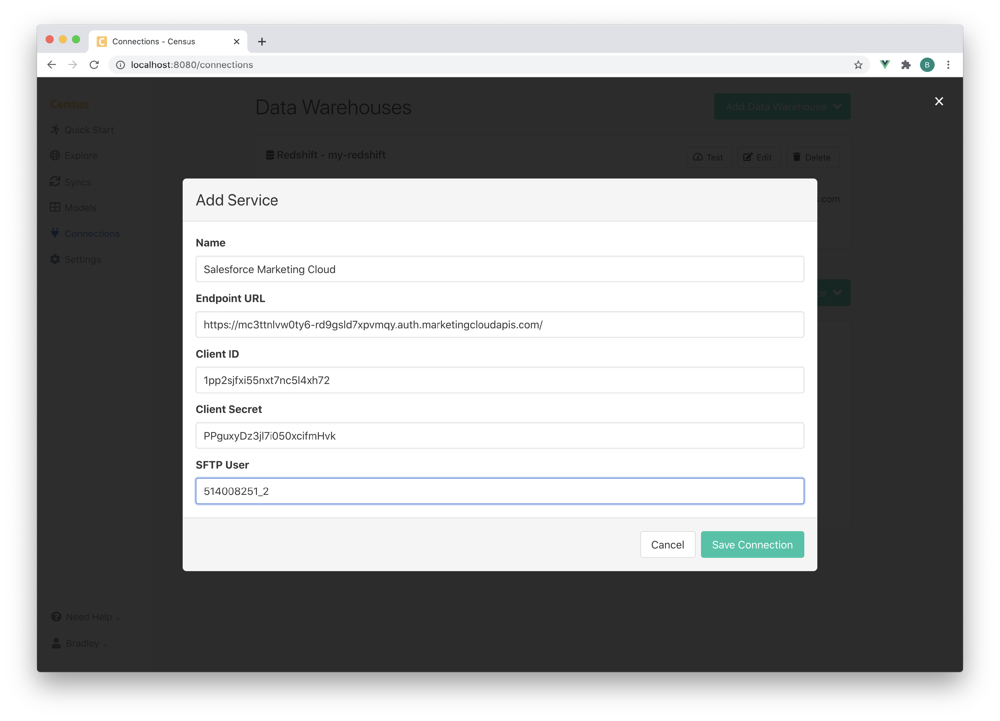

Census will show your new Salesforce Marketing Cloud connection in its connections list

### 4. Upload Census's SSH Public Key to Marketing Cloud

The final step is to configure Marketing Cloud to accept Census's SSH public key for FTP access, instead of using a password. Still in Census, click the button labeled "Click to Download" next to the "SFTP Public Key". This will download a file called "census.pub" to your computer - make a note of where it was saved.

Return to Salesforce Marketing Cloud Setup and navigate to "Data Management" &gt; "Key Management". Click "Create".

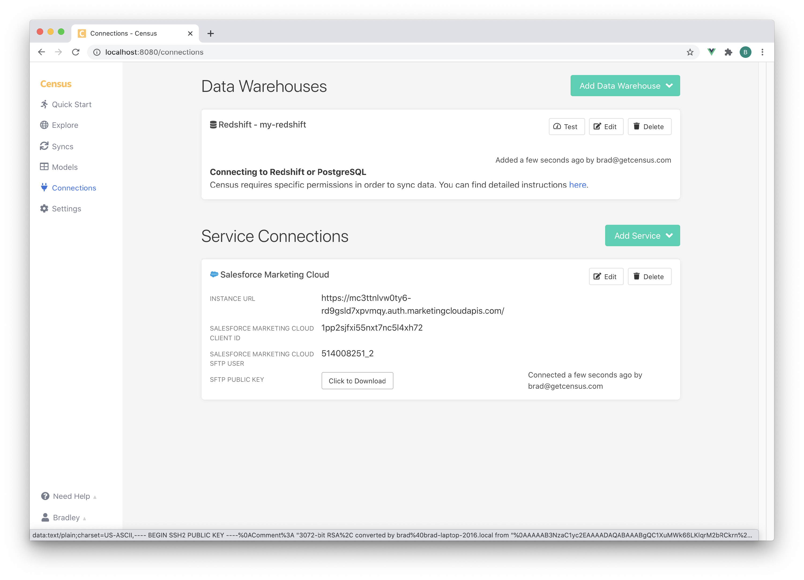

* For "Key Type", choose "SSH"
* For "Name", type "Census Public Key"
* For "External Key", type "census-public-key"
* Check the "Public Key" checkbox
* Click "Browse" next to the "Key \(required\)" field and find the "census.pub" file you previously downloaded.
* Click "Save"

Now we'll associate the key with the Census user. Navigate to "Data Management" &gt; "FTP Accounts". Choose the "support@getcensus.com" user and click the small arrow next to their name \(you may need to scroll to the right. Choose "SSH Keys" from the drop-down menu.

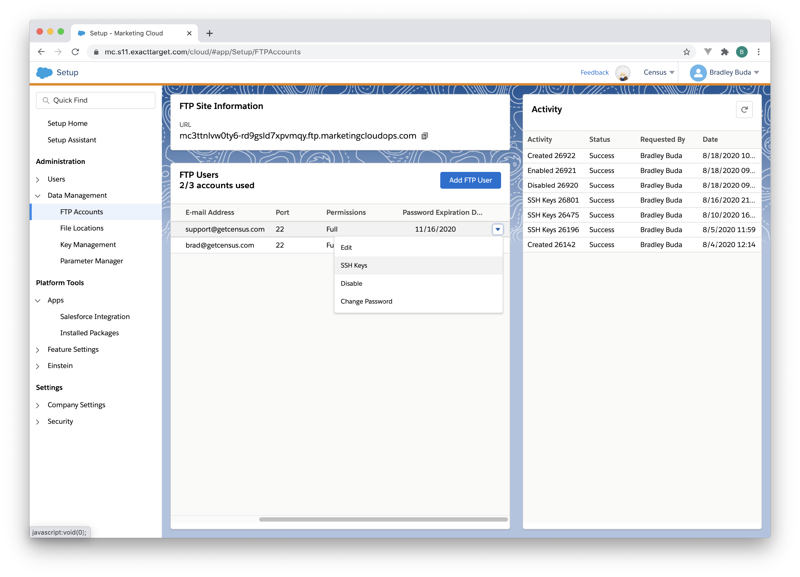

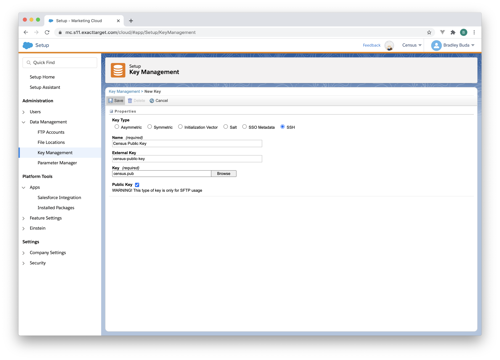

Click in the "Search SSH Keys" box and find "Census Public Key" and select it. Change the "Authentication Options" to "SSH Key" and click "Save". In a few seconds, Salesforce Marketing Cloud will finish configuring the SSH key \(you can click the refresh icon at the top right to see the activity log go from "Pending" to "Success".

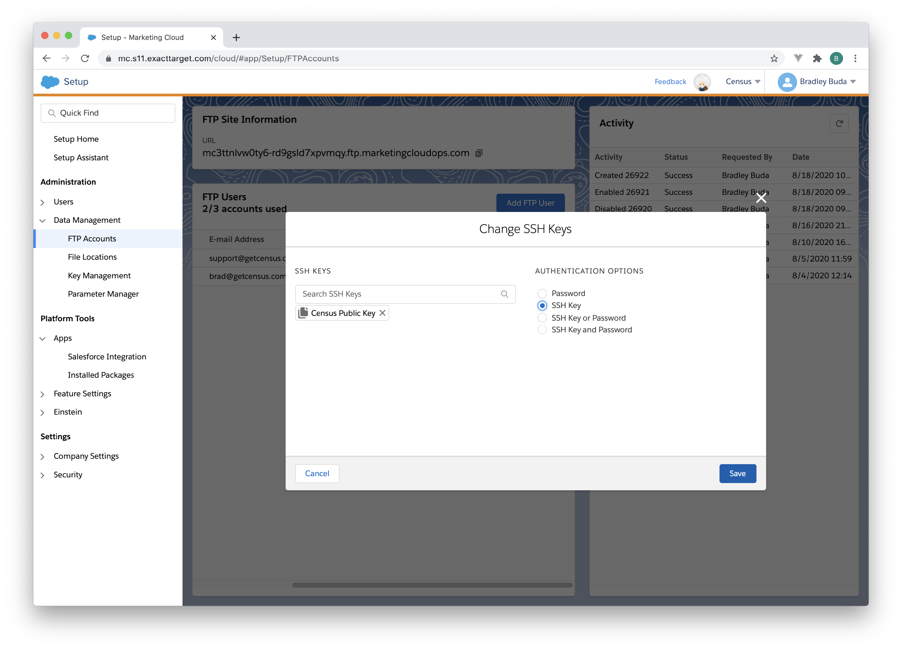

### 5. Starting syncing

You're ready to start using Census to load data from your warehouse to Salesforce Marketing Cloud!

## 🏎 Sync Speed

| **Service** | **Records sync / Minute** |
| :--- | :--- |
| Salesforce Marketing Cloud | ~20,000 |

## 🗄️ Supported Objects

\*\*\*\*

| **Object Name** | **Supported?** |
| ---: | :---: |
| Any Custom Data Extension | ✅ |

[Contact us](mailto:support@getcensus.com) if you want Census to support more Objects for Salesforce Marketing Cloud.

## 🔄 Supported Sync Behaviors


Learn more about all of our sync behaviors on our [Core Concept page](../basics/core-concept.md#the-different-sync-behaviors).


| **Behaviors** | **Supported?** | **Objects?** |
| ---: | :---: | :---: |
| **Update or Create** | ✅ | All |
| **Update Only** | 🔜 | All |

[Contact us](mailto:support@getcensus.com) if you want Census to support more Sync Behaviors for Salesforce Marketing Cloud.

## 🚑 Need help connecting to Salesforce Marketing Cloud?

[Contact us](mailto:support@getcensus.com) via support@getcensus.com or start a conversation with us via the [in-app](https://app.getcensus.com) chat.

