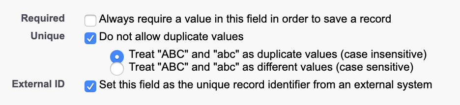

# Salesforce



## 🏃‍♀️ Getting Started

In this guide, we will show you how to connect Salesforce to Census and create your first sync.

## 🔑 Required permissions

Census connects to your Salesforce instance through a standard OAuth connection to an individual user account. We recommend using a stand-alone account specifically for Census (often called a Service Account) so you can see Census updates in your audit history. Census primarily uses the [Salesforce Bulk API](https://developer.salesforce.com/docs/atlas.en-us.api\_asynch.meta/api\_asynch/asynch\_api\_intro.htm) to sync data to Salesforce in the most API quota-efficient way possible.

The Census Service Account will need at least these permissions in order to connect successfully:

* "API Enabled" must be checked
* "Session Security Level Required at Login" must be "None"
  * Further details: [Salesforce blocks some API access](https://help.salesforce.com/s/articleView?id=sf.security\_require\_2fa\_api.htm\&type=5) when the **High Assurance on Session security level required at login** setting is used on user Profiles. This will prevent Census from accessing your Salesforce instance. [See Salesforce documentation](https://help.salesforce.com/s/articleView?id=sf.security\_require\_two-factor\_authentication.htm\&type=5) on how to disable this for your Profile (Strangely, this can be enabled/disabled per user and seems to have no effect on the API. Only the profile-level setting causes issues).

The objects and fields accessible to Census are all determined by the user account you use when connecting Census to your Salesforce instance. Census will have the same access as the user, so if fields are read-only or hidden for that user, they will be to Census. In general, you should give Census "Read", "Create", "Edit", and "Delete" access to all the objects you'd like to manage via Census.


**Require a connection via an API-Only user?**

If you have an API-Only Salesforce user that is unable to log into the Salesforce UI, please [contact us](mailto:support@getcensus.com) via support@getcensus.com. We'd be happy to set up this connection with you.


### Using a Salesforce Sandbox

Census supports Salesforce Sandbox instances as well. Note that Sandboxes have their own set of user accounts and you may need to create a new account for Census to replicate permissions. Any time a sandbox is refreshed from production, the account will need to be recreated and the Census link re-authorized.

## Identifying Salesforce records

Selecting the identifier on the destination object is one of the most important decisions when syncing to Salesforce. Salesforce in particular makes the process very flexible, but all the options can also get confusing. This article will guide you through the process of creating and selecting identifiers on your Salesforce objects.

### Using External Identifier fields (Recommended)

This is the most reliable choice for identifiers on Salesforce objects, particularly for an **Update or Create** sync. This will ensure no records with duplicate IDs can be created. If you've already got a field like this, you can skip over the setup instructions, but take a look at the advice on reusing existing external ID fields below.

_Before you start: You're going to need Salesforce admin permissions to edit your Salesforce objects. If you don't have that permission, ask your Salesforce admin._

Here's how to add a new External ID to your Salesforce Object:

1. In Salesforce, go to **Setup**, open the **Object Manager**, and click on the Salesforce object you want to sync to.
2. Select **Fields & Relationships** and press the **New** button in the top right.
3. Select the type of field. You'll want to stick to the Text, Email, or Number types as most others cannot be made into an External ID in the next step.
4.  Define your new ID field. The important part is that you check **External ID** AND **Unique.** You can choose between case sensitive and case insensitive.

    * Unique is strongly recommended. Without it, two records may have the same identifier value and Census can't ensure we're updating the correct record.
    * Case insensitive is a safer choice if you're ever going to have humans inputting values (such as an email address), but could in rare cases introduce a problem with computer-generated identifiers.

    
5. Continue through the field creation process and hit **Save**.
6. The field should now appear as an option in Census when creating a new sync. You may need to hit the **Refresh** button next to the menu if we haven't updated metadata since you created the new field.

#### Extra steps for syncing to Multi-destination Objects

If you're planning to create a Multi-destination sync to both Lead & Contact or Lead & Account, you'll need to do two more steps.

1. First, make sure you've created the same External ID on both the Lead and the Contact or Account.
2. Then, return to **Lead** in the **Object Manager**. Once again in **Fields & Relationships** and press the **Map Lead Fields** button in the top right. This UI will let you associate fields across a converted Lead. Create a mapping between your two external IDs and you're done!

#### Reusing existing External Identifier fields

If your object already has an identifier field, you're in great shape! One thing to double-check before using it for a sync is to make sure all the Salesforce records that should have an ID in that field actually do. If you've got an external ID field created but very few of the records that have an ID actually do, you'll want to make sure you fill that field first before creating a sync, otherwise Census won't know those records exist and will end up creating duplicates.

If this sounds like your situation, you have a couple of options. You may choose to do all of them.

* Manually go through your Salesforce records and fill in the missing ID values by hand.
* Create a separate ID population sync in Census. This sync would be **Update Only** and typically requires creating a Census model that uses SQL to do some fuzzy matching on other properties such as the name of Salesforce records to fill the ID field.
* Create your new sync anyway and let it create duplicates in Salesforce. Then use Salesforce's deduplication workflow to merge the duplicated objects together, making sure to keep the new ID value.

### Using Salesforce IDs

By default, every Salesforce object has an ID field. This ID is automatically generated and assigned whenever a new record is created, and can't be changed. This means the ID is completely under Salesforce's control. Census (nor anyone else really!) cannot set or update that ID.

Census can use the Salesforce ID field for **Update Only** syncs, but it cannot be used for Update or Create, or Create Only syncs.

### Using non-External ID fields as identifiers

Census does allow using non-External ID fields as identifiers in certain situations:

* Any string or numeric field can be used when using Update Only.
* Default Salesforce objects' other identifier fields. For example, the Contact object has an Email field that can be used as an identifier as well. Note:&#x20;

Note that, because these fields are not forced to be unique in Salesforce, Census will have trouble identifying which Salesforce record to update if duplicates are present. When this happens, Census will update one of the records, but not predictable.&#x20;

For this reason, we recommend you try to use an Unique External Identifier field whenever possible.

## 🗄 Supported Objects

Salesforce support is pretty straight forward!

|           **Object Name**          |      **Supported?**     |
| :--------------------------------: | :---------------------: |
|   All Standard and Custom Objects  |            ✅            |
| Multi-Destination: Lead or Contact |            ✅            |
| Multi-Destination: Lead or Account |            ✅            |
|       OpportunityContactRole       | Append Only (See below) |

### **Syncing to OpportunityContactRole**

The OpportunityContactRole in Salesforce is a bit weird. It doesn't actually support External ID fields like every other object in Salesforce, which means that Census cannot support most typical operations. For this, and only this object type Census supports an Append sync with a very specific configuration. This is definitely advanced mode so if you need help with these steps, please get in contact with Census Support.

1. On your source data model, you'll need to create a unique identifier for each record of the relationship you want to create with OpportunityContactRole. This can simply be `CONCAT(opportunity_id, contact_id)` as part of your data model. Your data model should also still include `opportunity_id`, `contact_id`, and `contact_email`, as well as any other fields you want to eventually pass to Salesforce. **Pro tip:** Your model should exclude any records where either the Opportunity or Contact are `null`.
2. Inside Salesforce, you'll need to add a new field to the OpportunityContactRole object. The API name of the field **must** be `census_tracking_id__c`, though you can provide whatever label you want.
3. Now you can set up your sync!
   1. Select your data source and target OpportunityContactRole in your Salesforce connection.
   2. Your sync will be an [append sync](../basics/core-concept/#sync-behaviors) meaning that Census can create OpportunityContactRole relations, but won't update or remove them.
   3. For Primary Identifier, you'll select the column you created in Step 1. Behind the scenes, Census will use the Salesforce field you created in Step 2 to make sure we're not creating any duplicate relationships.
   4. In the sync mappings, make sure to set both the Opportunity Lookup with `opportunity_id` as well as Contact lookup either using either Contact `contact_id` or `contact_email`. You can also map any other fields you want on the OpportunityContactRole.
   5. Make sure you press the **Refresh Fields** button one last time to pick up all the new fields you created.
4. At this point, you can use the Sync Tester to verify or save and run your sync. Even if you save and run your sync, we recommend limiting your data model to no more than 10 records just to verify relationships are being created as expected.
5. Once your test or first sync has run, sign into Salesforce and verify that the OpportunityContactRole relationships were created the way you expected!

That should be it! OpportunityContactRole is one of the weirdest parts of the Salesforce platform so if you're still confused, not to worry. Reach out and let our support team get you going!

## **🗃 Supported Data Types**

| **Salesforce Field Types** | **Source SQL Types**                                                                                                                                                                                  |
| :------------------------: | ----------------------------------------------------------------------------------------------------------------------------------------------------------------------------------------------------- |
|     Picklist (Multiple)    | 
String separated by a <code>;</code>

In Snowflake, this is best done via <code>LISTAGG(VAL, ';')</code>

In BigQuery, this can be via: <code>ARRAY_TO_STRING(VAL_ARRAY, ';')</code>
 |
|           Lookup           | On the object you are syncing to, the field you are looking up needs to be exposed as a unique and an external Id                                                                                     |
|          The Rest          | 
Census will give an informative error

message if rejected by Salesforce 😀
                                                                                                               |

**Clearing fields / Syncing null values**

You can clear fields in Salesforce by syncing `NULL` values from your data source. Note that the Salesforce will ignore any empty string or `''` values from your source and make no changes.

## :question:Why is my Salesforce sync so slow

Census utilizes the bulk API to write data into Salesforce. If a sync is taking a while, check to see if there are any automations, process builders, or Apex triggers on those specific objects. If so, Census must wait to upload/update the service. Our recommendation is to pause automations on that object for full syncs in the interest of speed.

## 🆘 Common Errors

There's a few errors which frequently cause skipped records on when syncing data to Salesforce.\
\
Keep in mind, Census will always retry syncing any records that are rejected by Salesforce so it's worth the effort to understand and address the cause of the issues. Once they're fixed, Census will sync any of the changes that had been missed.

**`DUPLICATES_DETECTED:Use one of these records?:--`**

This error is caused when attempting to insert a new Account, Contact, or Lead record that Salesforce thinks is a duplicate of a record already in Salesforce. That "Use one of these records?" message is actually the title of a message you'd see if you were trying to do this manually in Salesforce. Unfortunately, it's not that helpful as an error message!

Though Leads are separate objects from Contacts and Accounts, Salesforce has predefined duplication rules that check for duplicates between Lead and Contact/Account. You can [see the rules that define duplicates](https://help.salesforce.com/articleView?id=duplicate\_rules\_standard\_rules.htm\&type=5) and even define custom ones in Setup. Usually preventing duplicates is a great thing. The best way around this is to use Census's **Multi-destination Syncs** to sync to both Lead & Contact or Lead & Account at the same time.\
\
In extreme cases, you can choose to turn off duplicate rules either only for the Census account, or entirely for your org. This is probably a bad idea, so proceed with caution!

**`CANNOT_INSERT_UPDATE_ACTIVATE_ENTITY:MyCoolTrigger: System.LimitException: SBQQ:Too many SOQL queries: 101`**

Salesforce limits the number of SOQL queries that can be executed in an individual batch transaction. Because Census uploads data in batches, any triggers associated with objects directly also need to handle large batches as well.

The primary cause of this problem is doing SOQL queries within a loop. The fix for this is straightforward, raise the SOQL queries outside the loop! Look for any other causes where you can get by with reusing the results of one query rather than requesting multiple times.

In some cases though, it can be hard to avoid many SOQL queries (Salesforce CPQ is built within the Salesforce platform for example and frequently runs into this error when handling batches). In this case, you'll need to use Apex's [System.scheduleBatch()](https://developer.salesforce.com/docs/atlas.en-us.226.0.apexcode.meta/apexcode/apex\_batch\_interface.htm#apex\_batch\_scheduleBatch\_section) functionality to handle the trigger logic asynchronously. This gives you the flexibility to handle the changes in whatever batch size as appropriate to support your required number of SOQL queries.

**`CANNOT_EXECUTE_FLOW_TRIGGER: Apex CPU time limit exceeded`**

**`CANNOT_INSERT_UPDATE_ACTIVATE_ENTITY: Apex heap size too large`**

This is another form of the **CANNOT\_INSERT\_UPDATE\_ACTIVATE\_ENTITY** issue above. In this case, the validations, triggers, flows that are associated with the objects you are targeting are too computationally expensive. The cause may also be a loop, or optimized trigger code. And moving to the `scheduleBactch()` function can help with this as well.

If you're still having issues, please contact your Census representative. In some cases, we can help control batch sizes being passed to Census.

**`INVALID_CROSS_REFERENCE_KEY:INVALID CROSS REFERENCE ID`**

This error shows up when a sync is attempting to create a relationship using a Salesforce ID that doesn't actually exist in the particular Salesforce installation. This could happen if you are accidentally using a different type of ID as a Salesforce ID, but most often, we see this when trying to use Salesforce IDs that exist in one Salesforce environment but not the destination, for example, using Salesforce IDs that exist in production but that does not exist in a Salesforce Sandbox.

**`OAUTH_APP_BLOCKED: this app is blocked by admin`**

This error happens when Census is installed in Salesforce, but needs to be unblocked in the Connected App OAuth Usage page, under Actions. Census should also have read and write access to all the objects and fields you may want to update. Salesforce also currently requires that the user account have the "View Setup and Configuration" permission, so make sure this permission is set on the Profile assigned to this user under the "Administrative Permissions" heading of their profile.

**`UNABLE_TO_LOCK_ROW: unable to obtain exclusive access to this record or 200 records`**

This error occurs with highly automated or frequently changing Salesforce deployments. When Census is updating, it submits a batch of records to Salesforce. Salesforce splits up this batch into smaller sub batches and attempts to update them in a transaction. In this case, Salesforce was unable to create a transaction to update the specified records.

Typically, this is a transient issue and the next run of the sync won't have the same problem. However, if it persists, please contact your Census representative. In some cases, we can help control batch sizes being passed to Census.

## 🚑 Need help connecting to Salesforce?

[Contact us](mailto:support@getcensus.com) via support@getcensus.com or start a conversation with us via the [in-app](https://app.getcensus.com) chat.
