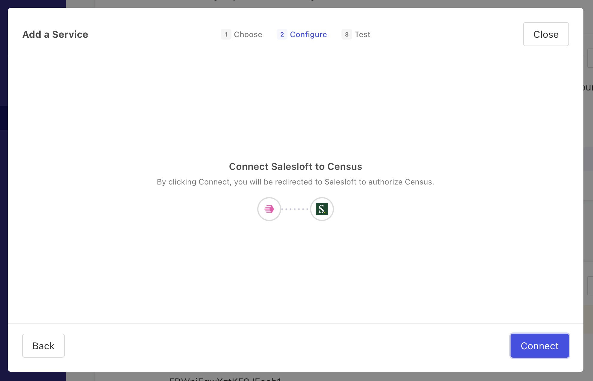

# Salesloft

## Getting Started

1. Navigate to the **Destinations** page in Census and click **New Destination**.
2. Select **Salesloft** from the menu.
3. Complete the OAuth flow to grant Census access to Salesloft.

<figure><figcaption>
Grant Census access to your Salesloft account.
</figcaption></figure>

## Supported Objects and Behaviors

| **Object Name** | **Supported?** | **Sync Keys**  | **Behaviors** |
| --------------: | :------------: | ---------------- | --------------|
| Person | ✅ | Primary email address | Update or Create |

[Contact us](mailto:support@getcensus.com) if you want Census to support more Salesloft objects and/or behaviors.

## Need help connecting to Salesloft?

[Contact us](mailto:support@getcensus.com) via support@getcensus.com or start a conversation with us via the [in-app](https://app.getcensus.com) chat.
