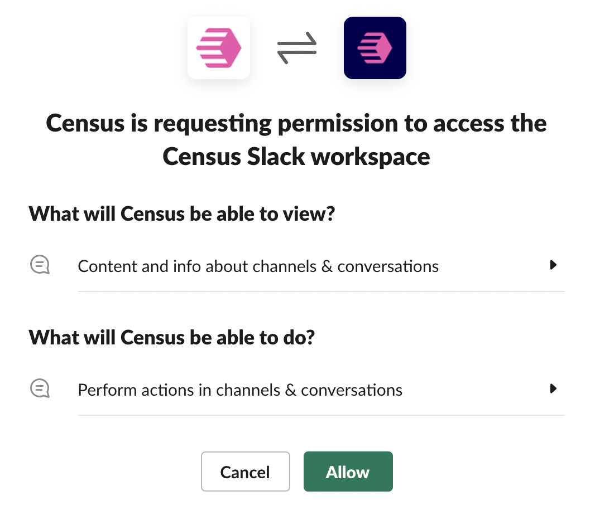
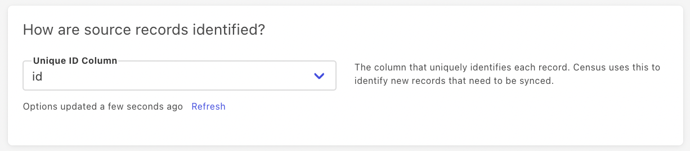

# Slack

## 🏃‍♀️ Getting Started

‌In this guide, we will show you how to connect Slack to Census and create your first sync.



### 📋 Prerequisites

* Have your Census account ready. If you need one, [create a Free Trial Census account](https://app.getcensus.com) now.
* Have your Slack account ready.
* Have the proper credentials to access to your data source. See our docs for each supported data source for further information:
  * [Databricks](https://docs.getcensus.com/sources/databricks)
  * [Google BigQuery](https://docs.getcensus.com/sources/google-bigquery)
  * [Google Sheets](https://docs.getcensus.com/sources/google-sheets)
  * [Postgres](https://docs.getcensus.com/sources/postgres)
  * [Redshift](https://docs.getcensus.com/sources/redshift)
  * [Rockset](https://docs.getcensus.com/sources/rockset)
  * [Snowflake](https://docs.getcensus.com/sources/snowflake)

## 1️⃣ Connect Census to Slack

In the **Connections** page in Census, click the **Add Service** button under the **Service Connections** section, and select Slack.

If you are not already logged in to Slack, you will be redirected to a page to log in to Slack to authorize your account to use Census. Once you are logged in, you'll see a page like the image below, confirming you want to authorize Census.

Once you've authorized Census, you'll be redirected back to the Connections page in Census and you should see your Slack connection there.

## 2️⃣ Connect Census to your data source

See our docs for each supported data source for further information:

* [Databricks](https://docs.getcensus.com/sources/databricks)
* [Google BigQuery](https://docs.getcensus.com/sources/google-bigquery)
* [Google Sheets](https://docs.getcensus.com/sources/google-sheets)
* [Postgres](https://docs.getcensus.com/sources/postgres)
* [Redshift](https://docs.getcensus.com/sources/redshift)
* [Rockset](https://docs.getcensus.com/sources/rockset)
* [Snowflake](https://docs.getcensus.com/sources/snowflake)

## 3️⃣ Create your first Census model

Navigate to the **Models** page in Census and click the **Add Model** button.

Here you can a write SQL query to select the data you want to send to Slack.&#x20;

Once you have created your model, give it a useful name, and click **Save Model**.&#x20;

## 4️⃣ Create your first Census sync

Navigate to the **Syncs** page in Census and click the **Add Sync **button.

Follow the instructions below as you go through each section:

### 📄 What data do you want to sync?

* For **Connection**, select the data warehouse you connected in step 2.
* For **Source**, select the model you created in step 3.

### 📄 **Where do you want to sync data to?**

* For **Connection**, select Slack.
* For **Object**, select the Slack channel you would like to sync data to.

### 📄 **How should changes to the source be synced?**


Note, **Append** is the only option available for Slack, so it will be automatically selected.


### 📄 **How are source records identified?**

* Pick the column that uniquely identifies each record in your data source. Census will use this to identify new records that need to be synced to Slack.

### 📄 **Which fields should be updated?**

* Select the additional fields you want to sync to Slack using **Add Mapping**.
* If you want to quickly select all the fields from your model in step 3, click on the **Multiple** dropdown and select **All From Source**.

### 📄 Should existing data be synced?

* Since **Append** is the only sync behavior option available for Slack, you can decide if existing records in source should be sent to destination.


**Backfill All Records** will be selected by default. Census will send records to a Slack channel one at a time, so if you have a high data volume that might clutter your Slack channel, consider changing the selection to **Skip Current Records**.


### 📄 Would you like to test your sync?

* Click the **Run Test **button to test whether your sync successfully sends a single record from your data source to Slack.

### ☑️ Finishing touches

* Click the **Next** button to see the final preview of the sync settings. If you selected **Skip Current Records **in the **Should existing data be synced? **section, it should look something like this:

* To run the sync now, select the **Run a sync now?** checkbox and click the **Create Sync** button. Your sync is in now progress!&#x20;

## 5. Confirm the data is in Slack

In Slack, go to the channel that you set up the sync to.

If everything went well, you should see your data there:


Reminder: Census will send records to a Slack channel one at a time.


## 🗄️ Supported Objects

| Object Name | Supported? | Identifiers      |
| ----------- | :--------: | ---------------- |
| channel     |      ✅     | any unique field |


Census can send data to **all** public channels and any private channels that Census has been explicitly invited to (e.g. `/invite @census`).


## 🔄 Supported Sync Behaviors

| **Behaviors** | **Supported?** | **Objects?** |
| ------------: | :------------: | :----------: |
|    **Append** |        ✅       |    channel   |


Census will only write new records to a specific channel when new records appear in your data warehouse.


## 🚑 Need help connecting to Slack?

[Contact us](mailto:support@getcensus.com) via support@getcensus.com or start a conversation with us via the [in-app](https://app.getcensus.com) chat.
