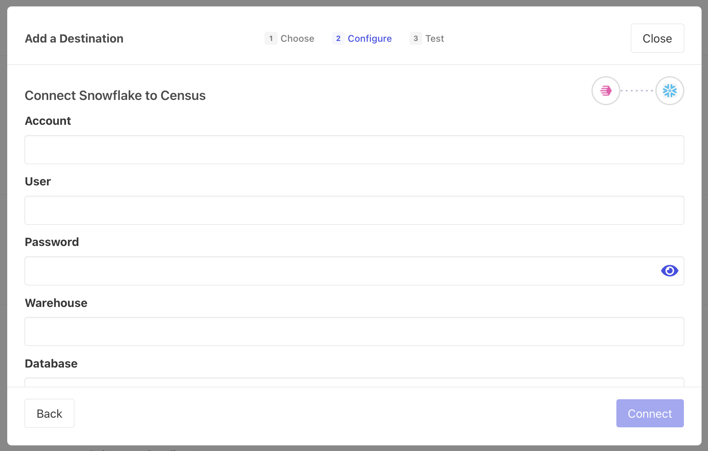

# Snowflake

## 🏃‍♀️ Getting Started

1. Navigate to the **Destinations** page in Census and click **New Destination**.
2. Select **Snowflake** from the menu.
3. Enter the requested database credentials:
   1. **Account**: should be in the form `iq18923.us-east-1`
   2. **User**
   3. **Password**
   4. **Warehouse**
   5. **Database**
   6. **Schema Name**: optional—you'll have the option to select this when creating a sync
   7. **Number of Client Connections:** the maximum number of concurrent connections Census will establish with your Snowflake destination

<figure><figcaption>
Enter your Snowflake credentials to connect with Census.
</figcaption></figure>

## 🔀 Supported Objects and Behaviors

<table data-header-hidden><thead><tr><th width="155" align="right"></th><th width="147" align="center"></th><th width="243"></th><th></th></tr></thead><tbody><tr><td align="right"><strong>Object Name</strong></td><td align="center"><strong>Supported?</strong></td><td><strong>Identifiers</strong></td><td><strong>Behaviors</strong></td></tr><tr><td align="right">Table</td><td align="center">✅</td><td>Primary keys or columns with uniqueness constraints</td><td>Update or Create, Update Only, Append</td></tr></tbody></table>

[Contact us](mailto:support@getcensus.com) if you want Census to support more sync behaviors for Snowflake.

## 🚑 Need help connecting to Snowflake?

[Contact us](mailto:support@getcensus.com) via support@getcensus.com or start a conversation with us via the [in-app](https://app.getcensus.com) chat.
