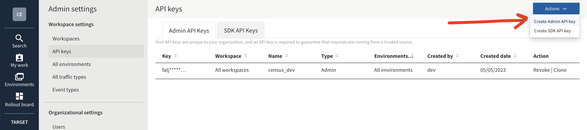

# Split

## 🏃‍♀️ Getting Started

1. Navigate to the **Destinations** page in Census and click **New Destination**.
2. Select **Split** from the menu.
3. Enter your **Admin API Token**, **SDK API Token**, and **Workspace Name**. You can find all of these in the Split app under the **API keys** and **Workspaces** pages of your **Admin settings**.

<figure><figcaption>
Get your admin and SDK API tokens.
</figcaption></figure>

<figure><figcaption>
Get the name of your workspace.
</figcaption></figure>

## 🔀 Supported Objects and Sync Behaviors 

| **Object Name** | **Supported?** | **Sync Keys**         | **Behaviors** |
| --------------: | :------------: | --------------------- | ------------- |
|           Event |        ✅       | Any unique identifier | Send          |


Learn more about all of our sync behaviors in our [Syncs](broken-reference) documentation.


[Contact us](mailto:support@getcensus.com) if you want Census to support more Split objects and/or behaviors.

## 🚑 Need help connecting to Split?

[Contact us](mailto:support@getcensus.com) via support@getcensus.com or start a conversation with us via the [in-app](https://app.getcensus.com) chat.
