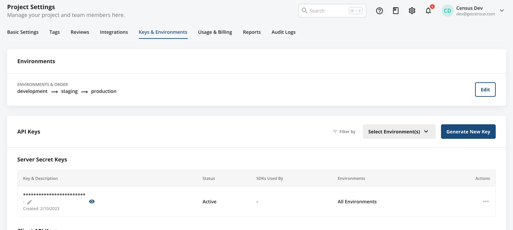

# Statsig

## Getting Started

1. Click **Add Service**.
2. Select **Statsig** from the menu.
3. Enter your **Api Key**. You can find all of these in the Statsig Console under **Project Settings > Keys & Environments > Server Secret Keys**.

<figure><figcaption>
Api Key
</figcaption></figure>

## Supported Objects and Sync Behaviors 

| **Object Name** | **Supported?** | **Identifiers**  | **Behaviors** |
| --------------: | :------------: | ---------------- |---------------|
| Event | ✅ | Event ID | Add           |


Learn more about all of our sync behaviors on our [Core Concepts page](../basics/core-concept/#the-different-sync-behaviors).


Contact our support team if you want Census to support more Statsig objects and/or behaviors.

## Need help connecting to Statsig?

Contact our support team or start a conversation with us via the [in-app](https://app.getcensus.com) chat.
