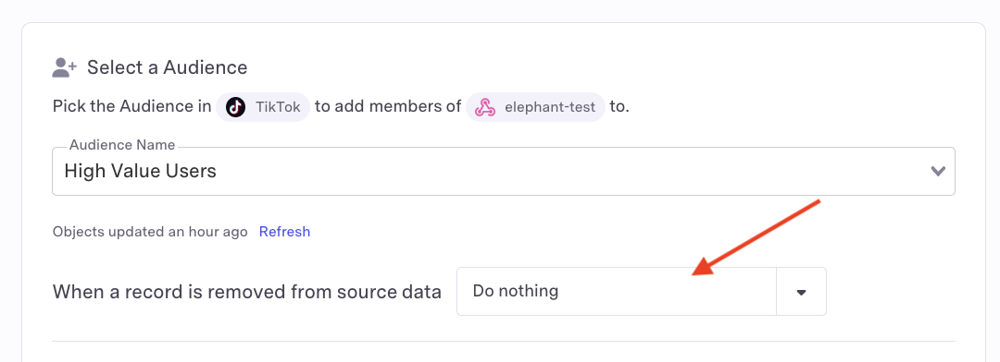

# TikTok

## 🏃‍♀️ Getting Started

* Navigate to the **Destinations** page in Census and click **New Destination**.
* Select **TikTok** from the menu.
* Click **Connect** and you will be redirected to sign in to your TikTok for Business account.
* After completing the flow, you'll see your TikTok connection listed on the **Destinations** page.

## 🔀 Supported Objects and Sync Behaviors <a href="#supported-objects-and-sync-behaviors" id="supported-objects-and-sync-behaviors"></a>

|           **Object Name** | **Supported?** | **Sync Keys**           | **Behaviors**            |
| ------------------------: | :------------: | ----------------------- | ------------------------ |
|          Partner Audience |        ✅       | Email, IDFA/GAID, Phone | Update or Create, Mirror |
|    Customer File Audience |        ✅       | Email, IDFA/GAID, Phone | Update or Create, Mirror |
| Offline Event Conversions |        ✅       | Any unique identifier   | Send                     |
|     Web Event Conversions |        ✅       | Any unique identifier   | Send                     |


Learn more about all of our sync behaviors in our [Syncs](broken-reference) documentation.


[Contact us](mailto:support@getcensus.com) if you want Census to support more TikTok objects and/or behaviors.

## Understanding TikTok Audiences

TikTok supports two different audience types: Partner Audiences and Customer File Audiences. Though they are similar, there are some important differences to note. When in doubt, we recommend using Partner Audiences.

### Partner Audiences

Partner Audiences are easier to manage with Census as they have no limitations on incremental syncs. The main limitation of Partner Audiences is that they cannot be used in Reach and Frequency campaigns.

### Customer File Audience

Customer File Audience is the older TikTok audience type and can be used with Reach and Frequency campaigns. However, TikTok only allows one **Mirror** operation per 24 hrs (sometimes a bit longer, depends on their processing delays) when using this API. This can present issues. This error will appear as:

```
This replace operation is rejected as there is an existing unfinished replace operation for this audience. Please wait until the current operation completes on this audience before re trying. Recommend no more than one replace operation per day.
```

To work around this limitation, you have a few options:

- Use a **Partner Audience** instead 
- Move to a less frequent sync schedule (once per 48 hrs)
- Use the **Update or Create** sync behavior instead of **Replace** by setting the `When a record is removed from source data` option to `Do Nothing` on sync set up

<figure><figcaption></figcaption></figure>


### Identifiers

TikTok supports the following identifiers across either audience type:

* **Email** - Original value or SHA256 hashed
* **Phone** - Original value or SHA256 hashed
* **IDFA/GAID** - Original value, SHA256 hashed, or MD5 hashed

Prior to hashing, please ensure you are [normalizing your data to TikTok's requirements](https://ads.tiktok.com/gateway/docs/index?identify\_key=2b9b4278e47b275f36e7c39a4af4ba067d088e031d5f5fe45d381559ac89ba48\&language=ENGLISH\&doc\_id=1701890972946433#item-link-Before%20you%20begin).

#### Important Notes

* All audience identifiers can be provided as either the original value or a hashed value.

## 🚑 Need help connecting to TikTok Ads?

[Contact us](mailto:support@getcensus.com) via support@getcensus.com or start a conversation with us via the [in-app](https://app.getcensus.com) chat.
