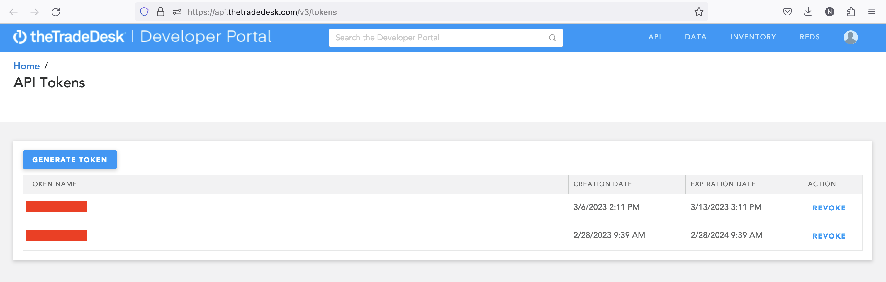

# The Trade Desk

In this guide, we will show you how to connect The Trade Desk to Census.

## 🏃‍♀️ Getting Started

1. Navigate to the **Destinations** page in Census and click **New Destination**.
2. Select **The Trade Desk** from the menu.
3. The Trade Desk needs a few different types of credentials depending on which of the destination objects you intend to use. You can optionally decide which credentials to provide:

* For Ad Groups and/or Campaigns, provide the **API Token**. See [The Trade Desk's documentation](https://api.thetradedesk.com/v3/portal/api/doc/Authentication) for more information on how to generate an API Token. We recommend you generate the long-lived token, and keep in mind that you will need to regenerate one whenver it expires.
* For Conversion Events, provide a **Postback URL**.
* For CRM Data Segments, provide the following:
  * **API Token** (as described above)
  * **Advertiser ID**
  * **Data Region** - One of: `US`, `EU`, or `APAC`. Census will create new CRM Data Segments in the region you specify here. You can create multiple The Trade Desk destinations in Census to sync to multiple regions.

<figure><figcaption>
Generate an API Token from the The Trade Desk developer portal.
</figcaption></figure>

## 🔀 Supported Objects and Sync Behaviors 

|  **Object Name** | **Supported?** | **Sync Keys**         | **Behaviors**            |
| ---------------: | :------------: | --------------------- | ------------------------ |
|         Ad Group |        ✅       | Any unique identifier | Update Only, Add         |
|       Advertiser |        ✅       | Any unique identifier | Update Only, Add         |
|         Campaign |        ✅       | Any unique identifier | Update Only, Add         |
| Conversion Event |        ✅       | Any unique identifier | Send                     |
|     Tracking Tag |        ✅       | Any unique identifier | Update Only, Add         |
| CRM Data Segment |        ✅       | Email/Phone           | Update or Create, Mirror |


Learn more about all of our sync behaviors in our [Syncs](broken-reference) documentation.


[Contact us](mailto:support@getcensus.com) if you want Census to support more The Trade Desk objects and/or behaviors.

### CRM Data Segment

#### PII Normalization

Census will automatically normalize email and phone identifiers to the format expected by The Trade Desk. You can optionally provide Census with a pre-hashed email or phone number. If you do, you must ensure that the data is normalized to the format expected by The Trade Desk. Census cannot determine whether a pre-hashed email or phone number is correctly normalized once it is hashed.

For more details on how The Trade Desk expects email and phone numbers to be normalized, see [The Trade Desk's documentation](https://api.thetradedesk.com/v3/portal/data/doc/DataPiiNormalization).

#### Segment Time Left and Refresh Frequency

Census will automatically set the segment time left to the maximum 180 days by using The Trade Desk's Data Retention feature. Census will also automatically refresh a segment as it approaches the 180-day limit.


The Trade Desk's Manage Segments UI is a bit confusing. The "Segment Time Left" field may "Zero days left" or "Expired" even a day or two after a segment is created. This is because it actually shows the number of days left as indicated by the last batch of data sent to the segment, not the segment overall. In order for Census to implement Mirror behavior, we send a batch of users to remove with a 0-day time left. This will cause the segment to appear expired in the UI, but rest assured, it's only indicating the last batch.


## 🚑 Need help connecting to The Trade Desk?

[Contact us](mailto:support@getcensus.com) via support@getcensus.com or start a conversation with us via the [in-app](https://app.getcensus.com) chat.
