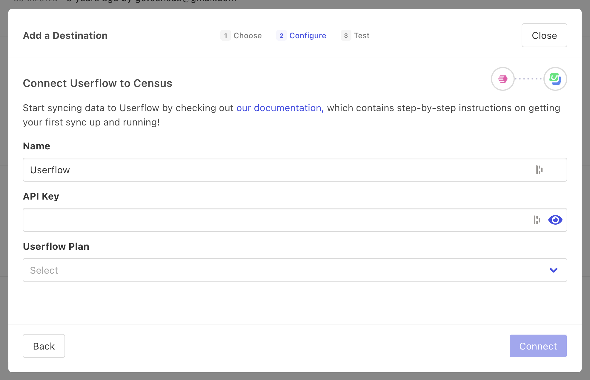

# Userflow

## 🏃‍♀️ Getting Started

1. Click **Add Service**.
2. Select **Userflow** from the menu.
3. Enter your **API Key** (found in the Userflow app) and select your **Userflow Plan**.

<figure><figcaption>
Enter your Userflow credentials to get started.
</figcaption></figure>

## 🗄 Supported Objects and Behaviors

<table data-header-hidden><thead><tr><th width="152" align="right"></th><th width="152" align="center"></th><th width="150"></th><th></th></tr></thead><tbody><tr><td align="right"><strong>Object Name</strong></td><td align="center"><strong>Supported?</strong></td><td><strong>Identifiers</strong></td><td><strong>Behaviors</strong></td></tr><tr><td align="right">Event</td><td align="center">✅</td><td>Unique ID</td><td>Append</td></tr><tr><td align="right">Group</td><td align="center">✅</td><td>Group ID</td><td>Update or Create</td></tr><tr><td align="right">User</td><td align="center">✅</td><td>User ID</td><td>Update or Create, Update Only, Mirror</td></tr></tbody></table>

[Contact us](mailto:support@getcensus.com) if you want Census to support more Userflow objects and/or behaviors.

## 🚑 Need help connecting to Userflow?

[Contact us](mailto:support@getcensus.com) via support@getcensus.com or start a conversation with us via the [in-app](https://app.getcensus.com) chat.
