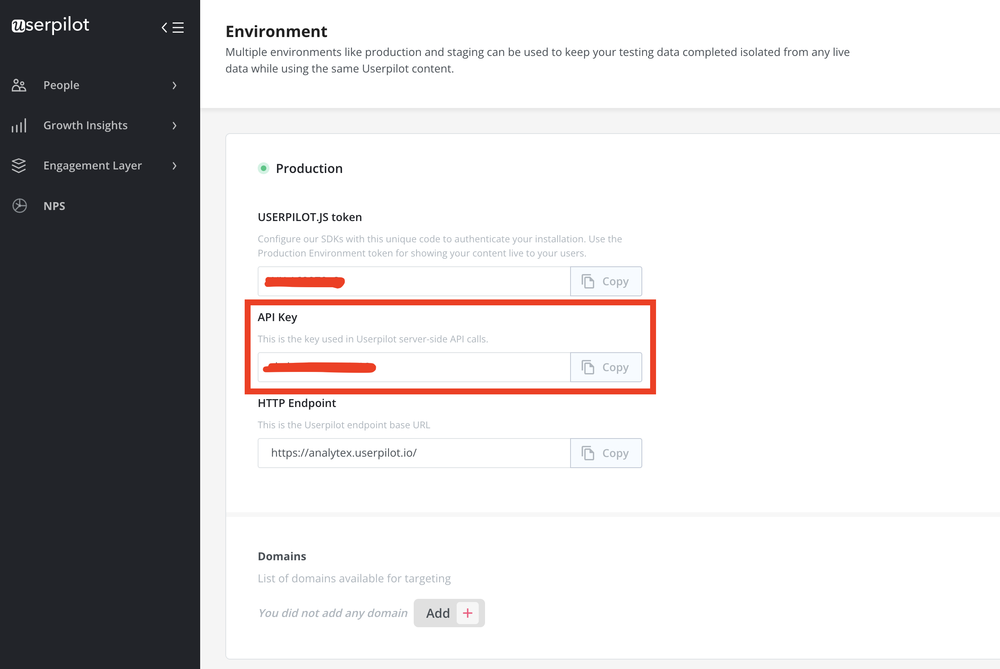

# Userpilot

## 🏃‍♀️ Getting Started

1. Click **Add Service**.
2. Select **Userpilot** from the menu.
3. Enter your **API Key**, which can be found in the Userpilot app under **Configure** > **Environment**.
4. If you have an Enterprise plan with Userpilot, enter your **Enterprise Base URL**. Otherwise, leave it blank.

<figure><figcaption>
Copy your API key from the Userpilot app.
</figcaption></figure>

## 🔀 Supported Objects and Behaviors

| **Object Name** | **Supported?** | **Sync Keys**  | **Behaviors** |
| --------------: | :------------: | ---------------- | --------------|
| User | ✅ | User ID | Update or Create |

[Contact us](mailto:support@getcensus.com) if you want Census to support more Userpilot objects and/or behaviors.

## 🚑 Need help connecting to Userpilot?

[Contact us](mailto:support@getcensus.com) via support@getcensus.com or start a conversation with us via the [in-app](https://app.getcensus.com) chat.
