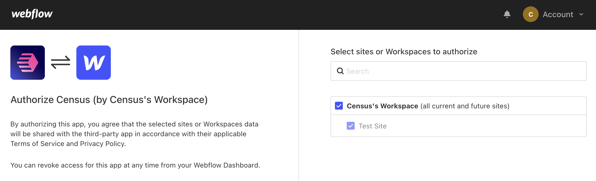

# Webflow

## 🏃‍♀️ Getting Started

1. Click **Add Service**.
2. Select **Webflow** from the menu.
3. When prompted, log into your Webflow account to authorize Census.

<figure><figcaption>
Select which sites and/or workspaces to grant access to.
</figcaption></figure>

## 🔀 Supported Objects and Behaviors

| **Object Name** | **Supported?** | **Identifiers** | **Behaviors** |
| --------------: | :------------: | --------------- | ------------- |
| Collection Item | ✅ | Slug | Update or Create, Update Only, Mirror |

[Contact us](mailto:support@getcensus.com) if you want Census to support more Webflow objects and/or behaviors.

## 🚑 Need help connecting to Webflow?

[Contact us](mailto:support@getcensus.com) via support@getcensus.com or start a conversation with us via the [in-app](https://app.getcensus.com) chat.
